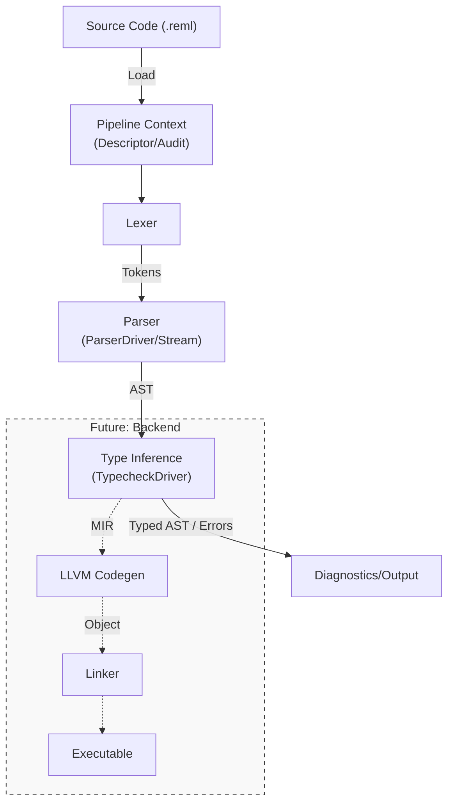

# 第1章: Remlコンパイルパイプライン

## 1. 概要 (Introduction)

Reml コンパイラは、人間の書いたテキスト（`.reml` ソースコード）を、機械が実行可能な形式（バイナリまたはメモリ上の命令列）へと変換するためのパイプラインです。このプロセスは「フロントエンド」と「バックエンド」という2つの大きなフェーズに分かれています。

現在の Reml の実装状態（Snapshot 0.x）では、この分業は次のように機能しています：

1. **フロントエンド（主役）**: ソースコードの読み込み、字句解析、構文解析、そして型検査までを一手に引き受けます。開発者へのフィードバック（エラー診断や警告）もここで行われます。現時点では、解析結果を JSON 形式で出力して終了することが主な動作モードです。
2. **バックエンド（準備中）**: 型付きの中間表現を受け取り、LLVM IR へ変換してネイティブバイナリを生成する役割ですが、現在はそのための骨組み（スケルトン）が整備されている段階です。

この章では、「ソースコードがどのように読み込まれ、どこを通って解析結果となるのか」という**データの流れ**を大局的に解説します。詳細なアルゴリズムは次章以降に譲り、ここでは主要なジャンクション（分岐点）とデータ構造に焦点を当てます。

## 2. データ構造 (Key Data Structures)

パイプラインを流れる主要なデータ構造は以下の通りです。これらはコンパイルの各段階における「プログラムの姿」を表しています。

- **`Token`** (`frontend/src/token.rs`):
    字句解析の成果物。ソースコードという「文字の列」が、「識別子」「キーワード」「記号」といった「意味のある単位」に分解されたものです。
- **`AST (Abstract Syntax Tree)`** (`frontend/src/parser/ast.rs`):
    構文解析の成果物。トークン列が組み合わされ、プログラムの構造（関数定義、式、文など）がツリー状に表現されたものです。まだ型の整合性は保証されていません。
- **`PipelineDescriptor`** (`frontend/src/pipeline/mod.rs`):
    コンパイル処理そのものの「コンテキスト」を表す構造体です。入力ファイルパス、実行 ID、コマンドライン引数など、**「誰が、何を、どのように実行したか」** というメタデータを保持します。これは監査（Audit）やエラー追跡において重要な役割を果たします。
- **`StageAuditPayload`** (`frontend/src/diagnostic/effects.rs`):
    コンパイルがどの「ステージ」（開発段階やセキュリティレベル）で実行されているかを管理します。Reml は Capability ベースの権限管理を行うため、このペイロードが各処理ステップに引き回され、しかるべき権限チェックが行われます。

## 3. アルゴリズムと実装 (Core Logic)

コンパイルの実行は、CLI エントリーポイントである `reml_frontend` バイナリから始まります。プロセスは大きく3つのフェーズで進行します。

### Phase 1: 初期化と監査開始

`reml_frontend/src/bin/reml_frontend.rs` の `main` 関数は、まず **FFI 実行エンジン** の初期化を行います。これはコンパイル中にプラグインなどを動的に実行するための準備です。
その後、`PipelineDescriptor` を作成し、`audit_emitter.pipeline_started` を呼び出します。これにより、「コンパイルが開始された」という事実が監査ログに記録されます。

```rust
// compiler/frontend/src/bin/reml_frontend.rs (概念図)
let descriptor = PipelineDescriptor::new(input_path, ...);
audit_emitter.pipeline_started(&descriptor, ...)?;
run_frontend(&args)?; // メイン処理へ
```

### Phase 2: 解析と型検査 (`run_frontend`)

`run_frontend` 関数がパイプラインの実質的な心臓部です。

1. **字句解析 (Lexing)** (Optional):
    `--emit-tokens` オプションがある場合、ソースをトークン列に変換して JSON 出力します。デバッグ用途でよく使われます。
2. **構文解析 (Parsing)**:
    `ParserDriver`、あるいはストリーミング解析が有効な場合は `StreamingRunner` が起動します。ソースコードはここで AST へと変換されます。
    > **Note:** Reml は Packrat Parsing を採用しており、メモ化によってバックトラックのコストを抑えています。
3. **型推論 (Type Inference)**:
    構文解析が成功すると、`TypecheckDriver::infer_module` が呼び出されます。ここでは AST に対して型の整合性がチェックされ、すべての式に型が割り当てられます。この段階で「型エラー」があれば診断（Diagnostic）として記録されます。

### Phase 3: 結果の出力

処理が完了すると、成功・失敗にかかわらず `AuditEmitter` が結果（`PipelineOutcome` または `PipelineFailure`）を記録します。
最後に、収集されたすべての診断情報（エラー、警告、Lint 情報）が `OutputFormat`（Human または JSON）に従って整形され、標準出力に書き出されます。

以下の図は、この一連の流れを視覚化したものです。



## 4. エラー処理と監査 (Error Handling & Audit)

Reml のコンパイルパイプラインにおけるエラー処理は、単なる「コンパイルエラーの表示」にとどまりません。**「なぜ失敗したか」を構造化されたデータとして残す** ことが重視されています。

- **ユーザー向け**: `Diagnostic` 構造体がエラーの場所（Span）、理由、修正提案を保持し、ユーザーにわかりやすい形式で提示されます。
- **システム向け**: 重大な内部エラーやパイプラインの異常終了は `PipelineFailure` として `AuditEmitter`経由で記録されます。これにより、ビルドシステムや IDE は「何が起きたか」を機械的に把握できます。

## 5. 発展的トピック (Advanced Topics)

### ストリーミング解析 (Streaming Parsing)

`StreamingRunner` (`compiler/frontend/src/streaming/`) は、巨大な入力を扱うための実験的な機能です。入力をチャンク単位で処理し、部分的な AST を生成しながら解析を進めることで、メモリ使用量を抑える設計になっています。

### コンフィグ互換性 (Config Compatibility)

CLI 引数と設定ファイル（`reml.toml` など）の間で設定値の競合が起きた場合、`ResolvedConfigCompatibility` がその解決ルールを決定し、監査ログに「どの設定が優先されたか」を記録します (`config_compat_changed`)。

## 6. 章末まとめ (Checkpoint)

- 現在の Reml コンパイラは、フロントエンド（`reml_frontend`）が解析から出力までを主導する構成になっている。
- `PipelineDescriptor` はコンパイル実行のアイデンティティであり、監査の基点となる。
- 解析フローは **Lexing -> Parsing -> Type Inference** の順に進み、各段階で診断情報が蓄積される。
- バックエンド連携は将来的な拡張ポイントとして設計されており、現時点では型検査までのパスが主要な動作である。

次は、これらのモジュールが配置されている **リポジトリ構造** について詳しく見ていきます。
