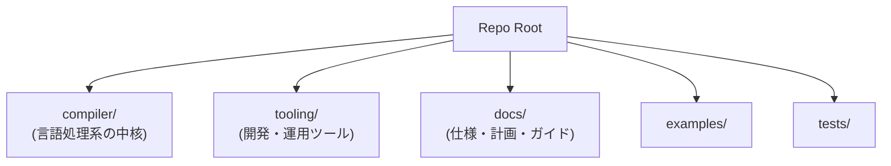
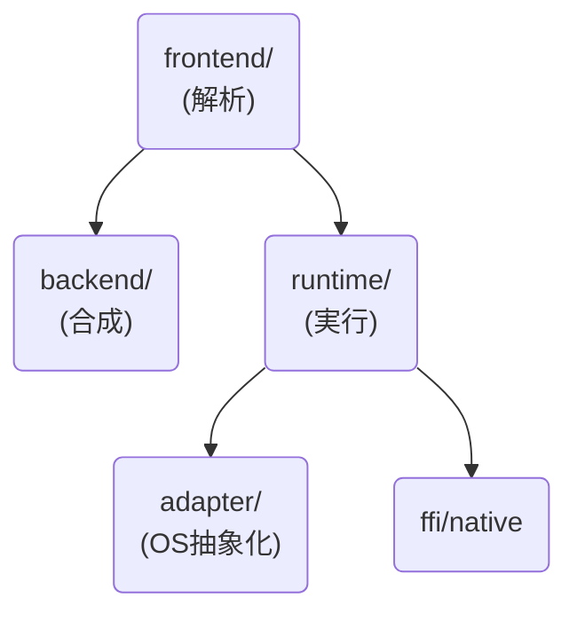

# 第2章: リポジトリの構造

本章では、Reml言語のリポジトリ全体の地図を描きます。

巨大なコードベースに足を踏み入れる際、最初に必要なのは全体像の把握です。どのディレクトリに何が置かれているのか、それぞれの役割分担はどうなっているのか。このメンタルモデルを構築することで、迷子にならずに深部へと潜っていくことができます。

## 1. ディレクトリ構成の俯瞰

Remlのリポジトリは、大きく分けて「コンパイラ本体」、「周辺ツール」、「ドキュメント」の3つの領域から構成されています。これらはルートディレクトリ直下に配置されており、明確な責務の分離がなされています。

図2-1に、ルートディレクトリの主要な構造を示します。

### 主要ディレクトリの役割

- **`compiler/`**: Reml言語の実装そのものです。フロントエンドからバックエンド、ランタイムまで、コンパイラの振る舞いを決定するすべてのRustコードがここに集約されています。
- **`tooling/`**: コンパイラ開発を支えるエコシステムです。CIスクリプト、ベンチマーク、LSP（Language Server Protocol）の実装計画などが含まれます。
- **`docs/`**: プロジェクトの知識ベースです。言語仕様書（Spec）、開発者ガイド、将来の計画書（Plans）、調査ノート（Notes）が整理されています。
- **`examples/`**: Remlで書かれたサンプルコードです。言語機能のデモンストレーションであると同時に、統合テストの入力としても機能します。
- **`tests/`**: エンドツーエンドの統合テストスイートです。

なお、ルート直下には `Cargo.toml.ws` というファイルが存在しますが、これはワークスペース定義です。ビルドやテストを行う際は、このワークスペースを意識しつつ、`--manifest-path` オプションで具体的なクレートを指定する運用が基本となります（詳細は第3章で触れます）。

コンパイラの実装を理解したい読者は `compiler/README.md` を、プロジェクトの全体構造や開発ルールを知りたい読者はルートの `README.md` を、まず最初に参照することをお勧めします。

## 2. コンパイラ (`compiler/`) の内部構造

`compiler/` ディレクトリは、Remlプロジェクトの心臓部です。ここでは、一般的に「コンパイラ」と呼ばれる機能が、いくつかのサブディレクトリに分割して格納されています（図2-2）。

それぞれのディレクトリは、以下の責務を持っています。

### `frontend/`: 言語の「理解」

ソースコードを読み込み、意味を解析する部分です。字句解析、構文解析、型チェック、そして中間表現への変換までを担います。エラー診断（Diagnostics）の生成もここで行われるため、ユーザーが目にするメッセージの大半はここから生まれます。また、開発者が直接実行するコマンドラインツール（`reml_frontend`, `remlc`）のエントリーポイントも内包しています。

### `backend/`: 機械語への「翻訳」

フロントエンドが理解したプログラムを、ターゲットとなるマシンのコード（LLVM IRなど）に変換します。現在は `llvm/` サブディレクトリに、LLVMバックエンドの初期実装として `type_mapping.rs` や `codegen.rs` などが配置されています。

### `runtime/`: プログラムの「実行」

Remlプログラムが動作するために必要なライブラリと環境です。`collections`, `io`, `text` といった標準ライブラリの実装に加え、FFI（外部関数インターフェース）やネイティブコードとの連携機能もここに含まれます。

### `adapter/`: 環境差分の「吸収」

Remlは多様な環境で動作することを目指しています（macOS, Linux, etc.）。`adapter/` は、ファイルシステム、ネットワーク、時間、乱数生成といったOS依存の機能を抽象化するレイヤーです。これにより、上位のコンパイラやランタイムは、OSごとの差異を意識せずに実装を進めることが可能になります。

### その他のコンポーネント

- **`ffi_bindgen/`**: C言語などのヘッダーファイルから、Reml用のバインディングコードを自動生成するツール `reml-bindgen` を含みます。
- **`xtask/`**: 開発者のためのタスクランナーです。監査ログの解析や定型作業の自動化を `cargo xtask` コマンドとして提供します。

## 3. ツール群 (`tooling/`) のエコシステム

コンパイラを開発・維持するためには、コンパイラ以外の多くのツールが必要となります。`tooling/` ディレクトリは、それらの「足場」を提供します。

- **`ci/`**: GitHub Actionsなどで使用されるCIスクリプトや、品質監査のためのメトリクス収集ツールです。
- **`benchmarks/`**: パフォーマンス計測用のスクリプトとデータです。コンパイラの速度低下（リグレッション）を防ぐために、`text/` 処理や `parse/` 処理のベンチマークが含まれています。
- **`lsp/`**: IDEでの快適な開発体験を実現するLSPサーバーの設計・実装に関する情報です。
- **`review/`**: 監査ログを集計・可視化し、コードレビューを支援するツールです。
- **`scripts/`**, **`templates/`**: 日々の開発作業を効率化するためのスクリプトやテンプレート集です。
- **`release/`**: バイナリの署名や配布プロセスに関するスクリプトです。

このように、`tooling/` はコンパイラ製品そのものには含まれませんが、プロジェクトの品質と開発速度を支える重要なコード群です。

## 4. ドキュメント体系 (`docs/`)

Remlのドキュメントは、「コード」と同等の重要資産として扱われています。入口となる `docs/README.md` から、以下の4つの主要カテゴリに分岐します。

1. **`spec/`（言語仕様）**:
    Reml言語がどうあるべきかを定義する「正典」です。すべての実装はこの仕様に従わなければなりません。実装と仕様に乖離がある場合は、原則として実装側のバグ、あるいは仕様側の更新漏れとみなされます。

2. **`guides/`（ガイド）**:
    開発者がRemlを使いこなすための手引きです。

3. **`plans/`（計画書）**:
    将来の実装計画や、現在進行中のタスク（この解説書自体の計画も含む）が格納されます。

4. **`notes/`（調査ノート）**:
    実装にあたっての調査記録や、設計上のトレードオフに関するメモです。なぜその決定がなされたのかという「コンテキスト」を知るための貴重な資料です。

## 5. まとめ

本章では、リポジトリを俯瞰し、各ディレクトリの役割を確認しました。

- **`compiler/`** は実装の本体であり、`frontend`、`backend`、`runtime` などの明確なレイヤー構造を持っています。
- **`tooling/`** は開発プロセスと品質保証を支えるエコシステムです。
- **`docs/`** は仕様と知識の集積地として構造化されています。

次章からは、いよいよ具体的なコードの海へと足を踏み入れます。まずは、コンパイラを実行するための「入口」となるコマンドラインインターフェース（CLI）から見ていきましょう。
