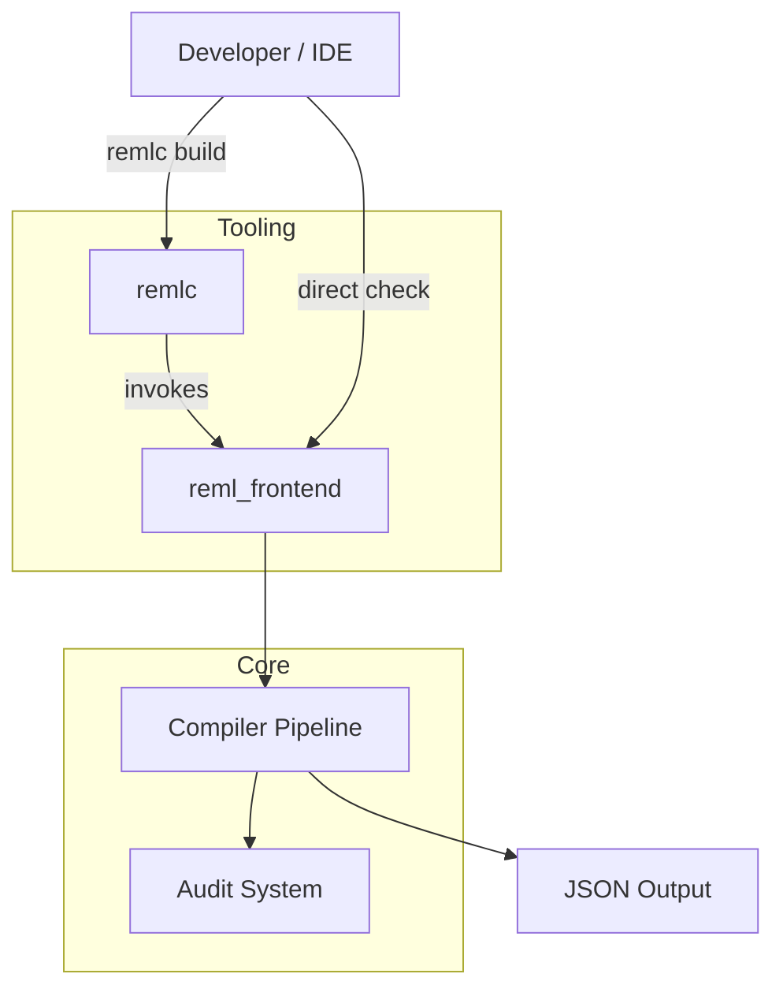

# 第1部 第3章: 実行の入口

## 1. はじめに

コンパイラのソースコードを読み解く旅は、プログラムが実際に起動される「入口（Entry Point）」から始まります。Reml のアーキテクチャでは、単一のモノリシックなバイナリではなく、役割の異なる 2 つの主要な CLI（Command Line Interface）ツールが提供されています。

1. **`reml_frontend`**: ソースコードを入力とし、解析・診断・コード生成を行う「コンパイラの核心」です。
2. **`remlc`**: プロジェクトの作成、設定の検証、ビルドオーケストレーションを行う「開発支援ツール」です。

本章では、これら 2 つのコマンドがどのように起動し、引数を解釈し、内部の処理パイプラインへと制御を渡していくのか、その「入口の地図」を描きます。ここでの理解は、第2部以降で解説する字句解析や型検査といった詳細なプロセスへ進むための羅針盤となります。

## 2. 実行モデルの概要

Reml のコンパイラドライバである `reml_frontend` は、現代的なコンパイラの設計思想を反映し、「構造化された入出力」を重視しています。エラーメッセージを標準エラー出力にテキストで流すだけでなく、診断結果を JSON 形式で出力したり、LSP (Language Server Protocol) と連携したりすることを前提に設計されています。

一方、`remlc` は Cargo (Rust) や npm (Node.js) のように、プロジェクト全体のライフサイクルを管理するためのユーティリティです。

### 全体的なデータフロー

## 3. `reml_frontend`: コンパイラの核心

`reml_frontend` は、Reml のソースコードを処理するための主要なバイナリです。そのエントリポイントは `compiler/frontend/src/bin/reml_frontend.rs` にあります。

### 3.1 起動シーケンス

`main` 関数は、単に解析処理を呼び出すだけでなく、Reml の実行環境を正しくセットアップするために重要ないくつかの前処理を行います。

1. **FFI 実行エンジンの初期化**:
    Reml は FFI (Foreign Function Interface) を強力にサポートしているため、最初に `install_cli_ffi_executor` を呼び出し、ネイティブブリッジを初期化します。これにより、コンパイル時計算やプラグイン実行の基盤が整います。
    - 参照: `compiler/frontend/src/bin/reml_frontend.rs:546`

2. **ショートカットコマンドの処理**:
    通常のコンパイルフローに入る前に、`plugin` や `--capability` といった即時応答が求められるサブコマンドをチェックします。これらはソースコードの解析を必要とせず、ランタイムの状態確認や管理を行うためのものです。
    - 参照: `compiler/frontend/src/bin/reml_frontend.rs:549-568`

3. **引数の解析とパイプラインの準備**:
    `parse_args` 関数によってコマンドライン引数が解析され、`CliArgs` 構造体に変換されます。ここで、パイプラインの実行を追跡するための `PipelineDescriptor` や、セキュリティ監査のための `StageAuditPayload` が初期化されます。
    - 参照: `compiler/frontend/src/bin/reml_frontend.rs:569-586`

### 3.2 実行パイプライン (`run_frontend`)

準備が整うと、制御は `run_frontend` 関数へと移ります。ここでは以下の直線的なフローで処理が進みます。

1. **入力の読み込み**: 指定されたソースファイルをメモリに読み込みます。
2. **字句解析 (Lexing)**: `lex_source_with_options` を通じてトークン列を生成します（`--emit-tokens` 指定時）。
3. **構文解析 (Parsing)**:
    ここでは `ParserDriver` または `StreamingRunner` が選択されます。ストリーミングモードが有効な場合、ファイル全体を一度にパースするのではなく、部分的に処理を進める高度な制御が行われます。
    - 参照: `compiler/frontend/src/bin/reml_frontend.rs:668-678`
4. **型検査 (Type Checking)**:
    パースに成功した場合、`TypecheckDriver` が起動し、意味解析と型チェックを行います。
    - 参照: `compiler/frontend/src/bin/reml_frontend.rs:684`
5. **結果の集約**:
    すべての診断情報（エラーや警告）、監査ログ、そして最終的な実行結果は `CliRunResult` 構造体にまとめられ、`main` 関数へ返されます。

### 3.3 データ構造のハイライト

`reml_frontend` の実装において、特に注目すべきデータ構造がいくつかあります。

- **`CliRunResult`**:
    CLI の実行結果を包括的に表す構造体です。終了コード (`exit_code`) だけでなく、診断情報のエンベロープ (`envelope`) や監査情報 (`stage_payload`) を保持しており、構造化された出力を生成するための基盤となります。
  - 定義: `compiler/frontend/src/bin/reml_frontend.rs:91`
- **`CliDiagnosticEnvelope`**:
    JSON 出力のルートとなる構造体です。Reml の CLI は、ツール連携を容易にするために、診断情報をこのエンベロープに包んで出力します。

## 4. `remlc`: 開発支援の司令塔

`remlc` は、より高レベルなタスクを扱うためのツールです。ソースコードの解析そのものではなく、プロジェクト設定 (`reml.json`) の管理や、スキャフォールディング（雛形作成）を担います。

エントリポイントは `compiler/frontend/src/bin/remlc.rs` です。このファイルは、`cargo` コマンドのようにサブコマンド形式で機能を切り替える構造になっています。

### main と try_main

`remlc` の `main` 関数は非常にシンプルです。実際の実装は `try_main` に委譲されており、エラーが発生した場合はここで捕捉してユーザーフレンドリーなメッセージを表示します。

`try_main` 内では、コマンドラインの第一引数（サブコマンド）を見て分岐します。

- **`new`**: 新しいプロジェクトを作成します。テンプレートディレクトリからファイルをコピーする処理が含まれます。
  - 参照: `compiler/frontend/src/bin/remlc.rs:93`
- **`manifest`**: マニフェストファイルの検証やダンプを行います。
- **`config`**: 設定ファイルの Lint や差分比較 (`diff`) を行います。
- **`build`**: ビルドプロセスを実行します。これには `reml_frontend` の呼び出しや、FFI バインディング生成 (`bindgen`) の制御が含まれます。

## 5. エラー処理と監査

Reml のコンパイラは、単に「コンパイルに失敗しました」と伝えるだけではありません。セキュリティと信頼性を重視する言語として、**監査 (Audit)** の仕組みが入口から組み込まれています。

- **監査ログ**:
    `reml_frontend` は、実行の開始 (`pipeline_started`)、完了 (`pipeline_completed`)、そして失敗 (`pipeline_failed`) を監査イベントとして記録します。これは `AuditEmitter` を通じて行われ、誰が・いつ・どのような権限でコンパイラを実行したかを追跡可能にします。
  - 参照: `compiler/frontend/src/bin/reml_frontend.rs:587-622`
- **終了コード**:
    エラーの種類に応じて適切な終了コードを返すことは、CLI ツールの行儀作法です。`CliExitCode` は成功 (0)、一般的なエラー (1) だけでなく、設定エラーや内部エラーなどを区別して扱えるように設計されています。

## 6. 発展的トピック

### プラグイン管理

`reml_frontend` は `plugin install` や `plugin verify` といったコマンドも内包しています。これらはコンパイラの機能を拡張するバイナリプラグインを安全に管理するための機能です。`run_plugin_install` 関数などがその実体であり、コンパイラドライバがパッケージマネージャ的な役割も一部担っていることがわかります。

### ストリーミング実行

第3.2節で触れた `StreamingRunner` は、巨大な入力を扱う際や、リアルタイムな応答が求められる場合に威力を発揮します。これは第9章で詳しく解説しますが、入口の段階で `stream_config` を通じて起動モードが切り替わる点は記憶に留めておいてください。

## 7. 章末まとめ

本章では、Reml の実行の起点となる 2 つの CLI について解説しました。

- **`reml_frontend`** は解析と診断の専門家であり、FFI や監査システムと密結合して動作します。
- **`remlc`** はプロジェクト管理の専門家であり、設定検証やスキャフォールディングを提供します。
- 両者とも、構造化されたエラー処理と監査ログ出力を備え、堅牢なツールチェーンの基盤となっています。

次章からは、`reml_frontend` の内部へ踏み込み、ソースコードがどのように読み込まれ、トークンへと分解されるのか——**第4章: 字句解析** の世界へと進みます。
