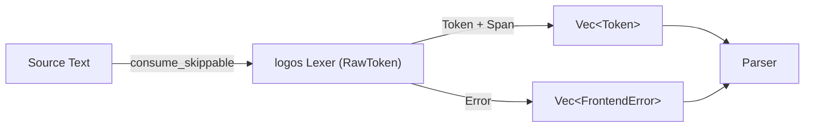

# 第4章: 字句解析 (Lexical Analysis)

## 1. 概要 (Introduction)

Reml コンパイラにおける最初の解析フェーズである「字句解析（Lexical Analysis）」について解説します。

字句解析器（Lexer）の責務は、ソースコードという単なる「文字列」を、文法的な意味を持つ最小単位である「トークン（Token）」の列に変換することです。このプロセスでは、キーワード、演算子、識別子、リテラルといった意味のある要素を抽出し、一方でコンパイルには不要な空白やコメントを排除します。

Reml の字句解析は `compiler/frontend/src/lexer` モジュールで実装されています。Rust の高速な字句解析ライブラリである `logos` を採用していますが、単にライブラリを呼び出すだけでなく、ネスト可能なコメントの処理や Unicode 識別子の正規化など、言語固有の要件を満たすためのロジックな層が組み込まれています。

最終的に生成される `LexOutput` は、「トークン列」と「エラー列」のペアです。これは、字句解析段階で発生したエラー（例えば不正な文字の混入など）があっても処理を中断せず、可能な限り解析を継続してパーサに情報を渡すための設計です。



## 2. データ構造 (Key Data Structures)

字句解析で扱われる主要なデータ構造を見ていきます。これらは主に `compiler/frontend/src/token.rs` で定義されています。

### 2.1 トークンの分類 (`TokenKind`)

`TokenKind` は、トークンの種類を識別する列挙型（enum）です。Reml の文法要素はこの enum のバリアントとして表現されます。

- **ファイルパス**: `compiler/frontend/src/token.rs`

主なカテゴリは以下の通りです。

| カテゴリ | 例 | 説明 |
| --- | --- | --- |
| **キーワード** | `KeywordFn` (`fn`), `KeywordLet` (`let`) | 言語の予約語です。 |
| **演算子・記号** | `Plus` (`+`), `Arrow` (`->`), `LBrace` (`{`) | 式や構造を表す記号類です。 |
| **リテラル** | `IntLiteral`, `StringLiteral` | 数値や文字列などの定数値です。 |
| **識別子** | `Identifier`, `UpperIdentifier` | 変数名や型名です。 |
| **制御** | `EndOfFile`, `Unknown` | ストリームの終端や解析不能なトークンを表します。 |

### 2.2 トークンの実体 (`Token`)

`Token` 構造体は、字句解析の結果として生成される個々の要素です。`TokenKind` そのものに加え、ソースコード上の位置情報や、必要な付加情報を保持します。

```rust
pub struct Token {
    pub kind: TokenKind,
    pub span: Span,
    pub lexeme: Option<String>,
    pub literal: Option<LiteralMetadata>,
}
```

- **`kind`**: トークンの種類。
- **`span`**: ソースコード上の位置（バイトオフセットの範囲）。
- **`lexeme`**: トークンの文字列表現。識別子やリテラルのように、テキストそのものに意味がある場合に使用されます（キーワードや記号では通常 `None` です）。
- **`literal`**: リテラルの場合に付与されるメタデータ（後述）。

### 2.3 位置情報 (`Span`)

Reml では、ソースコード上の位置を `Span` 構造体で管理します。これは「開始バイトオフセット」と「終了バイトオフセット」のペアで表現される半開区間 `[start, end)` です。

- **ファイルパス**: `compiler/frontend/src/span.rs`

行番号や列番号は `Span` 自体には含まれていません。診断メッセージ（エラー表示など）を出力する段階で、ソースコード全体と照らし合わせて行・列に変換される仕組みになっています。これにより、AST やトークンが軽量に保たれています。

## 3. アルゴリズムと実装 (Core Logic)

字句解析の核心となる処理は `compiler/frontend/src/lexer/mod.rs` の `lex_source_with_options` 関数にあります。ここでは、入力テキストを走査し続けるメインループが実装されています。

### 3.1 解析のメインループ

解析は以下のステップを繰り返すことで進行します。

1. **スキップ処理 (`consume_skippable`)**:
    空白（スペース、タブ、改行）やコメントを読み飛ばします。Reml は `/* ... */` 形式のブロックコメントのネスト（入れ子）をサポートしているため、単純な正規表現ではなく、ネスト深度をカウントする専用のロジックで処理しています。
    (`compiler/frontend/src/lexer/mod.rs:348`)

2. **`logos` によるトークン切り出し**:
    スキップ処理が終わった位置から、`logos` ライブラリの字句解析器を起動します。`RawToken` という内部用の enum 定義に基づき、最長一致で次のトークンを決定します。
    (`compiler/frontend/src/lexer/mod.rs:83` - `RawToken` 定義)

3. **トークンの変換 (`RawToken` -> `Token`)**:
    `logos` が抽出した `RawToken` を、外部公開用の `Token` 構造体に変換します。
    - 単純な演算子やキーワードは、そのまま対応する `TokenKind` にマッピングされます。
    - 識別子やリテラルなど、値を持つトークンはこの段階で詳細な解析（後述）が行われます。

4. **リストへの追加**:
    生成された `Token` をベクタに追加し、次の位置へ進みます。ファイルの終端（EOF）に達するまでこれを繰り返します。

### 3.2 リテラルの扱い

数値や文字列などのリテラルは、字句解析の時点では「値への変換（パース）」を行わず、**メタデータの付与**にとどめているのが特徴です。

- **数値リテラル**:
    `0x` (16進数) や `0o` (8進数) などのプレフィックスを検出し、`LiteralMetadata::Int { base: ... }` として基数情報を記録します。実際の数値への変換（文字列から整数型へのパース）はここを行わず、後段の処理に委ねています。

- **文字列リテラル**:
    文字列の中身（エスケープシーケンスなど）の解釈も字句解析では行いません。`"..."` で囲まれた範囲を特定し、`LiteralMetadata::String` を付与して保持します。これにより、パースエラーが発生した場合でも、元のソースコードの情報を正確に保つことができます。

### 3.3 識別子と Unicode 正規化

識別子（変数名など）の処理には、Reml の国際化対応への配慮が見られます。

- **ASCII 互換モード**:
    設定により識別子を ASCII 文字のみに制限することができます（`IdentifierProfile::AsciiCompat`）。この場合、非 ASCII文字が含まれているとエラーとして報告されます。

- **Unicode 正規化**:
    デフォルトでは Unicode 識別子が使用可能です。ここで重要なのが **正規化（Normalization）** です。Reml は識別子の比較において一貫性を保つため、`Lexer` レベルで Unicode 正規化形式（NFC）への統一や、Bidi（双方向テキスト）制御文字のチェックを行います。
    この処理は `reml_runtime::text::prepare_identifier` に委譲されており、不適切な文字が含まれている場合は `FrontendError` が生成されます。

## 4. エラー処理 (Error Handling)

字句解析中に発生した問題は、即座に処理を中断する（panic する）のではなく、エラーリストに記録して解析を続行する「回復可能エラー」として扱われます。

- **未知のトークン**:
    どのパターンにもマッチしない文字に遭遇した場合、`TokenKind::Unknown` というトークンを生成し、同時に `FrontendErrorKind::UnknownToken` エラーを記録します。

- **不正な Unicode**:
    識別子として許可されていない文字や、正規化できないシーケンスが含まれていた場合も、詳細な情報（`UnicodeDetail`）を含んだエラーを生成しつつ、識別子としての一応の処理を行います。

このようにエラーとトークンを分離して保持することで、IDE での補完やシンタックスハイライトなど、不完全なコードに対しても機能するツール類をサポートしやすくしています。

## 5. 発展的トピック (Advanced Topics)

### 5.1 CLI オプションによる挙動の変化

`reml_frontend` コマンドラインツールでは、`--emit-tokens` フラグを使用することで、字句解析の結果（トークン列とエラー）を JSON 形式でダンプすることができます。また、識別子のプロファイル設定なども CLI 引数経由で `LexerOptions` に渡され、解析の挙動を制御します。

### 5.2 `Span` とソースマップ

現在の `Span` 実装はバイトオフセットのみを持っていますが、これは意図的な設計です。コンパイルの効率を落とさないため、行番号への変換はエラー表示などの「人間との対話」が必要な時点まで遅延されます。これを行うのが `compiler/frontend/src/diagnostic` などのモジュールにある SourceMap の仕組みですが、これについては第6章で詳述します。

## 6. 章末まとめ (Checkpoint)

本章では、Reml の字句解析の仕組みを見てきました。

- **ツール活用**: `logos` ライブラリを活用しつつ、ネストコメントや Unicode 処理など言語固有の機能を補完しています。
- **データ構造**: `TokenKind` で種別を、`Span` で位置を管理し、リテラルはメタデータ付きで保持します。
- **堅牢性**: エラー箇所があっても解析を止めず、`errors` リストに情報を集約して後段に渡す設計になっています。

次章「第5章: 構文解析 (Parsing)」では、ここで生成されたフラットなトークン列が、どのようにして木構造を持つ「構文木（AST）」へと組み上げられていくのかを解説します。
