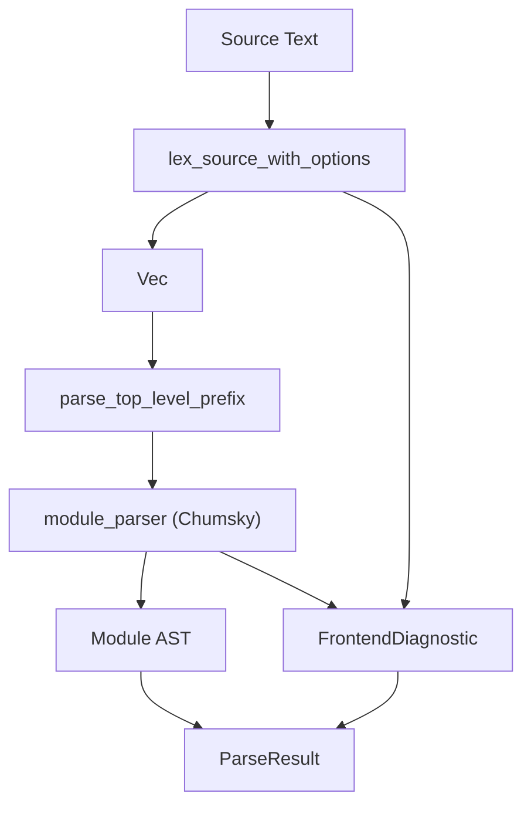

# 第5章: 構文解析 (Parsing)

## 1. 概要 (Introduction)

本章では、字句解析によって得られたトークン列を入力とし、AST（抽象構文木）を構築する構文解析フェーズについて解説します。

Reml のフロントエンドにおいて、構文解析の中核を担うのは `compiler/frontend/src/parser` モジュールです。ここには、Chumsky ライブラリを用いたパーサコンビネータ実装と、それらを統括する `ParserDriver` が存在します。
`ParserDriver` は単に構文解析を行うだけでなく、字句解析、構文解析、そして診断（Diagnostics）の統合を一手に引き受けます。

Reml のパーサには、「解析結果の観測性（Observability）」という際立った特徴があります。
`ParseResult` 型は、生成された AST だけでなく、Packrat 解析の統計情報、ソーススパンのトレース、ストリーミング解析のためのメタ情報などを含んでいます。これにより、CLI や LSP が解析プロセスを可視化したり、大規模なソースコードをストリーミング処理したりすることが可能になっています。



## 2. データ構造 (Key Data Structures)

### 2.1 パーサ API の中核型

`parser/api.rs` では、仕様 `docs/spec/2-1-parser-type.md` に準拠した型定義が行われています。これらはコンパイラ全体で解析結果をやり取りするための共通言語となります。

- **`RunConfig`** (`compiler/frontend/src/parser/api.rs:47`)
  解析時の挙動を制御する設定オブジェクトです。Packrat キャッシュの有効化、トレースの有無、左再帰の自動判定モードなどを指定できます。`extensions` フィールドを通じて、将来的な機能拡張にも柔軟に対応できる設計となっています。

- **`Input`** (`compiler/frontend/src/parser/api.rs:118`)
  入力ソースコードと現在の読み取り位置 (`offset`) を保持する軽量なビューです。`advance` メソッドによって位置を進めた新しいビューを生成します。

- **`Reply<T>`** (`compiler/frontend/src/parser/api.rs:210`)
  `Parser<T>` 関数の戻り値として、解析の成功 (`Ok`) または失敗 (`Err`) を表現します。消費されたトークン量 (`consumed`) や、バックトラックの可否に関わるコミット状態 (`committed`) も管理します。

- **`ParseResult<T>`** (`compiler/frontend/src/parser/api.rs:225`)
  CLI や LSP などの呼び出し元へ返される最終的な解析結果です。AST (`value`) や診断情報 (`diagnostics`) に加え、パフォーマンスチューニングに役立つ Packrat 統計 (`packrat_stats`) やスパンのトレース情報 (`span_trace`) を集約しています。

### 2.2 AST の構造

構文解析の出力である AST は `parser/ast.rs` に定義されています。
トップレベルのルートとなるのは `Module` 構造体であり、宣言 (`Decl`)、関数 (`Function`)、式 (`Expr`) などの要素を包括しています。

- **`Module`** (`compiler/frontend/src/parser/ast.rs:6`)
  ソースファイル全体を表現するノードです。`ModuleHeader`（モジュールの宣言）、`UseDecl`（インポート）、そして `ModuleBody`（本文）から構成されます。

- **`FixityKind`** (`compiler/frontend/src/parser/ast.rs:179`)
  演算子の結合性（`InfixLeft`, `InfixRight` など）や位置（`Prefix`, `Postfix`）を表現します。Reml では演算子定義が柔軟であるため、AST レベルでこれを明示的に管理しています。

- **Render トレイト**
  `Module::render` のように、各 AST ノードは自身をソースコード文字列へと再構築する簡易的な機能を持っています。これはデバッグや簡易フォーマッタとして役立ちます。

### 2.3 解析トレース

デバッグや可視化のために、構文解析中のイベントを記録する `ParserTraceEvent` が用意されています (`compiler/frontend/src/parser/mod.rs:86`)。
例えば、「式の解析開始 (`ExprEnter`)」や「モジュールヘッダの受理 (`ModuleHeaderAccepted`)」といったイベントが、タイムスタンプやスパン情報と共に記録されます。

## 3. アルゴリズムと実装 (Core Logic)

### 3.1 `ParserDriver` による統合フロー

構文解析のメインエントリポイントは `ParserDriver::parse_with_options` です (`compiler/frontend/src/parser/mod.rs:344`)。
このメソッドは、以下のステップでソースコードを AST へと変換します。

1. **字句解析の実行**:
   `lex_source_with_options` を呼び出し、ソーステキストをトークン列 (`Vec<Token>`) へと変換します。同時に Lexer レベルのエラー（未知の文字など）も収集します。

2. **トークン列の解析 (`parse_tokens`)**:
   生成されたトークン列を `parse_tokens` 関数へ渡します。ここで Chumsky パーサが起動し、AST の構築と構文エラーの検出が行われます。この際、ストリーミング解析用の状態 (`StreamingState`) も考慮されます。

3. **診断情報の統合**:
   Lexer エラーと Parser エラーを `DiagnosticBuilder` に統合します。エラー発生位置のソーススパン情報などを付与し、ユーザーに提示可能な形式へと整形します。

4. **AST の後処理**:
   AST が生成された場合、追加の整合性チェックを行います。例えば、`handle` 式における `with` 句の欠落などをこの段階で検出し、診断情報を追加します (`compiler/frontend/src/parser/mod.rs:400`)。

5. **結果のパッケージング**:
   最終的に `ParsedModule` 構造体にすべての情報を詰め込み、`ParseResult` として返却します。

### 3.2 トップレベル Prefix の先行抽出

Reml のパーサには、通常の再帰下降解析の前処理として `parse_top_level_prefix` という独自の手順が存在します (`compiler/frontend/src/parser/mod.rs:5802`)。
これは、ファイル先頭にある `module` 宣言と `use` 宣言（インポート）のみを先行して抽出する処理です。

- **目的**: 依存関係解決や増分コンパイルのために、ファイルの完全なパースを待たずにモジュール名や依存先を知る必要があるためです。また、文法エラーがファイルの後半にあっても、ヘッダ情報は確実に取得したいという意図もあります。
- **実装**: トークン列を先頭からスキャンし、`module ...;` や `use ...;` のパターンにマッチするトークンを直接処理して AST ノード (`ModuleHeader`, `UseDecl`) を生成します。
- **統合**: ここで消費されたトークン数は記録され、メインの Chumsky パーサはその後続トークンから解析を開始します。

### 3.3 `module_parser` による文法定義

実際の構文規則は `module_parser` 関数内で Chumsky のコンビネータを用いて定義されています (`compiler/frontend/src/parser/mod.rs:2094`)。

例えば、識別子（Identifier）の解析ルールは以下のように定義されています。

```rust
let identifier = choice((
    just(TokenKind::Identifier),
    just(TokenKind::UpperIdentifier),
    // ...
)).map_with_span(|_, span| { ... });
```

予約語（キーワード）の扱いは `context_keyword` ヘルパー関数によって制御され、文脈に応じて識別子として使えるかどうかが判定されます。
最終的に、これらの小さなパーサ部品が組み合わされ、`module_item` の繰り返しとしてモジュール全体を解析する巨大なパーサが構築されます。

## 4. エラー処理 (Error Handling)

構文解析におけるエラー処理は、発生源に応じて二段階で管理されます。

1. **字句解析エラー**:
   Lexer が報告した `FrontendError` は、`error_to_diagnostic` メソッドによって `FrontendDiagnostic` へ変換されます。この際、`CODE_UNKNOWN_TOKEN` などのエラーコードが付与され、スキップされた旨が注記されます (`compiler/frontend/src/parser/mod.rs:426`)。

2. **構文解析エラー**:
   Chumsky が報告する `Simple` エラーは、`build_expected_summary` によって、「何が期待されていたか（expected tokens）」という情報に要約されます (`compiler/frontend/src/parser/mod.rs:678`)。
   ストリーミング解析時には、大量のエラーによるノイズを防ぐため、`StreamingRecoverController` がエラーを集約し、チェックポイント単位で報告数を制限する制御を行います。

この多層的なアプローチにより、致命的なエラーが発生しても可能な限り解析を続行し、IDE での補完やハイライトに必要な部分的な AST を提供できるようにしています。

## 5. 発展的トピック (Advanced Topics)

### 5.1 Packrat 解析と Span Trace

Reml のパーサは Packrat 解析（メモ化）をサポートしており、`RunConfig` で有効化できます。これにより、バックトラック時の再解析コストを削減し、パフォーマンスを向上させています。
解析結果には `packrat_stats` が含まれており、キャッシュのヒット率などを確認できます。また、`span_trace` を有効にすると、どのスパンがどのルールで解析されたかを詳細に追跡できるため、パーサ自体のデバッグに有用です。

### 5.2 ストリーミング実行

`StreamingRunner` は、入力を小さなチャンクに分割して解析するための仕組みです (`compiler/frontend/src/parser/streaming_runner.rs`)。
`RunConfig` の拡張設定で `chunk_size` を指定することで、巨大なファイルを一度にメモリに読み込むことなく、逐次的に解析を進めることが可能です。これは将来的な大規模プロジェクトや、メモリ制約のある環境での動作を見据えた設計です。

### 5.3 トップレベル式の許容

通常、Reml のトップレベルには宣言のみが記述できますが、スクリプト実行や REPL のような用途のために `allow_top_level_expr` オプションが存在します。
これを有効にすると、診断収集フェーズでのチェックが緩和され、トップレベルに式を書くことが許容されます (`compiler/frontend/src/parser/mod.rs:403`)。

## 6. 章末まとめ (Checkpoint)

- 構文解析の入口は `ParserDriver::parse_with_options` であり、字句解析から AST 構築、診断生成までのパイプラインを管理しています。
- 主要な文法は Chumsky コンビネータを用いた `module_parser` で定義されており、宣言的で保守性の高い記述になっています。
- `parse_top_level_prefix` によるヘッダ情報の先行抽出戦略により、依存関係解決の効率性と堅牢性を高めています。
- 解析結果 `ParseResult` は、単なる AST のコンテナにとどまらず、Packrat 統計やトレース情報を含む「観測可能な」オブジェクトです。

次章「第6章: 診断と出力」では、パーサを含む各フェーズで生成された `FrontendDiagnostic` が、どのように整形され、開発者に理解しやすいエラーメッセージとして出力されるかを詳しく見ていきます。
