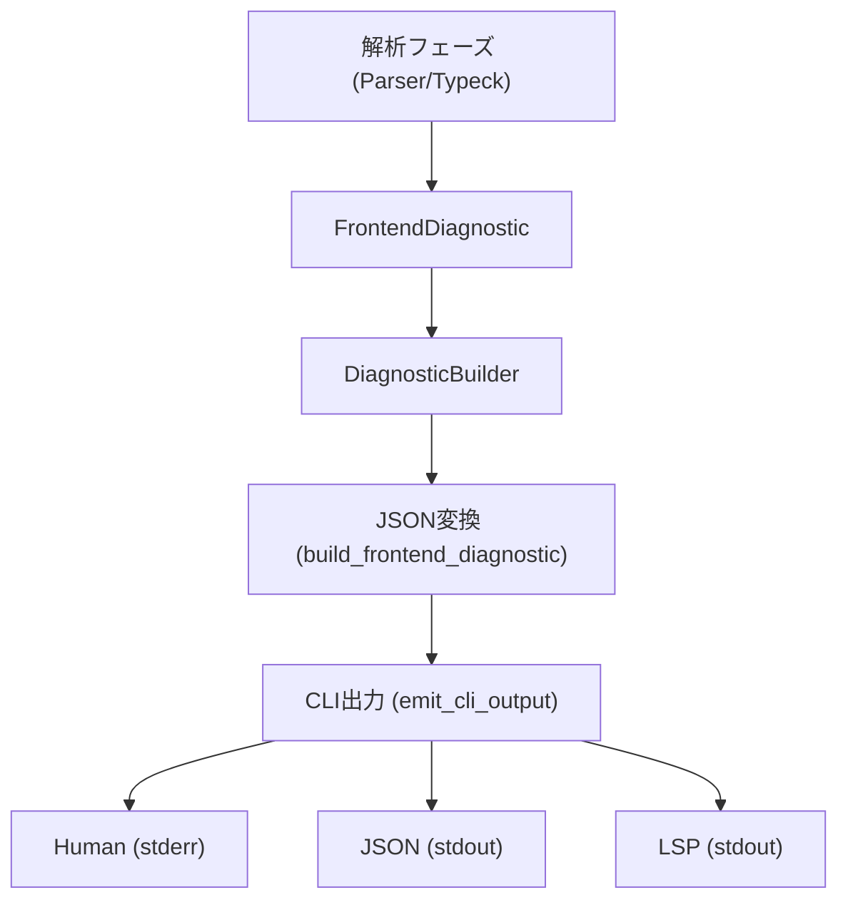

# 第6章: 診断と出力

## 1. 概要 (Introduction)

本章では、Reml コンパイラのフロントエンドが、解析中に発生したエラーや警告をどのように取り扱い、開発者にフィードバックするかについて解説します。

コンパイラにとって、「診断（Diagnostic）」は単なるエラーメッセージの表示以上の重要な役割を持ちます。それはユーザーと対話し、問題の所在を正確に伝え、可能な限りの修正案を示すためのインターフェースです。特に Reml のような現代的な言語では、LSP（Language Server Protocol）や構造化ログ（JSON）への対応が不可欠であり、人間が読むためのテキスト出力と、機械が処理するためのデータ出力を統一的に扱う必要があります。

Reml の診断システムは、`compiler/frontend/src/diagnostic` モジュールを中心に構築されています。ここでは以下の責務を担います。

1. **統一モデル**: パーサ、型検査、その他のフェーズから発生するあらゆる問題を `FrontendDiagnostic` という単一の構造体で表現します。
2. **回復と提案**: 単にエラーを報告するだけでなく、「期待されるトークン」や「修正コード（Fix-It）」を含めることで、ユーザーの次のアクションを支援します。
3. **監査と追跡**: どのバージョンのコンパイラが、どのようなコンテキストでエラーを出したかを追跡するための「監査（Audit）」情報を付与します。
4. **多態な出力**: コマンドライン引数 `--output` に応じて、人間向けのテキスト、CI 向けの JSON、エディタ向けの LSP プロトコルへと出力を切り替えます。

この章を通じて、エラーが発生してから、それがユーザーの端末に表示されるまでのデータの流れを追跡します。



## 2. データ構造 (Key Data Structures)

診断システムの核となるデータ構造は、情報の粒度と拡張性を両立するように設計されています。

### 2.1 診断モデル: `FrontendDiagnostic`

すべての診断情報の基底となるのが、`compiler/frontend/src/diagnostic/model.rs` で定義されている `FrontendDiagnostic` 構造体です。この構造体は、エラーの内容、発生場所、深刻度などの基本情報に加え、豊富な拡張フィールドを持っています。

```rust
// compiler/frontend/src/diagnostic/model.rs

pub struct FrontendDiagnostic {
    pub id: Option<Uuid>,                  // 診断の一意識別子
    pub message: String,                   // 人間向けのメッセージ
    pub severity: Option<DiagnosticSeverity>, // Error, Warning, Info, Hint
    pub domain: Option<DiagnosticDomain>,  // エラーの発生源 (Parser, Type, etc.)
    
    // 位置情報
    span: Span,                            // エラーの主たる箇所
    pub span_trace: Vec<TraceFrame>,       // マクロ展開などのトレース情報
    pub secondary_spans: Vec<DiagnosticSpanLabel>, // 関連する箇所の注釈
    
    // 回復と提案
    pub fixits: Vec<DiagnosticFixIt>,      // 自動修正のための情報
    pub expected_tokens: Vec<String>,      // 期待されていたトークン群
    pub expected_alternatives: Vec<ExpectedToken>, // より詳細な期待トークン情報
    
    // メタデータ
    pub audit: AuditEnvelope,              // 監査用エンベロープ
    pub extensions: Map<String, Value>,    // 任意の追加データ
    // ... 他多数のフィールド
}
```

このモデルの特徴は、`extensions` や `audit` といったフィールドを通じて、将来的な要件変更や外部ツールとの連携に柔軟に対応できる点にあります。

### 2.2 期待トークン: `ExpectedToken`

構文エラーからの回復において、「本来来るはずだったもの」をユーザーに伝えることは非常に重要です。`ExpectedToken` 列挙型は、単なる文字列ではなく、そのトークンの意味的な分類（キーワード、識別子、型など）を保持します。

```rust
// compiler/frontend/src/diagnostic/recover.rs

pub enum ExpectedToken {
    Keyword(String),    // "fn", "let" など
    Token(String),      // ";", "{" など
    Class(String),      // "identifier", "literal" など
    Rule(String),       // "expression", "type" など
    // ...
}
```

これにより、例えば「ここで `fn`、識別子、または式が必要です」といった、文脈に即した自然なエラーメッセージを生成することが可能になります。

### 2.3 監査エンベロープ: `AuditEnvelope`

エンタープライズ利用や大規模開発を見据え、Reml は診断情報に「監査情報」を含めます。これが `AuditEnvelope` です。

- **`audit_id`**: エラー発生を一意に特定する UUID。
- **`metadata`**: 実行時のコマンドライン引数、タイムスタンプ、Git コミット ID などの環境情報。
- **`capability`**: エラーがセキュリティや権限（Capability）に関連する場合、その種別。

この情報は、バグ報告やセキュリティ監査において、問題が発生した正確な状況を再現するために役立ちます。

## 3. アルゴリズムと実装 (Core Logic)

診断情報は、発生から出力まで、いくつかの変換ステップを経てユーザーに届きます。

### 3.1 診断の組み立て: `DiagnosticBuilder`

各解析フェーズ（Parser や TypeCheck）では、エラーを検出すると `FrontendDiagnostic` を生成し、`DiagnosticBuilder` に追加していきます（`compiler/frontend/src/diagnostic/model.rs`）。

ここで重要なのが、`DiagnosticBuilder` による「重複の排除」と「マージ」です。特にパーサのエラー回復中には、同じ位置で「Aが期待される」「Bが期待される」という報告が複数回発生することがあります。`DiagnosticBuilder` はこれらを検知し、一つの診断メッセージ内の「期待される候補（alternatives）」として統合します。

```rust
// 重複排除のイメージ
builder.push(diag_expecting_fn);
builder.push(diag_expecting_let);
// -> 出力: "ここで `fn` または `let` が必要です" (1つのエラーとして報告)
```

このロジックにより、大量のエラーでユーザーを圧倒することなく、整理された情報を提供します。

### 3.2 JSON への変換と位置計算

CLI や LSP で出力するためには、内部モデルを JSON 形式に変換する必要があります。この役割を担うのが `compiler/frontend/src/diagnostic/json.rs` の `build_frontend_diagnostic` 関数です。

ここでは、ソースコード上のバイトオフセット（`Span`）を、人間が理解できる「行・列番号」に変換する処理が行われます。これを効率的に行うために `LineIndex` という軽量な構造体が使われます。

- **`primary` フィールド**: エラー箇所の行番号、列番号に加え、該当行のテキストと、エラー箇所を指し示すハイライト情報（`^^^^` のような文字列）を含みます。これは主に人間向けの表示に使われます。
- **`location` フィールド**: LSP 仕様に準拠した形式（0-indexed の行・列番号）で位置情報を出力します。

このように、一つの JSON オブジェクトの中に、用途の異なる複数の位置情報表現を共存させることで、多様なクライアントに対応しています。

### 3.3 期待トークンの集約と要約

`compiler/frontend/src/diagnostic/recover.rs` にある `ExpectedTokenCollector` は、収集された期待トークン群を整理する重要なアルゴリズムを含んでいます。

1. **優先順位付け**: キーワード、具体的な記号、抽象的なクラス（識別子など）の順に並べ替えます。
2. **重複排除**: 同じ意味のトークンをまとめます。
3. **要約**: 数が多い場合はリストとして整形し、人間が読みやすいメッセージ（"humanized" message）を生成します。

```rust
// compiler/frontend/src/diagnostic/recover.rs:197
pub fn summarize(&self) -> ExpectedTokensSummary {
    // ... 整列と重複排除を行い、メッセージキーと引数を生成 ...
}
```

### 3.4 CLI 出力のルーティング

最終的な出力は `compiler/frontend/src/output/cli.rs` の `emit_cli_output` 関数によって制御されます。ここでは `--output` オプションの値（`human`, `json`, `lsp`）に応じて処理が分岐します。

- **Human**: 標準エラー出力（stderr）に、色付きのテキストでエラーを表示します。ハイライト情報や関連するコードスニペットもここで整形されます。
- **JSON**: 標準出力（stdout）に、診断情報の配列を含む JSON オブジェクト（`CliDiagnosticEnvelope`）を出力します。CI ツールなどはこれを解析します。
- **LSP**: 標準出力に、LSP の `textDocument/publishDiagnostics` 通知の形式で JSON を出力します。

特筆すべきは、LSP モードにおいても、Reml 独自の詳細な JSON 構造体（`FrontendDiagnostic` の内容）が、LSP の `data` フィールドにそのまま埋め込まれる点です（`cli.rs:296`）。これにより、Reml 専用のエディタ拡張機能は、標準の LSP クライアントよりもリッチな情報（詳細な修正提案や監査IDなど）を利用することができます。

## 4. エラー処理 (Error Handling)

診断システム自体もまた、堅牢である必要があります。

- **必須フィールドの検証**: `DiagnosticBuilder` は、`severity`（深刻度）、`domain`（領域）、`code`（エラーコード）が設定されていない診断を登録しようとすると、`DiagnosticBuilderError` を返します。これにより、不完全な診断情報が出力されることを防ぎます。
- **監査IDの自動生成**: もし実行環境から監査IDが得られない場合でも、`formatter.rs` の `ensure_audit_id` が現在のタイムスタンプや環境情報から決定論的な UUID を生成し、追跡可能性を維持します。

## 5. 発展的トピック (Advanced Topics)

### 5.1 診断のローカライズ

Reml は国際化を考慮して設計されています。`FrontendDiagnostic` はハードコードされたメッセージだけでなく、メッセージキー（`message_key`）と引数（`locale_args`）を持ちます。
CLI 出力時（Human モード）には、これらのキーを用いて適切な言語のリソースを検索し、翻訳されたメッセージを表示することが可能です（`compiler/frontend/src/output/localization.rs`）。

### 5.2 ストリーミング解析時の診断

巨大なファイルを扱う「ストリーミング解析」においては、ファイル全体の解析を待たずに診断を出力する必要があります。`compiler/frontend/src/diagnostic/recover.rs` はストリーミングモード用の特別な要約ロジックを持っており、不完全な構文木の状態でも、そこから推測できる「次に期待されるトークン」のセット（プレースホルダー的なもの）を提供します。

## 6. 章末まとめ (Checkpoint)

- **統合されたモデル**: `FrontendDiagnostic` は、あらゆるフェーズのエラーを表現する高機能な構造体であり、詳細な位置情報、回復提案、監査メタデータを保持します。
- **ビルダーパターン**: `DiagnosticBuilder` は診断の重複を排除し、関連する情報をマージすることで、ノイズの少ないクリアな出力を生成します。
- **柔軟な出力**: `LineIndex` による正確な位置計算と、JSON/LSP 形式への変換ロジックにより、人間と機械の両方にとって親和性の高い出力を実現しています。
- **監査への配慮**: すべてのエラーには一意な ID と環境コンテキストが付与され、大規模なシステムにおける運用とデバッグを容易にしています。

次章「第7章: 型チェックと型推論」では、ここで解説した診断システムが、型システムという複雑な領域でどのように活用され、型不整合などの難解なエラーをユーザーに分かりやすく伝えているかを見ていきます。
