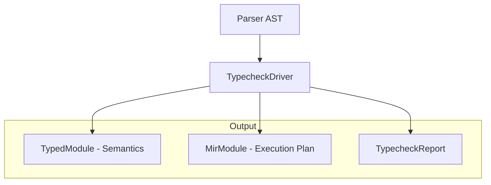

# 第8章: 意味解析 (Semantic Analysis)

## 1. 概要 (Introduction)

本章では、Reml コンパイラのフロントエンドにおける「意味解析」のプロセスと、その成果物である **型付き AST（Typed AST）** および **MIR（Mid-level IR）** について解説します。

一般的なコンパイラ構成では、意味解析（Semantic Analysis）は構文解析の後に独立したパスとして実行されることが多いですが、Reml では**型推論 (Type Inference)** と**意味解析**が密接に統合されています。具体的には、`TypecheckDriver` という単一のドライバが、AST のトラバース、型制約の解決、そして中間表現の構築を一挙に行います。

この設計には以下の意図があります。

1. **効率性**: AST を何度も走査するコストを削減し、単一のパスで必要な情報を収集します。
2. **堅牢性**: 型エラーが発生した場合でも、可能な限り多くの意味情報（解決できた型やシンボル）を保持した中間表現を生成し、言語サーバー (LSP) 等のツールが利用できるようにします。

本章を読むことで、Reml のソースコードがどのようにして「型情報を持つ木構造 (Typed AST)」と「実行に適したフラットな表現 (MIR)」へと変換されるかを理解できます。

### 入力と出力

- **入力**:
  - `Parser AST` (`compiler/frontend/src/parser/ast.rs`): 構文解析の結果。
  - `TypecheckConfig`: トレース設定などのコンフィグレーション。
- **出力 (`TypecheckReport`)**:
  - `TypedModule` (`compiler/frontend/src/semantics/typed.rs`): 型情報が付与された AST。
  - `MirModule` (`compiler/frontend/src/semantics/mir.rs`): バックエンド向けに正規化・平坦化された中間表現。
  - `TypecheckViolation` (`compiler/frontend/src/typeck/driver.rs`): 検出された型エラーや意味論的エラーのリスト。



## 2. データ構造 (Key Data Structures)

意味解析の成果物は `compiler/frontend/src/semantics` モジュールに定義されています。ここでは主要なデータ構造を見ていきます。

### 2.1 Typed AST (`TypedModule`)

`TypedModule` は、ソースコードの構造を維持しつつ、すべての式やパターンに型情報 (`ty`) と Trait 辞書の参照 (`dict_ref_ids`) を付与したものです。

[`compiler/frontend/src/semantics/typed.rs`](compiler/frontend/src/semantics/typed.rs)

```rust
pub struct TypedModule {
    pub functions: Vec<TypedFunction>,
    pub active_patterns: Vec<TypedActivePattern>,
    pub conductors: Vec<TypedConductor>,
    pub actor_specs: Vec<TypedActorSpec>,
    pub externs: Vec<TypedExtern>,
    pub dict_refs: Vec<DictRef>,   // 解決された Trait 実装への参照
    pub schemes: Vec<SchemeInfo>,  // 汎化された型スキーム
}
```

特に重要なのが `TypedExpr` 構造体です。Reml では「型推論の結果、どの Trait 実装が使われるか」もここで確定されます。

```rust
pub struct TypedExpr {
    pub span: Span,
    pub kind: TypedExprKind,
    pub ty: String,                  // 推論された型（文字列表現）
    pub dict_ref_ids: Vec<DictRefId>, // この式で利用される Trait 辞書の ID リスト
}
```

### 2.2 QualifiedCall と Trait 解決のヒント

メソッド呼び出しや関連関数の呼び出しは、構文上は単なる `Call` として現れますが、意味解析によってその実体が特定されます。`TypedExprKind::Call` には `QualifiedCall` オプションがあり、呼び出しの種類が記録されます。

[`compiler/frontend/src/semantics/typed.rs`](compiler/frontend/src/semantics/typed.rs)

```rust
pub struct QualifiedCall {
    pub kind: QualifiedCallKind, // TypeMethod, TraitMethod など
    pub owner: Option<String>,   // 所有する型や Trait の名前
    pub name: Option<String>,    // メソッド名
    pub impl_id: Option<String>, // 特定された impl ブロックの ID
}
```

これにより、後続のフェーズでは「どの型のどのメソッドを呼ぶか」を再検索する必要がなくなります。

### 2.3 MIR (`MirModule`)

MIR (Mid-level IR) は、Typed AST を**実行**や**コード生成**に適した形に変形したものです。Typed AST との最大の違いは、**式がフラットな配列 (`Vec<MirExpr>`) で管理され、ID (`MirExprId`) で参照される**点です。

[`compiler/frontend/src/semantics/mir.rs`](compiler/frontend/src/semantics/mir.rs)

```rust
pub struct MirFunction {
    pub name: String,
    pub body: MirExprId,       // エントリポイントとなる式の ID
    pub exprs: Vec<MirExpr>,   // フラット化された式のアリーナ
    // ...
}
```

MIR では、ブロック式 (`Block`) も整理され、`defer` 文の実行順序が確定された状態 (`defer_lifo`) で保持されます。これにより、ランタイムやバックエンドはスコープ脱出時の処理を単純に実行するだけで済みます。

## 3. アルゴリズムと実装 (Core Logic)

意味解析の中核ロジックは `compiler/frontend/src/typeck/driver.rs` にある `TypecheckDriver::infer_module_from_ast` です。この関数は以下のステップで処理を進めます。

### 3.1 推論と構築の同時進行

`TypecheckDriver` は AST をトップダウンに走査 (`infer_decl`, `infer_function`, `infer_expr`) しながら、同時に2つの作業を行います。

1. **制約の生成と解決**: 変数の型を決定するための制約 (`Constraint`) を発行し、ソルバ (`ConstraintSolver`) で解きます。
2. **Typed AST の構築**: 推論の過程で得られた情報を元に、`TypedExprDraft`（未確定の型変数を含む仮の AST）を生成します。

```rust
// compiler/frontend/src/typeck/driver.rs (概念コード)
fn infer_module_from_ast(...) {
    // 1. 各宣言（関数、型、implなど）を推論
    // 2. TypedExprDraft を生成
    // 3. 最後に finalize_typed_expr で型変数を確定型に置換
}
```

### 3.2 二段階の型確定プロセス (`finalize_typed_expr`)

推論中は、まだ型が完全に決まっていない（型変数のままの）部分があります。そのため、まずは `TypedExprDraft` という中間構造体を作り、モジュール全体の推論が終わってすべての制約が解けた段階で、`finalize_typed_expr` を呼び出します。

[`compiler/frontend/src/typeck/driver.rs`](compiler/frontend/src/typeck/driver.rs)

この関数は、`TypecheckDriver` が持つ `Substitution`（型変数の置換マップ）を用いて、`TypedExprDraft` 内の全ての型変数を具体的な型（例: `?0` → `Int`）に置き換え、最終的な `TypedExpr` を生成します。この設計により、**相互再帰的な関数や複雑な推論が必要な箇所でも、AST の構造を一度作るだけで済む**ようになっています。

### 3.3 MIR への変換 (`Lowering`)

`TypedModule` が完成すると、即座に `MirModule::from_typed_module` が呼び出され、MIR への変換（Lowering）が行われます。

[`compiler/frontend/src/semantics/mir.rs`](compiler/frontend/src/semantics/mir.rs)

この変換プロセスには、いくつかの重要な正規化が含まれます。

- **型ラベルの正規化**: `normalize_mir_type_label` 関数により、例えば `Int` は `i64` に、`Unit` は `()` に正規化されます。これはバックエンド（LLVM や ランタイム）との整合性を取るためです。
- **Panic の特別化**: `panic` 関数の呼び出しは、通常の関数呼び出し (`Call`) から `MirExprKind::Panic` という専用の命令に変換されます。
- **Match の計画化**: パターンマッチは `MatchLoweringPlan` という構造体に分析結果が格納され、どの順序でパターンを評価すべきか、失敗時にどこへジャンプすべきか等の戦略が決定されます。

### 3.4 Trait 候補の探索と統合

興味深い点として、Trait メソッドの解決（どの `impl` を使うか）の一部は、MIR 生成後に行われます。

1. `infer_expr` の段階で、メソッド呼び出しの形状（`FieldAccess` や `ModulePath`）から `QualifiedCall` を生成し、「これは Trait メソッドの可能性がある」とマークします。
2. MIR 生成後に `populate_qualified_call_candidates` が走ります。ここで、モジュール内の全 `impl` (`MirImplSpec`) をスキャンし、利用可能な候補 (`impl_candidates`) をリストアップします。

[`compiler/frontend/src/typeck/driver.rs`](compiler/frontend/src/typeck/driver.rs)

候補が1つに絞られれば `impl_id` が確定しますが、複数ある場合や見つからない場合は、エラーにはせず候補リストを持たせたままにします。これにより、IDE での補完候補表示や、後続のステップでの詳細なエラー報告が可能になります。

## 4. エラー処理 (Error Handling)

意味解析のエラーは `TypecheckViolation` として `TypecheckReport` に集約されます。

[`compiler/frontend/src/typeck/driver.rs`](compiler/frontend/src/typeck/driver.rs)

Reml のコンパイラは「エラー許容型 (Error Tolerant)」の設計を目指しており、型エラーが発生しても処理を中断せず、可能な限り解析を続行します。
例えば、型が不一致でも `TypedExpr` は生成され（型は `error` 型になる場合があります）、MIR も生成されます。これにより、開発者はコンパイルエラーがある状態でも、コードの他の部分については正しい補完や定義ジャンプを利用できます。

## 5. 発展的トピック (Advanced Topics)

### 5.1 MatchLoweringPlan の詳細

`builder.rs` や `semantics/mir.rs` で生成される `MatchLoweringPlan` は、バックエンドが効率的な分岐コード生成を行うための青写真です。

[`compiler/frontend/src/semantics/mir.rs`](compiler/frontend/src/semantics/mir.rs)

各パターンについて `miss_on_none`（None の場合にマッチ失敗とみなすか）や `always_matches`（常に成功するか）といったフラグが事前計算されます。これは、Reml の強力なパターンマッチ（Active Pattern を含む）を、低レベルな条件分岐に落とし込むための重要なステップです。

### 5.2 ストリーミング実行への布石

MIR で `functions` とは別に `conductors` が保持されていることに注目してください。Conductor は Reml のストリーミング処理の中核機能であり、MIR の段階で `MirConductor` として定義が保持されます。これらは後続の `pipeline` モジュールで、データフローグラフへと変換されます。

## 6. 章末まとめ (Checkpoint)

- 意味解析は `TypecheckDriver` によって行われ、型推論と同時に **Typed AST** と **MIR** を生成します。
- **Typed AST** は型情報と Trait 辞書IDを持つ木構造で、**MIR** は式IDによる参照を持つフラットな構造です。
- `QualifiedCall` と `MatchLoweringPlan` により、実行時に必要な「どのメソッドを呼ぶか」「どう分岐するか」の情報が静的に解決・整理されます。
- エラーが発生しても解析結果 (AST/MIR) は生成されるため、Language Server 等での利用に適しています。

次章「第9章: 実行パイプライン」では、ここで生成された MIR が、どのようにしてランタイムで実行可能な構造（パイプライン）へと変換されるかを見ていきます。

---

## 関連仕様

- [Language Core Overview](file:///docs/spec/1-0-language-core-overview.md)
- [Syntax](file:///docs/spec/1-1-syntax.md)
