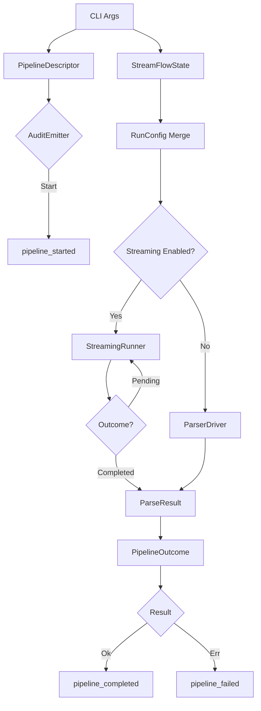

# 第9章: 実行パイプライン

## 1. 概要 (Introduction)

本章では、Reml フロントエンドが CLI 実行を受け取ってから、診断・監査イベント・パース結果を生成するまでの「実行パイプライン」について解説します。
このパイプラインは、単なる関数の呼び出し順序だけでなく、監査可能性（Auditability）と中断・再開可能なストリーミング実行（Streaming Execution）を支える重要なインフラストラクチャです。

主な対象モジュールは以下の通りです。

- **パイプライン基盤**: `compiler/frontend/src/pipeline`
- **ストリーミング状態**: `compiler/frontend/src/streaming`
- **オーケストレーション**: `compiler/frontend/src/bin/reml_frontend.rs`（CLI エントリポイント）
- **実行ランナー**: `compiler/frontend/src/parser/streaming_runner.rs`

この章で理解すべき重要な概念は以下の 2 点です。

1.  **監査パイプライン**: すべての CLI 実行を 1 回の「パイプライン実行」として識別し、開始・完了・失敗のライフサイクルを厳密に追跡します。これにより、コンパイラの動作が常に追跡可能（Traceable）であることを保証します。
2.  **ストリーミング実行**: 長大な入力や非同期な入力を効率的に処理するために、パーサーの状態を保持・再開する機構です。Packrat キャッシュと `span_trace` を活用し、部分的な解析結果を積み上げることで、柔軟な実行制御を実現します。

### 入力と出力

-   **入力**:
    -   **CLI 引数 / 入力ファイル**: 解析対象のソースコード。
    -   **RunConfig**: ストリーミング設定やトレース設定を含む実行構成。
    -   `reml_frontend` はこれらを元に `PipelineDescriptor` と `StreamFlowState` を初期化します（`compiler/frontend/src/bin/reml_frontend.rs:545` 付近）。
-   **出力**:
    -   **監査イベント**: JSON ライン形式で出力される構造化ログ（`AuditEmitter` 経由）。
    -   **パース結果**: AST、トークン列、診断情報の集合。
    -   **ストリーミング統計**: Packrat キャッシュのヒット率やメモリ使用量などのメトリクス。

## 2. データ構造 (Key Data Structures)

実行パイプラインを支える主要なデータ構造を見ていきましょう。

### 2.1 PipelineDescriptor / AuditEmitter

これらは「監査パイプライン」の中核を担う構造体です。

-   **`PipelineDescriptor`** (`compiler/frontend/src/pipeline/mod.rs`):
    -   CLI 実行のコンテキスト（入力パス、コマンド、Run ID、プログラム名など）を一元管理します。
    -   すべての監査イベントに共通するメタデータ（`base_metadata`）を生成する責務を持ちます。これにより、ログの相関付けが容易になります。

-   **`AuditEmitter`** (`compiler/frontend/src/pipeline/mod.rs`):
    -   監査イベントの発行を抽象化します。標準エラー出力への書き出しを担当し、イベントの生成メソッド（`pipeline_started`, `pipeline_completed`, `pipeline_failed`）を提供します。
    -   各イベントは `AuditEnvelope` に包まれ、一意の ID とタイムスタンプが付与されます。

### 2.2 StreamingState / Packrat / SpanTrace

ストリーミング実行において、解析の「途中経過」と「記憶」を保持するための構造です。`compiler/frontend/src/streaming/mod.rs` で定義されています。

-   **`StreamingState`**:
    -   スレッドセーフ（`Arc<StreamingStateShared>`）な状態コンテナです。以下の 2 つの主要なコンポーネントを管理します。

-   **`PackratEntry` / `PackratCache`**:
    -   Packrat パースの中核となるメモ化テーブルです。`(ParserId, Range)` をキーとして、解析結果（`TokenSample` や期待されるトークン集合 `Expectation`）をキャッシュします。
    -   メモリ使用量を抑制するため、`approx_bytes` でサイズを見積もり、予算（Budget）を超えた場合に古いエントリを破棄する LRU ライクな機構を備えています。

-   **`TraceFrame` / `SpanTrace`**:
    -   エラー発生時のコンテキストを追跡するための軽量なスタックトレースです。
    -   `VecDeque` を用いて直近の N 件（デフォルト 128）のフレームを保持し、診断情報に「過去にどのパスを通ってきたか」という文脈を付与することができます。

### 2.3 StreamFlowState / RuntimeBridgeSignal

外部ランタイム（Reml Runtime）との連携や、実行フローの制御状態を管理します。`compiler/frontend/src/streaming/flow.rs` で定義されています。

-   **`StreamFlowState`**:
    -   CLI オプション（`--stream-chunk-size` など）から生成されるフロー設定を保持します。
    -   バックプレッシャー（背圧制御）やチェックポイントの通過回数などの統計情報を集計します。

-   **`RuntimeBridgeSignal`**:
    -   コンパイラ（Frontend）からランタイムへ渡すべきシグナル（`Await`、`Resume`、`Backpressure` など）を表現します。
    -   これは、コンパイラが単なるバッチ処理だけでなく、インタラクティブな実行基盤の一部として組み込まれることを想定した設計です。

### 2.4 StreamingRunner / Continuation / StreamOutcome

`ParserDriver` をラップし、中断・再開可能な実行を提供するランナーです。`compiler/frontend/src/parser/streaming_runner.rs` で定義されています。

-   **`StreamingRunner`**:
    -   パースの実行主体です。`run_stream` メソッドを持ち、指定されたチャンクサイズ分だけ入力を処理して一時停止することができます。

-   **`Continuation`**:
    -   「続き」を実行するために必要なすべての状態（バッファ、オプション、カーソル位置、ストリーミング状態）を保持する構造体です。
    -   これを保持しておけば、任意のタイミングでパースを再開（`resume`）できます。

-   **`StreamOutcome`**:
    -   実行結果を表す Enum です。
        -   `Completed`: 解析が完了した状態。`ParseResult` を含みます。
        -   `Pending`: まだ入力が必要、あるいはチャンクの境界で一時停止した状態。`Continuation` と `DemandHint`（次への要求）を含みます。

## 3. アルゴリズムと実装 (Core Logic)

ここでは、実際に `reml_frontend` がどのようにパイプラインを駆動しているか、そのフローを追います。

### 3.1 CLI エントリポイントとパイプライン構築

エントリーポイントである `reml_frontend` の `main` 関数（`compiler/frontend/src/bin/reml_frontend.rs:545`）は、オーケストレーターとして振る舞います。

1.  **初期化**: CLI 引数（`CliArgs`）をパースし、`PipelineDescriptor` を作成します。
2.  **監査開始**: `AuditEmitter::pipeline_started` を呼び出し、パイプラインの開始を宣言します。
3.  **実行委譲**: `run_frontend` 関数を呼び出して実際の処理を行います。
4.  **結果報告**:
    -   成功時: `PipelineOutcome::success` を作成し、`pipeline_completed` イベントを発行します。その後、結果を JSON やテキストとして出力します。
    -   失敗時: `PipelineFailure` を作成し、`pipeline_failed` イベントを発行します。

### 3.2 パース実行とストリーミング制御

`run_frontend` 関数（`compiler/frontend/src/bin/reml_frontend.rs:628`）は、設定のマージと実行モードの選択を行います。

1.  **ストリーミング設定の適用**:
    -   `StreamFlowState` を初期化します。
    -   `RunConfig` の拡張領域（`extensions["stream"]`）に、CLI から与えられたストリーム設定をマージします。
2.  **ランナーの選択**:
    -   **ストリーミング有効時**: `StreamingRunner` を生成し、`run_stream()` を実行します。現在の実装では、チャンクサイズごとの擬似的なストリーミング（ループによる継続実行）を行い、最終的に `StreamOutcome::Completed` に到達するまで処理を進めます（`resolve_completed_stream_outcome` 参照）。
    -   **通常時**: `ParserDriver::parse_with_options_and_run_config` を直接呼び出します。

### 3.3 ParserDriver における状態収集

`ParserDriver` は、パース処理の実体ですが、ストリーミングパイプラインの一部として重要な役割を果たします（`compiler/frontend/src/parser/mod.rs`）。

-   **`StreamingState` の注入**: パース開始時に `StreamingState` が生成（または渡され）ます。
-   **Packrat キャッシュの利用**: パーサコンビネータ（Chumsky）内部で、この状態を参照してメモ化を行います。
-   **エラー回復の記録**: `StreamingRecoverController` が、パース中の回復不可能なエラーを捕捉し、ストリーミング状態に記録します。これにより、部分的な再開時にも過去のエラー情報を参照可能にします。
-   **メトリクス収集**: パース終了時に、Packrat の統計（ヒット数、エビクション数）や `span_trace` のスナップショットを取得し、結果（`ParsedModule`）に含めます。

図9-1: 実行パイプラインのフロー

## 4. エラー処理 (Error Handling)

パイプラインにおけるエラー処理は、主に「監査イベントとしての記録」と「診断情報への統合」の2つの側面があります。

### 4.1 監査イベントのバリデーション

`AuditEmitter` は、イベントを出力する直前に `validate` を実行します（`compiler/frontend/src/pipeline/mod.rs`）。必須フィールドの欠落や不正なデータが含まれている場合、イベント発行自体が `io::Error` として失敗します。これは、監査ログの信頼性を担保するためです。

### 4.2 ストリーミング回復制御

`StreamingRecoverController`（`compiler/frontend/src/parser/mod.rs`）は、ストリーミング実行特有のエラーハンドリングを行います。

-   **Checkpoint**: 解析の特定区間（チェックポイント）ごとにエラーを集約します。
-   **Pending Error**: ストリーミング中は、エラーを即座にユーザーへ出力せず、一時的に保留（Pending）することがあります。
-   **Flow 連携**: `StreamFlowState::checkpoint_end` が呼ばれると、コントローラは診断情報を確定します。これにより、ストリーミングの区切りごとに整合性のとれた診断情報が生成されます。

## 5. 発展的トピック (Advanced Topics)

### 5.1 StreamFlow と Runtime ブリッジ

`StreamFlowState` が保持する `RuntimeBridgeSignal` は、現在のコンパイラ実装では主に統計情報の収集に使われていますが、設計上はコンパイラとランタイムの動的な連携を見据えています。
例えば、ランタイム側からのバックプレッシャー（負荷制御）要求を受け取り、コンパイラが自律的に処理速度を落とす（`Await` シグナルを発行する）といった制御が可能になるよう設計されています。

### 5.2 仕様との対応

本章の内容は、以下の仕様ドキュメントに対応しています。

-   `docs/spec/2-6-execution-strategy.md`: 実行戦略の全体像。
-   `docs/spec/2-7-core-parse-streaming.md`: ストリーミングパースの詳細仕様。

現在の実装（`StreamingRunner`）は Feeder や FlowController を持たない「簡易版」であり、仕様にある完全なリアクティブストリームの機能はまだ実装されていません。今後の開発で、より高度なフロー制御が追加される予定です。

## 6. 章末まとめ (Checkpoint)

本章では、Reml コンパイラの実行パイプラインについて学びました。

-   **`PipelineDescriptor` と `AuditEmitter`** が、CLI 実行のライフサイクルを管理し、監査可能なイベントストリームを生成すること。
-   **`StreamingState`** が Packrat キャッシュと `span_trace` をスレッドセーフに管理し、効率的な再開とデバッグ支援を提供すること。
-   **`StreamingRunner`** が `RunConfig` の拡張設定に基づいて、チャンク単位の実行制御（`Continuation` の管理）を行うこと。
-   **`ParserDriver`** がこれらの状態を利用して、メトリクス収集とエラー回復を行う実体であること。

次章「第10章: エフェクトとFFI実行」では、パイプラインのさらに先、実行時に外部世界と作用する「エフェクトシステム」と、安全な外部関数呼び出し（FFI）の仕組みについて解説します。
