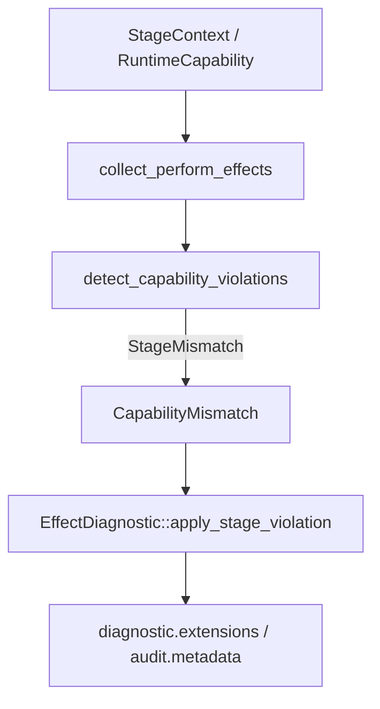
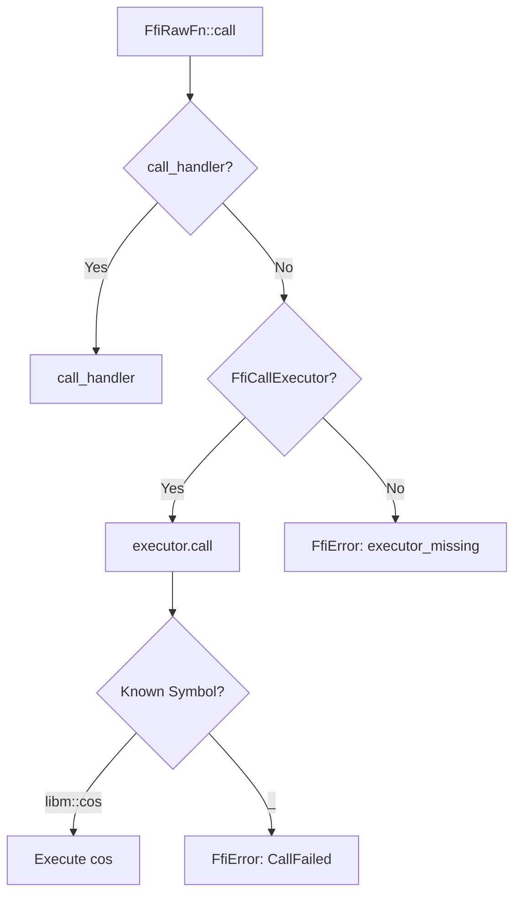

# 第10章: エフェクトとFFI実行

## 1. 概要 (Introduction)

本章では、Reml フロントエンドが**効果（Effect）タグと Capability ステージ**をどのように検証し、それらを診断情報や監査メタデータへ伝搬させているか、そして**FFI（Foreign Function Interface）実行エンジン**がどのように組み込まれているかを解説します。

Reml の安全性モデルにおいて、効果システムと FFI の境界制御は核心的な役割を果たします。コンパイル時には静的なステージ検証を行い、実行時には動的な監査ログを通じて、システムが意図した権限の範囲内で動作していることを保証します。

対象となる主なモジュールは以下の通りです。

- **効果診断**: `compiler/frontend/src/effects/diagnostics.rs`
- **効果監査メタデータ**: `compiler/frontend/src/diagnostic/effects.rs`
- **ステージ文脈/Capability**:
  - `compiler/frontend/src/typeck/env.rs`
  - `compiler/frontend/src/typeck/capability.rs`
  - `compiler/frontend/src/typeck/driver.rs`
- **FFI 実行エンジン (CLI)**: `compiler/frontend/src/ffi_executor.rs`
- **FFI DSL (Runtime)**: `compiler/runtime/src/ffi/dsl/mod.rs`

この章を通じて理解すべきポイントは、大きく分けて以下の2点です。

1.  **効果ステージの整合**: CLI 引数、ランタイム設定、Capability Registry から解決されたステージ情報を元に、`perform` 式で発生する効果を静的に検証し、その結果を診断と監査メタデータとして整合性を持って出力する仕組み。
2.  **FFI 実行境界**: `FfiRawFn::call` が実行エンジン (`FfiCallExecutor`) を介して外部関数を呼び出す仕組みと、CLI 環境における最小実装（`libm::cos` のみ提供）の現状。

### 入力と出力

このモジュールの入力と出力は以下のようになります。

- **入力**:
  - **効果文脈 (`StageContext`)**: 実行環境が許容するステージ（stable/beta/experimental）の設定。
  - **指定 Capability (`RuntimeCapability`)**: CLI 等でユーザーが明示的に許可した権限セット。
  - **AST 内の `perform` 呼び出し**: ソースコード中で効果（Effect）を使用している箇所（効果名とソーススパン）。
  - **FFI 署名 (`FfiFnSig`) と実引数 (`FfiValue`)**: 外部関数呼び出しのシグネチャと値。
- **出力**:
  - **型検査違反**: `effects.contract.stage_mismatch` など、ステージ要件を満たさない場合のコンパイルエラー。
  - **監査メタデータ**: 監査ログに含まれる `effect.stage.*` や `capability.*` などの付加情報。
  - **FFI 実行結果**: 外部関数の戻り値、または `FfiError`（および関連する `ffi.*` 監査メタデータ）。

## 2. データ構造 (Key Data Structures)

効果と FFI を扱う主要なデータ構造について解説します。

### 2.1 StageContext / StageRequirement / RuntimeCapability

これらは型システムがセキュリティステージを管理するための基礎的な型です。

- **[`StageContext`](file:///Users/dolphilia/github/reml/compiler/frontend/src/typeck/env.rs#L187-L191)**:
  実行時の許容ステージ（runtime）と、Capability の要求ステージ（capability）を保持するコンテナです。さらに、そのステージ設定がどこから来たか（CLI引数、環境変数など）を追跡する `StageTrace` も保持しています。これは型推論全体で共有される文脈となります。

- **[`StageRequirement`](file:///Users/dolphilia/github/reml/compiler/frontend/src/typeck/env.rs#L318-L321)**:
  ステージへの要求レベルを表現します。厳密な一致を求める `Exact` と、指定以上の安定度を求める `AtLeast` があります。実際の検証では `satisfies` メソッドを用いて、現在の環境が要求を満たしているかを判定します。

- **[`RuntimeCapability`](file:///Users/dolphilia/github/reml/compiler/frontend/src/typeck/capability.rs#L157-L160)**:
  `capability@stage` という形式（例: `io@beta`）の文字列をパースし、CLI 設定から型検査器へと権限情報を渡すための構造体です。

### 2.2 CapabilityMismatch / EffectAuditContext / StageAuditPayload

これらは診断メッセージや監査ログに、リッチなメタデータを提供するための中間構造体です。

- **[`CapabilityMismatch`](file:///Users/dolphilia/github/reml/compiler/frontend/src/effects/diagnostics.rs#L10-L14)**:
  要求されたステージと実際のステージの不一致情報を保持します。これは後に診断エンジンの拡張フィールドや監査メタデータへと変換されます。

- **[`EffectAuditContext`](file:///Users/dolphilia/github/reml/compiler/frontend/src/diagnostic/effects.rs#L48-L54)**:
  `StageContext` と `RuntimeCapability` の情報から、`effects.*` 系の構造化ログを生成するための文脈情報です。監査ログ生成専用のビューといえます。

- **[`StageAuditPayload`](file:///Users/dolphilia/github/reml/compiler/frontend/src/diagnostic/effects.rs#L172-L178)**:
  型検査とパイプライン実行の両方で利用される共通コンテナです。診断（Diagnostics）と監査（Audit）という異なる出力経路に対して、完全に同一のステージ情報を一貫して渡すために設計されています。

### 2.3 FfiType / FfiRawFn / FfiWrappedFn / FfiError

FFI（外部関数インターフェース）を実行するための型定義です。

- **[`FfiType` / `FfiFnSig`](file:///Users/dolphilia/github/reml/compiler/runtime/src/ffi/dsl/mod.rs#L26-L44)**:
  FFI DSL で利用される型表現と関数シグネチャです。プリミティブ型、ポインタ、構造体などを表現できます。

- **[`FfiRawFn`](file:///Users/dolphilia/github/reml/compiler/runtime/src/ffi/dsl/mod.rs#L298-L303)**:
  ライブラリ名、シンボル名、署名を持つ低レベルの関数表現です。`call` メソッドを呼び出すと、背後の実行エンジン（`FfiCallExecutor`）へ処理を委譲します。

- **[`FfiWrappedFn`](file:///Users/dolphilia/github/reml/compiler/runtime/src/ffi/dsl/mod.rs#L426-L429)**:
  `FfiRawFn` の上に安全性を付加するラッパーです。引数の検証、戻り値の NULL チェック、所有権の確認などを行い、違反があれば `ffi.wrap.*` 系エラーを生成します。

- **[`FfiError`](file:///Users/dolphilia/github/reml/compiler/runtime/src/ffi/dsl/mod.rs#L662-L669)**:
  FFI 実行時のエラーを表します。診断コード、拡張情報、監査メタデータを保持しており、`GuardDiagnostic` へと変換可能です。

## 3. アルゴリズムと実装 (Core Logic)

### 3.1 ステージ文脈の解決

コンパイラ起動時、`StageContext::resolve` は以下の順序で既定のステージを決定します（[`env.rs:204`](file:///Users/dolphilia/github/reml/compiler/frontend/src/typeck/env.rs#L204)）。

1.  CLI 引数 (`--effect-stage`)
2.  Capability Registry (`runtime.json`)
3.  環境変数 (`REMLC_EFFECT_STAGE`)

決定されたステージは `StageTraceStep` として記録され、ユーザーが「なぜこのステージが適用されたか」を後から追跡できるようになっています。通常、`StageRequirement::AtLeast` が基本設定として採用されます。

### 3.2 効果使用の収集と Capability 検証

型検査のフェーズでは、ソースコード全体を走査して効果の使用状況をチェックします。

1.  **効果収集**: `collect_perform_effects` 関数が AST をトラバースし、`ExprKind::PerformCall` （`perform` 式）を検出して集計します（[`driver.rs:9304`付近](file:///Users/dolphilia/github/reml/compiler/frontend/src/typeck/driver.rs#L9304)※行番号は概算）。
2.  **違反検出**: `detect_capability_violations` 関数は、使用された効果に対応する `CapabilityDescriptor` を解決します。
    - 要求されるステージを特定し、現在の `StageContext` と照合します。
    - もし実行時ステージが要求を満たさない場合（`satisfies` が false）、`TypecheckViolation::stage_mismatch` を生成します（[`driver.rs:8394`付近](file:///Users/dolphilia/github/reml/compiler/frontend/src/typeck/driver.rs#L8394)）。

図10-1: 効果検証と診断生成の流れ

### 3.3 診断・監査メタデータへの伝搬

Reml の特徴的な設計として、診断エラーと監査ログの整合性が挙げられます。

- **CLI 初期化時**: `StageAuditPayload` が早期に作成され、パイプライン開始時の監査イベント（`pipeline_started`）に埋め込まれます（[`reml_frontend.rs:571`](file:///Users/dolphilia/github/reml/compiler/frontend/src/bin/reml_frontend.rs#L571)）。
- **診断生成時**: 型検査違反が発生すると、`CapabilityMismatch` オブジェクトが `EffectDiagnostic::apply_stage_violation` に渡されます。これにより、診断メッセージの `extensions` フィールドに `effect.stage.required` などの構造化データが追加されます（[`diagnostics.rs:52`](file:///Users/dolphilia/github/reml/compiler/frontend/src/effects/diagnostics.rs#L52)）。

これにより、エラーを目視する開発者と、ログを解析するセキュリティ監査ツールの双方が、全く同じ情報源（`StageAuditPayload` 経由）を参照することになります。

### 3.4 FFI 呼び出しの実行フロー

ランタイムにおける FFI 実行フローは以下の通りです。

1.  **呼び出し**: `FfiRawFn::call` が呼ばれます。
2.  **ハンドラ確認**: `call_handler`（テスト用モック等）が設定されていればそれを実行します。
3.  **Executor 委譲**: なければ `FfiCallExecutor` トレイトの実装（グローバルインスタンス）に委譲します（[`dsl/mod.rs:331`](file:///Users/dolphilia/github/reml/compiler/runtime/src/ffi/dsl/mod.rs#L331)）。

現在の Reml CLI (`reml_frontend`) 実装では、`install_cli_ffi_executor` が起動時に `CliFfiExecutor` を登録します。セキュリティ上の理由から、この Executor は最小限の実装となっており、**`libm::cos` の呼び出しのみ**をサポートしています（[`ffi_executor.rs:29`](file:///Users/dolphilia/github/reml/compiler/frontend/src/ffi_executor.rs#L29)）。それ以外の呼び出しはすべて `CallFailed` エラーとなります。

図10-2: FFI 呼び出し実行フロー

## 4. エラー処理 (Error Handling)

### 4.1 ステージ不一致の診断

ステージ不一致が検出された際のエラー処理は、単なるテキストメッセージの表示にとどまりません。

- `TypecheckViolation::stage_mismatch` はエラーコード `effects.contract.stage_mismatch` を生成します。
- 内部に含まれる `CapabilityMismatch` が `EffectDiagnostic` を通じて展開され、`effect.stage.required`（要求ステージ）、`effect.stage.actual`（現在のステージ）、`capability.id` などの詳細情報が JSON 形式で診断情報に付加されます。
- これにより、LSP クライアントや監査ツールは、エラーメッセージをパースすることなく正確な状況を把握できます。

### 4.2 FFI エラーの分類

FFI DSL レイヤでは、エラーは以下のように細かく分類されます（[`dsl/mod.rs:650`](file:///Users/dolphilia/github/reml/compiler/runtime/src/ffi/dsl/mod.rs#L650)）。

- **`ffi.call.executor_missing`**: FFI 実行エンジンが登録されていない場合。
- **`ffi.wrap.invalid_argument`**: 引数の数や型がシグネチャと一致しない場合。
- **`ffi.wrap.null_return`**: NULL チェックが有効なラッパーで、関数が NULL を返した場合。
- **`ffi.wrap.ownership_violation`**: 所有権（Ownership）制約に違反した場合。
- **`ffi.call.failed`**: CLI で未実装の関数を呼び出した場合など、実行自体が失敗した場合。

## 5. 発展的トピック (Advanced Topics)

### 5.1 RuntimeBridgeSignal の影響範囲

`RuntimeBridgeSignal` は、ストリーミング実行におけるバックプレッシャー（背圧）や一時停止の状態を監査メタデータへ埋め込むための仕組みです（[`streaming/flow.rs:34`](file:///Users/dolphilia/github/reml/compiler/frontend/src/streaming/flow.rs#L34)）。

`StageAuditPayload` はこの `bridge` 信号からの情報を統合できるように設計されていますが、現状の実装では生成元が限定的であり、多くのケースでこのフィールドは空のままとなります。将来的にストリーミング実行が本格化した際、このフィールドを通じて実行時の動的な負荷状況が監査ログに記録されることになります。

### 5.2 仕様との対応

本実装は Reml 仕様書の以下のセクションに対応しています。

- **効果と安全性**: `docs/spec/1-3-effects-safety.md`
- **FFI DSL**: `docs/spec/3-9-core-async-ffi-unsafe.md` §2.4.1 (Core.Ffi.Dsl)

特に FFI DSL は仕様に準拠したデータ構造を持っていますが、CLI における実行エンジンは意図的に機能を制限（`libm::cos` のみ）した「最小実装」となっている点に留意してください。完全な FFI 機能は、将来的なランタイム拡張やプラグインによって提供される想定です。

## 6. 章末まとめ (Checkpoint)

本章では、Reml の安全性を支える効果システムと FFI の実装を見てきました。

- **StageContext と RuntimeCapability**: これらが連携して実行環境のセキュリティステージを定義し、型検査器に伝達します。
- **効果の静的検証**: `collect_perform_effects` と `detect_capability_violations` により、ソースコード上の効果利用が許可されたステージ内であるかをコンパイル時に保証します。
- **一貫したメタデータ**: `EffectDiagnostic` と `StageAuditPayload` の仕組みにより、コンパイルエラー（診断）とセキュリティログ（監査）の両方に、完全に同一のステージ情報が構造化データとして出力されます。
- **FFI の最小実行**: 外部関数呼び出しは `FfiCallExecutor` インターフェースにより抽象化されており、現在の CLI では `libm::cos` のみが安全に呼び出し可能という制約された実装になっています。

次章「第11章: LLVMへのラウアリング」では、ここで検証された型付き AST が、どのようにしてネイティブコード生成の中間表現である LLVM IR へと変換されていくのか、そのバックエンド処理を追っていきます。
