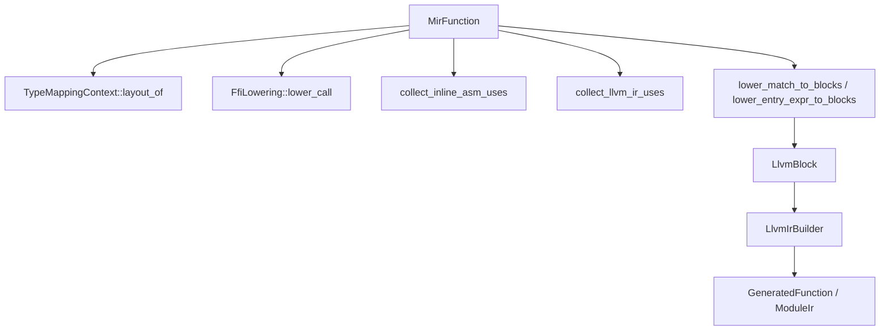

# 第11章: LLVMへのラウアリング

## 1. 概要 (Introduction)

本章では、Reml フロントエンドが生成した MIR（Mid-level Intermediate Representation）を、LLVM IR に近い形式へ「ラウアリング（lowering）」するバックエンド層の実装について解説します。

Reml コンパイラの現在のバックエンド実装における最も重要な特徴は、生成される IR が完全な LLVM IR ではなく、**「LLVM 風 IR (LLVM-like IR)」** であるという点です。これは、実際のターゲットコード生成を行う前に、ABI（Application Binary Interface）、メモリレイアウト、および監査（Audit）要件を明確にするための「骨格」としての役割を果たします。

主な対象モジュールは `compiler/backend/llvm` ディレクトリに集約されています。

- **MIR → LLVM 風 IR**: `compiler/backend/llvm/src/codegen.rs`
- **型レイアウト**: `compiler/backend/llvm/src/type_mapping.rs`
- **FFI スタブ生成準備**: `compiler/backend/llvm/src/ffi_lowering.rs`
- **Bridge メタデータ**: `compiler/backend/llvm/src/bridge_metadata.rs`
- **ターゲット情報**: `compiler/backend/llvm/src/target_machine.rs`
- **検証と監査**: `compiler/backend/llvm/src/verify.rs`

### 入力と出力

このプロセスの入力と出力は以下の通りです。

- **入力**:
  - `MirFunction` のリスト: フロントエンドから JSON 経由、あるいは直接渡される関数群の定義です。
  - `TargetMachine`: ターゲットアーキテクチャのトリプル（例: `x86_64-unknown-linux-gnu`）、ABI 設定、データレイアウト（DataLayout）を含みます。
- **出力**:
  - `GeneratedFunction` / `ModuleIr`: LLVM 風 IR コードと、それに付随する監査情報（Audit Tags）を束ねた構造体です。
  - `BackendDiffSnapshot`: コンパイル結果の差分スナップショット。これには生成された IR だけでなく、変換プロセスで発生した診断メッセージや監査ログも含まれます。

実装のエントリポイントは `compiler/backend/llvm/src/integration.rs` の `generate_snapshot` 関数です。ここで `CodegenContext` が初期化され、各関数のコード生成（`emit_function`）が行われた後、検証（`Verifier`）を経て最終的なスナップショットが生成されます（`compiler/backend/llvm/src/integration.rs:1289` 付近）。

## 2. データ構造 (Key Data Structures)

### 2.1 RemlType / TypeLayout / TypeMappingContext

Reml の型システムを LLVM の型システムへマップするための基盤が `TypeMappingContext` です。Reml の型は `RemlType` enum で表現され、`layout_of` メソッドを通じて `TypeLayout`（サイズ、アラインメント、LLVM 型記述文字列）に変換されます（`compiler/backend/llvm/src/type_mapping.rs`）。

重要なマッピングルールには以下のようなものがあります。

- **String**: `{i8*, i64}` という構造体（ポインタと長さ）として扱われます。
- **RowTuple**: 各フィールドのアラインメントを考慮してパディングを計算し、適切な構造体レイアウトを決定します。
- **Adt (Algebraic Data Type)**: タグ（判別子）と、バリアントの中で最大のペイロードサイズを持つ共用体のようなレイアウトとして計算されます。

### 2.2 MIR と LLVM 風 IR のモデル

コード生成の中心となる `codegen.rs` では、入力である `MirFunction` と、出力である `GeneratedFunction` が定義されています。

特筆すべきはブロックの表現です。入力の `BasicBlock` は文字列ベースの識別子を持ちますが、出力の `LlvmBlock` は型付きの LLVM 風ブロック表現として構築されます。これにより、制御フローグラフ（CFG）の構築中に不整合が生じるのを防いでいます。

### 2.3 FFI ロワリングと Bridge メタデータ

`native` キーワードを用いた FFI（Foreign Function Interface）呼び出しは、`FfiCallSignature` から `LoweredFfiCall` へと変換されます（`compiler/backend/llvm/src/ffi_lowering.rs`）。

ここで重要なのが **Bridge メタデータ** です。`BridgeMetadataContext` は、生成された FFI スタブに関する情報（`reml.bridge.version` や `reml.bridge.stubs` など）を収集します（`compiler/backend/llvm/src/bridge_metadata.rs`）。これは Reml の仕様（`docs/spec/3-9-core-async-ffi-unsafe.md`）で定められた、安全性監査のための必須要件です。これにより、どのような外部関数が、どのような ABI と所有権モデルで呼び出されるかが追跡可能になります。

### 2.4 ターゲット情報

`TargetMachine` 構造体は、ターゲットトリプル (Triple) とデータレイアウト仕様 (DataLayoutSpec) を保持しています（`compiler/backend/llvm/src/target_machine.rs`）。CPU の機能（features）や ABI の詳細もここで管理されます。`TypeMappingContext` による型サイズの計算は、この `TargetMachine` が提供するデータレイアウト情報に依存しています。

## 3. アルゴリズムと実装 (Core Logic)

### 3.1 ラウアリングの流れ

`CodegenContext::emit_function` メソッドが、単一の MIR 関数を LLVM 風 IR に変換する処理の核心です（`compiler/backend/llvm/src/codegen.rs`）。処理は概ね以下のステップで進行します。

1. **戻り値レイアウトの算出**: `TypeMappingContext::layout_of` を使用して、関数の戻り値型に対応する LLVM 型を決定します。
2. **FFI ロワリング**: 関数内で FFI 呼び出しが行われる場合、`FfiLowering::lower_call` を呼び出し、必要なスタブ情報を `BridgeMetadataContext` に登録します。
3. **属性の処理**: `@intrinsic` や `@unstable` などの属性を解析し、監査ログに必要な「使用記録」を作成します。
4. **Inline ASM / LLVM IR 直書きの収集**: `collect_inline_asm_uses` および `collect_llvm_ir_uses` により、コード内に埋め込まれた低レベルコードのテンプレートハッシュや入力型を収集します。
5. **ブロック生成**: `lower_match_to_blocks` や `lower_entry_expr_to_blocks` を使用して、MIR の式ツリーを基本的なブロックと制御フロー（分岐）に分解します。
6. **IR レンダリング**: 最後に `LlvmIrBuilder::build_function` と `render_ir` を呼び出し、メモリ上のブロック構造をテキスト形式の LLVM 風 IR に変換します。

図11-1: MIR から LLVM 風 IR への変換フロー

### 3.2 Match 式のロワリング

`lower_match_to_blocks` 関数は、Reml のパターンマッチ（`match` 式）を、低レベルな分岐命令の列に展開します（`compiler/backend/llvm/src/codegen.rs`）。

- **パターン判定ブロック**: `emit_pattern_blocks` が、値がパターンにマッチするかどうかの検査コードを生成します。
- **Guard ブロック**: パターンにガード条件（`if` 節）がある場合、`BrCond`（条件付き分岐）を生成し、成功時と失敗時のパスを作ります。
- **Body ブロック**: マッチ成立時に実行される式（アーム本体）のコードです。
- **Phi ノード**: 各アームの実行結果は、最終的に `match.end` ブロックで合流し、`phi` 命令によってひとつの値に統合されます。

`panic` や `propagate`（エラー伝播）が発生するパスは、専用の早期脱出（early-exit）ブロックへと誘導されます。

### 3.3 Entry 式のロワリング

関数の本体となる単一の式（Entry expression）は `lower_entry_expr_to_blocks` で処理されます。
`unsafe` ブロックや `effect` ブロックなど、スコープを持つ式はここで再帰的に処理され、内部の式が展開されていきます。

### 3.4 LLVM 風 IR の命名規則

生成される IR 内の識別子は `sanitize_llvm_ident` によって正規化されます。例えば、数字で始まる名前にはプレフィックス `_` が付与され、不正な文字は `_uXXXX` 形式にエスケープされます。これは、仕様で定められたバックエンド内部名の規約（`docs/spec/1-1-syntax.md`）に準拠するための処理です。

## 4. エラー処理 (Error Handling)

ラウアリング後の検証は `Verifier::verify_module` が担当します（`compiler/backend/llvm/src/verify.rs`）。ここでは主に以下の検証が行われます。

- **構造的整合性**: 関数本体が空でないか、必要なデータレイアウト定義が存在するか、型レイアウトのサイズが正しく計算されているかなどをチェックします。
- **監査ログの確定**: `native.*` 系の監査キーを付与し、最終的な `audit.verdict`（監査判定）を `pass` または `fail` で確定させます。
- **低レベルコードの検証**: Inline ASM や埋め込み LLVM IR が使用されている場合、その制約文字列の妥当性や、プレースホルダー（`$0` など）の整合性を確認します。

仕様上、Inline ASM や LLVM IR の直接記述は `effect {native}` および `unsafe` ブロック内でのみ許可されています。`Verifier` は、これらの制約が守られているかどうかの最終防衛線としても機能します。

## 5. 発展的トピック (Advanced Topics)

### 5.1 「LLVM 風 IR」と「実 LLVM」の境界

本章で生成される IR は、`LlvmIrBuilder` によって文字列として構築されたものであり、LLVM の C++ API や `inkwell` クレートのデータ構造を直接操作しているわけではありません。これは意図的な設計であり、Reml コンパイラが LLVM への依存度を制御し、バックエンドの実装をポータブルに保つための「足場」として機能しています。

実際のバイナリ生成を行うには、この IR を LLVM の `llc` コマンド等に渡すか、あるいは後のフェーズで `runtime_link` モジュールを通じて実際の LLVM コンテキストにロードする工程が必要になります（次章参照）。

### 5.2 FFI Bridge と監査メタデータ

`BridgeMetadataContext` が生成する `reml.bridge.stubs` は、Core ランタイムの監査エンベロープ（Audit Envelope）に含まれる `metadata["bridge"]` と完全に一致する必要があります。これは、FFI を介して実行されるコードが、事前に宣言・監査された通りの振る舞いをしているかをランタイム側で検証するためです。

### 5.3 仕様との対応関係

本実装は以下の仕様ドキュメントと密接に関連しています。

- `docs/spec/1-1-syntax.md`: バックエンド内部識別子の正規化ルール。
- `docs/spec/1-3-effects-safety.md`: `native` エフェクト、`unsafe` ブロック、および `@unstable` 属性の取り扱い。
- `docs/spec/3-9-core-async-ffi-unsafe.md`: Bridge メタデータの構造と要件。

## 6. 章末まとめ (Checkpoint)

- **`TypeMappingContext`**: Reml の型情報をターゲットアーキテクチャに合わせたメモリレイアウト（LLVM 型）に変換します。
- **`CodegenContext`**: MIR 関数をトラバースし、FFI ロワリング、属性処理、ブロック生成を行い、最終的に LLVM 風 IR を出力します。
- **`Verifier`**: 生成された IR とメタデータの整合性を検査し、監査ログを確定させます。
- **Bridge メタデータ**: 安全な FFI 実行のために不可欠な情報を収集・出力します。

次章「第12章: ランタイム連携と検証」では、ここで生成された IR とメタデータが、どのようにして実際の実行可能コードやライブラリとしてリンクされ、ランタイム環境で検証されるのかを解説します。
