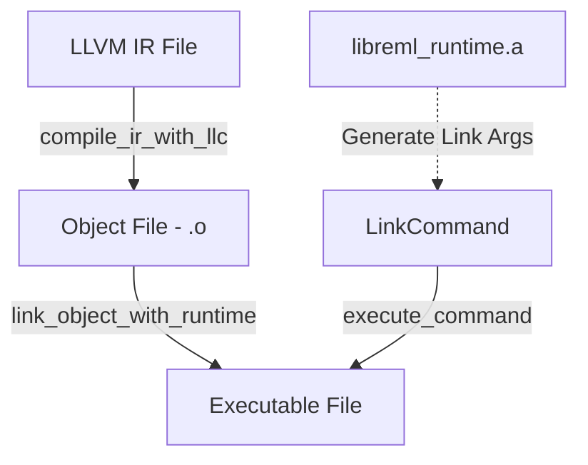

# 第12章: ランタイム連携と検証

## 1. 概要 (Introduction)

本章では、バックエンドが生成した LLVM 風 IR を **実際の実行可能なバイナリへと変換する「ランタイム連携」** と、その生成物が正しく安全であることを保証する **「検証 (Verification)」** のプロセスについて解説します。

Reml コンパイラのバックエンドは、単に LLVM IR を吐き出して終わりではありません。生成されたコードがターゲット環境（OS、アーキテクチャ）と整合しているかを確認し、Reml の標準ランタイムライブラリとリンクし、最終的にユーザーが実行できる形にパッケージングする責任を持っています。

主な役割は以下の3点です。

1. **ランタイムリンク**: LLVM IR をオブジェクトファイルにコンパイルし、`reml_runtime` とリンクして実行可能ファイルを生成する。
2. **検証と監査**: 生成されたモジュールの健全性をチェックし、安全に関わる操作（unsafe, FFI, Inline ASM）を監査ログとして記録する。
3. **ターゲット診断**: ユーザーが要求したターゲット設定と、コンパイラが動作している実際の環境との間に矛盾がないか診断する。

### 入力と出力

- **入力**:
  - `ModuleIr`: コンパイルされた LLVM 風 IR と、それに関連するターゲット情報。
  - `RunConfigTarget`: ユーザーが要求したターゲット設定（CLI 引数などから構成）。
  - ランタイムライブラリ: `libreml_runtime.a`（`REML_RUNTIME_PATH` で指定可能）。
- **出力**:
  - **実行可能ファイル**: リンク成功時。
  - **検証結果 (`VerificationResult`)**: 診断メッセージと監査ログ。
  - **スナップショット**: 他のツール（W3など）向けの JSON 形式のサマリ。

## 2. データ構造 (Key Data Structures)

実装の中心となるデータ構造は、`compiler/backend/llvm/src` 配下のいくつかのファイルに分散しています。

### 2.1 ターゲット環境の表現 (`TargetMachine`)

`TargetMachine` は、コンパイルターゲットのハードウェアと OS の特性をカプセル化した構造体です。LLVM のターゲットトリプル、データレイアウト、ABI などを管理します。

- **ファイル**: `compiler/backend/llvm/src/target_machine.rs`

```rust
// compiler/backend/llvm/src/target_machine.rs:315
pub struct TargetMachine {
    pub triple: Triple,             // 例: x86_64-unknown-linux-gnu
    pub cpu: String,                // 例: x86-64
    pub features: String,           // 例: +sse4.2,+popcnt
    pub data_layout: DataLayoutSpec,// LLVM DataLayout 文字列
    pub backend_abi: String,        // 例: system_v, gnu, msvc
    // ...
}
```

`Triple` 列挙型（`target_machine.rs:7`）は、Reml が公式にサポートまたは認識しているターゲット（Linux, macOS, Windows）を定義しています。`TargetMachineBuilder` を使用して、デフォルト値とユーザー設定（`RunConfigTarget`）をマージして構築されます。

### 2.2 ランタイムリンクの抽象化 (`LinkCommand`)

外部リンカー（clang など）への呼び出しは `LinkCommand` 構造体で抽象化されています。

- **ファイル**: `compiler/backend/llvm/src/runtime_link.rs`

```rust
// compiler/backend/llvm/src/runtime_link.rs:48
pub struct LinkCommand {
    program: String,       // 実行するコマンド名 ("clang" など)
    args: Vec<OsString>,   // 引数リスト
}
```

この構造体は、OS ごとに異なるリンカーの引数形式を隠蔽し、統一的なインターフェースでコマンド実行を扱えるようにします。

### 2.3 検証と監査 (`Verifier`, `AuditLog`)

バックエンドの安全性チェックと記録は `verification` モジュールで行われます。

- **ファイル**: `compiler/backend/llvm/src/verify.rs`

```rust
// compiler/backend/llvm/src/verify.rs:79
pub struct VerificationResult {
    pub passed: bool,
    pub diagnostics: Vec<Diagnostic>, // コンパイルエラーや警告
    pub audit_log: AuditLog,          // 監査用キーバリューログ
}
```

`AuditLog`（`verify.rs:56`）は、`audit.verdict`（合格/不合格）、`native.intrinsic.used`（使用された組み込み関数）、`backend.triple`（ターゲット情報）などの構造化されたログを保持します。これはコンパイラの動作を後から追跡するために重要です。

### 2.4 ターゲット診断コンテキスト (`TargetDiagnosticContext`)

「ユーザーが何を要求したか」と「実際にどの環境で動いているか」を比較するためのコンテキストです。

- **ファイル**: `compiler/backend/llvm/src/target_diagnostics.rs`

```rust
// compiler/backend/llvm/src/target_diagnostics.rs:8
pub struct TargetDiagnosticContext {
    pub run_config: RunConfigTarget, // 要求（CLI引数など）
    pub platform_info: PlatformInfo, // 実環境（自動検出）
}
```

## 3. アルゴリズムと実装 (Core Logic)

### 3.1 ランタイムリンクのパイプライン

`runtime_link::link_with_runtime` 関数は、生成された IR をバイナリにするまでの一連の流れを制御します。

- **参照**: `compiler/backend/llvm/src/runtime_link.rs:267`



1. **オブジェクト生成**: `compile_ir_with_llc` が外部コマンド `llc` を呼び出し、LLVM IR をマシンコード（オブジェクトファイル）に変換します。
2. **ランタイム探索**: `find_runtime_library` が `REML_RUNTIME_PATH` 環境変数、または既定のパスから静的ライブラリ `libreml_runtime.a` を探します。
3. **リンクコマンド生成**: `generate_link_command` がプラットフォーム（Linux/macOS）に応じた `clang` の引数を構築します。
    - **Linux**: `-lc`, `-lm` など標準ライブラリをリンク。
    - **macOS**: `-lSystem` をリンク。
4. **実行**: 生成されたコマンドを実行し、最終的なバイナリを出力します。

### 3.2 検証ロジック (`Verifier`)

`Verifier::verify_module` は、コンパイルの最終段階で呼び出され、生成物の品質保証を行います。

- **参照**: `compiler/backend/llvm/src/verify.rs:94`

主なチェック項目は以下の通りです：

1. **モジュール健全性**:
    - 関数が含まれているか？ (`llvm.module.empty`)
    - データレイアウトが指定されているか？ (`target.datalayout.missing`)
2. **ターゲット診断**:
    - `TargetDiagnosticEmitter` を呼び出し、設定の不整合がないか確認します。
3. **安全性監査 (`native.*`)**:
    - **Intrinsic**: 使用されている組み込み関数のシグネチャが正しいか (`native.intrinsic.signature_mismatch`)。Polyfill が使用されているか。
    - **Unstable Features**: 不安定な機能が使われている場合、フラグが有効か (`native.unstable.disabled`)。
    - **Inline ASM**: アセンブリテンプレートの制約文字列が有効か (`native.inline_asm.invalid_constraint`)。
    - **LLVM IR 埋め込み**: プレースホルダと入力の数が一致しているか (`native.llvm_ir.invalid_placeholder`)。

これらのチェックで問題が見つかった場合、`diagnostics` にエラーが追加され、`audit_log` には `audit.verdict = "fail"` が記録されます。

### 3.3 ターゲット診断 (`TargetDiagnosticEmitter`)

ユーザーが意図した環境と実際の環境のズレは、予期せぬ実行時エラーの原因になります。`TargetDiagnosticEmitter` はこれを未然に防ぎます。

- **参照**: `compiler/backend/llvm/src/target_diagnostics.rs:229`

`emit` メソッドは以下のロジックで診断を行います：

1. **プロファイル確認**: `profile_id`（例: "production", "debug" などの構成ID）が指定されているか？ なければ警告を出します (`target.profile.missing`)。
2. **不整合の検出**: `collect_mismatches` で OS, アーキテクチャ, ファミリ, Triple を比較します。例えば、Linux 上で Windows 向けのビルドをしようとした場合などが検出され、不整合があれば `target.config.mismatch` エラーとなります。

### 3.4 統合とスナップショット

テストや外部ツール連携のために、検証結果や生成された IR の構造を JSON として出力する機能があります。これを行っているのが `integration.rs` です。

- **参照**: `compiler/backend/llvm/src/integration.rs`
  - `BackendFunctionRecord`: 関数の詳細（属性、呼び出し規約、基本ブロック構成など）を記録。
  - `BackendDiffSnapshot`: モジュール全体の状態をまとめたもの。

これは特に言語開発時のリグレッションテスト（W3 テストスイートなど）で、コンパイラの挙動変化を検知するために役立っています。

## 4. エラー処理 (Error Handling)

### 4.1 ランタイムリンクのエラー

外部コマンドに依存するため、リンク処理は様々な理由で失敗する可能性があります。`RuntimeLinkError` 列挙型でこれを分類しています。

- **参照**: `compiler/backend/llvm/src/runtime_link.rs:74`

| エラー型 | 説明 |
| --- | --- |
| `Io` | ファイル書き込み権限がない、ディスクがいっぱい、など。 |
| `RuntimeLibraryMissing` | `libreml_runtime.a` が見つからない。ビルド忘れやパス指定ミス。環境変数 `REML_RUNTIME_PATH` の値もエラーメッセージに含まれます。 |
| `UnsupportedPlatform` | Windows など、現在リンク機能が未実装のプラットフォーム。 |
| `CommandFailed` | `llc` や `clang` が非ゼロの終了コードで終了した。標準出力・エラー出力を保持します。 |

### 4.2 バックエンド検証のエラー

検証エラーはパニックさせるのではなく、`Diagnostic` として返されます。これにより、複数の問題を一度に報告できます。

- **回復**: 検証エラーは基本的に致命的（バイナリ生成不能または安全性欠如）ですが、コンパイラ自体はクラッシュせず、終了コードで失敗を伝えます。

## 5. 発展的トピック (Advanced Topics)

### 5.1 クロスコンパイルの展望

現在の `runtime_link` 実装はホストの `clang` に依存しており、ネイティブビルドを主眼に置いています。クロスコンパイル（例: macOS 上で Linux 向けバイナリ作成）を行うには、リンカーの選定ロジックをより柔軟にし、sysroot の指定などをサポートする必要があります。`TargetDiagnosticContext` の設計はそのための布石となっています。

### 5.2 監査ログとセキュリティ

Reml は安全性重視の言語であり、`Verifier` が出力する監査ログは重要な意味を持ちます。特に `native.*` 系のログは、unsafe な操作がどこでどのように行われているかを追跡可能にします。将来的には、このログを署名したり、デプロイメントパイプラインで自動チェックしたりする構想があります（第14章で詳述の Capability 監査とも関連します）。

## 6. 章末まとめ (Checkpoint)

本章では、コンパイルの最終工程である連携と検証について学びました。

- **`TargetMachine`**: ユーザーの要求とマシンの現実を仲介する設定オブジェクト。
- **`runtime_link`**: LLVM IR を外部ツール (`llc`, `clang`) と連携させて実行ファイルにする実働部隊。
- **`Verifier`**: 生成物の構造的正しさと、unsafe 操作の使用状況をチェックする門番。
- **`AuditLog`**: コンパイル結果の安全性を事後検証するための記録。

ここまでの工程で、Reml ソースコードは無事にマシン語のバイナリとなりました。次章からは、リンクされたその先、つまり「ランタイム」の中で何が起きているのかを見ていきます。

- **次は**: [第13章: ランタイムの全体像](../plans/source-code-commentary/drafts/5-1-runtime-overview-draft.md)（ランタイムライブラリの初期化と構造について）
