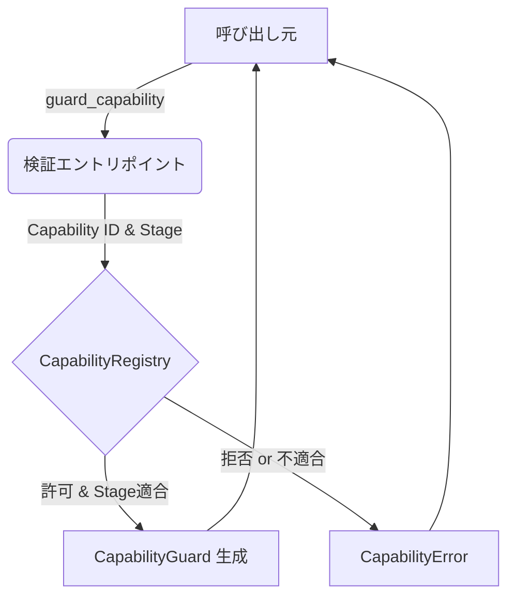

# 第13章: ランタイムの全体像

## 1. 概要 (Introduction)

本章からは、Reml プログラムを実行するための基盤である「ランタイム（Runtime）」について解説します。Reml のランタイムは、単なる標準ライブラリのサポートコードにとどまらず、セキュリティと監査のための重要な「関所」としての役割を担っています。

具体的には、本章で取り上げる `compiler/runtime/src/runtime` および関連モジュールは、以下の責務を持ちます。

1. **Capability（権限）の検証**: コードが特定の操作（ファイル読み書き、ネットワーク接続など）を行う際に、許可された権限を持っているかを確認します。
2. **Stage（安定度）の管理**: 実行中のコードやプラグインが要求する安定度（Alpha, Beta, Stable）と、現在の実行環境が許容するレベルを照合します。
3. **プラグインのロードと署名検証**: 外部から読み込まれるプラグインが改竄されていないかを確認し、安全にシステムに統合します。
4. **埋め込み（Embedding）API の提供**: C言語などの他の言語から Reml を安全に呼び出すための最小限のインターフェースを提供します。

これらは、Reml が目指す「安全で、監査可能なシステム記述言語」という目標を実現するための核となる部分です。本章では、これらの機能がどのように実装され、連携しているかを俯瞰します。

### 入力と出力

このモジュール群への入力と、そこから得られる出力は以下の通りです。

- **入力**:
  - **Capability ID と Stage 要件**: コードが実行しようとしている操作と、その安定度レベル（例: `requirements: [exact:stable]`）。
  - **プラグインバンドル**: 署名付きのプラグインパッケージ（JSONマニフェストを含む）。
  - **実行設定 (`reml.toml`)**: プロジェクトごとの設定や、ユーザーによる上書き設定。
  - **C ABI 呼び出し**: ホストアプリケーションからのコンテキスト作成や実行要求。

- **出力**:
  - **CapabilityGuard**: 権限検証に成功したことを証明する、ゼロコストのトークン。
  - **監査メタデータ**: 誰が、いつ、どの権限を行使したか（あるいは拒否されたか）を記録したログデータ。
  - **実行環境の構築**: ロードされたプラグインや初期化されたランタイムの状態。
  - **エラーステータス**: 署名検証失敗や権限不足などの詳細なエラー情報。

## 2. データ構造 (Key Data Structures)

ランタイムの動作を理解するために、中心となるデータ構造を見ていきましょう。

### 2.1 StageId と StageRequirement

Reml では、機能の安定度を厳密に管理するために `StageId` を定義しています。

- **ファイル**: `compiler/runtime/src/stage.rs`

```rust
pub enum StageId {
    Experimental,
    Alpha,
    Beta,
    Stable,
}
```

`StageRequirement` は、ある機能が必要とする安定度レベルを表現します。「厳密にこのステージである必要がある (`Exact`)」場合と、「少なくともこのステージ以上であればよい (`AtLeast`)」場合があります。`satisfies` メソッドによって、実際のステージとの適合判定が行われます。

### 2.2 RunConfig と拡張設定

`RunConfig` は、パーサーやランタイムの挙動を制御する設定値の集合です。

- **ファイル**: `compiler/runtime/src/run_config.rs`

特徴的なのは `extensions` フィールドです。これは `HashMap<String, Map<String, Value>>` という構造をしており、コアのフィールド定義を変更することなく、プラグインや将来の機能拡張のための設定を柔軟に保持できるようになっています。`apply_manifest_overrides` 関数によって、`reml.toml` から読み込まれた設定がこの構造にマッピングされます。

### 2.3 CapabilityGuard

`CapabilityGuard` は、Capability 検証が成功したことの「証（あかし）」となる構造体です。

- **ファイル**: `compiler/runtime/src/runtime/api.rs`

```rust
pub struct CapabilityGuard {
    capability: &'static str,
    requirement: StageRequirement,
    actual_stage: StageId,
}
```

この構造体自体は軽量ですが、これが返されるということは「Capability レジストリによる検証を通過した」ことを意味します。ランタイム内の各機能は、このガードを取得することで操作の正当性を保証します。

### 2.4 RuntimeBridgeRegistry

実行時の監査ログを強化するための機構です。

- **ファイル**: `compiler/runtime/src/runtime/bridge.rs`

`BridgeStageRecord` は、どの Capability が、どの Stage 要件でチェックされ、結果としてどの Stage で実行されたかという履歴を保持します。この情報は、後に監査ログ（Audit Log）が出力される際にメタデータとして付与され、実行時のトレーサビリティを向上させます。

### 2.5 プラグイン関連構造体

プラグインシステムは、マニフェスト、登録情報、そして実行ブリッジから構成されます。

- **ファイル**: `compiler/runtime/src/runtime/plugin.rs`

- `PluginBundleManifest`: プラグインパッケージ全体の定義（署名、バージョン、内包するプラグイン一覧）。
- `PluginRegistration`: ロード済みのプラグインIDと、それが持つ Capability のリスト。
- `PluginSignature`: 署名アルゴリズム（現在は主に `Ed25519`）と署名データ。

これらは、外部コードを信頼できる形でランタイムに取り込むための「契約書」のような役割を果たします。

### 2.6 埋め込み API コンテキスト

C言語などのホスト環境との境界を管理します。

- **ファイル**: `compiler/runtime/src/embedding.rs`

`RemlEmbedContext` は、ABIのバージョン、ロードされたソースコード、発生した最後のエラーなどを保持する不透明なポインタ（Opaque Pointer）として外部に公開されます。これにより、Reml の内部メモリレイアウトを隠蔽しつつ、安全な操作を提供します。

## 3. アルゴリズムと実装 (Core Logic)

ここでは、ランタイムが安全性を担保するために実行する主要なフローを解説します。

### 3.1 Capability 検証フロー

Reml におけるあらゆる「副作用」のある操作（IO、時間取得、非同期処理など）は、必ずこの検証フローを通過します。

**ファイル**: `compiler/runtime/src/runtime/api.rs`

1. **エントリポイント**: `guard_capability` 関数が呼び出されます。引数として必要な Capability ID と Stage 要件が渡されます。
2. **レジストリ問い合わせ**: `CapabilityRegistry::verify_capability_stage` に問い合わせを行い、現在の実行コンテキストでその操作が許可されているか、また Stage 要件を満たしているかを確認します。
3. **ガード生成**: 検証に成功すれば `CapabilityGuard` が生成されて返されます。失敗すれば `CapabilityError` が発生します。



図13-1: Capability 検証の基本フロー

### 3.2 Stage 記録と監査への転写

単に検証するだけでなく、その「事実」を記録に残すことが Reml の特徴です。

**ファイル**: `compiler/runtime/src/runtime/bridge.rs`

検証が行われると、`RuntimeBridgeRegistry::record_stage_probe` が呼び出され、検証結果がインメモリに記録されます。その後、実際に監査ログ（Audit Log）が生成されるタイミングで `attach_bridge_stage_metadata` が呼ばれ、記録された Stage 情報がログのメタデータとして統合されます。これにより、「いつ、どの権限確認が行われたか」が完全に追跡可能になります。

### 3.3 プラグインのロードと署名検証

プラグインのロードは、セキュリティを最優先した厳格な手順で行われます。

**ファイル**: `compiler/runtime/src/runtime/plugin.rs`, `plugin_manager.rs`

1. **署名検証**: `PluginLoader::verify_bundle_signature` が実行されます。ポリシー設定（Strict/Permissive）に従い、Ed25519 署名が正しいか、バンドルのハッシュ値が一致するかを確認します。Strict モードでは、一点でも不備があれば即座にロードは拒否されます。
2. **Capability 登録**: マニフェストに記載された Capability がシステムに登録されます（`register_manifest_with_context`）。
3. **ブリッジ接続**: `PluginRuntimeManager` が、プラグインの実体（Native または Wasm）に応じた実行ブリッジ (`PluginExecutionBridge`) を初期化します。

Wasm プラグインの場合、Wasmtime ランタイムを用いてモジュールがインスタンス化され、メモリ空間が隔離された状態で実行されます。

### 3.4 埋め込み API の実行フロー

他言語から Reml を利用する場合の最小フローです。

**ファイル**: `compiler/runtime/src/embedding.rs`

1. `reml_create_context`: ABI バージョンをチェックし、コンテキストを生成します。ターゲット OS のサポート状況もここで確認され、監査ログに記録されます。
2. `reml_load_module`: UTF-8 のソースコードを受け取り、コンテキスト内にロードします。
3. `reml_run`: 指定されたエントリポイント（デフォルトは `main`）を実行します。

すべてのステップで `record_embed_audit` が呼ばれ、外部からの操作であっても監査ログが漏れなく記録される設計になっています。

## 4. エラー処理 (Error Handling)

ランタイムのエラー処理は、単なるデバッグ情報ではなく、セキュリティイベントの一部として扱われます。

### 4.1 Capability と Stage の不一致

権限不足や Stage の不適合によるエラーは、`CapabilityError` として報告されます。プラグインシステムでは、これが `PluginError::Capability` にラップされ、最終的に `effects.contract.stage_mismatch` という診断コードに変換されます。この際、不足していた Effect や要求された Stage の詳細が構造化データとしてエラーに含まれるため、利用者は「なぜ拒否されたか」を正確に知ることができます。

- **参照**: `compiler/runtime/src/runtime/plugin.rs` の `into_diagnostic_with_bridge`

### 4.2 プラグインロードのエラー

プラグインのロード失敗は、ファイル IO の問題から署名の不正まで多岐にわたります。これらは `PluginLoadError` enum に集約されており、特に署名関連のエラー（`SignatureInvalid`）はセキュリティ上重要であるため、詳細な理由とともに監査ログに "failure" イベントとして記録されます。

### 4.3 埋め込み API のステータスコード

C ABI では Rust の `Result` 型を直接返せないため、`RemlEmbedStatus` という enum（整数値）を返します。

- `Ok (0)`: 成功
- `Error (1)`: 一般的なエラー（詳細は `reml_last_error` で取得）
- `AbiMismatch (2)`: ABI バージョン不一致
- `UnsupportedTarget (3)`: 非対応プラットフォーム

このようにエラー種別を値で明確に区別することで、ホスト側でのハンドリングを容易にしています。

## 5. 発展的トピック (Advanced Topics)

### 5.1 Stage: Alpha の位置づけ

`compiler/runtime/src/stage.rs` の実装には `Alpha` という Stage ID が存在しますが、現在の仕様書 `docs/spec/3-8-core-runtime-capability.md` では `Experimental`, `Beta`, `Stable` の三段階が主に言及されています。`Alpha` は開発中の機能や、実験的機能とベータ版の中間に位置する不安定な機能を表現するために実装されています。仕様と実装の整合性を保つため、今後の仕様改訂で `Alpha` の扱いが明文化される可能性があります。

### 5.2 埋め込み API の将来

現在の `embedding.rs` は最小限の実装ですが、将来的にはよりリッチな相互運用性が計画されています。例えば、Reml の値をホスト側のデータ構造にマッピングしたり、ホスト側の関数を Reml からコールバックとして呼び出したりする機能です。これらが実装される際も、今回解説した「監査ログの自動記録」という原則は維持されるでしょう。

## 6. 章末まとめ (Checkpoint)

本章では、Reml ランタイムの全体像とセキュリティ基盤について学びました。

- **Capability 検証**: `CapabilityGuard` を通じて、すべての副作用操作が許可制で管理されています。
- **Stage 管理**: 機能の安定度が厳密に定義され、コードの要求レベルと照合されます。
- **監査トレース**: 検証結果や外部 API の呼び出しは、`RuntimeBridgeRegistry` や埋め込み API を通じて監査ログに記録されます。
- **プラグイン**: 厳格な署名検証プロセスを経てロードされ、安全性が担保されます。

次章「第14章: Capability と監査」では、ここで登場した `CapabilityRegistry` の内部構造や、監査ログが具体的にどのようなフォーマットで生成・管理されるのかを、さらに深く掘り下げていきます。
