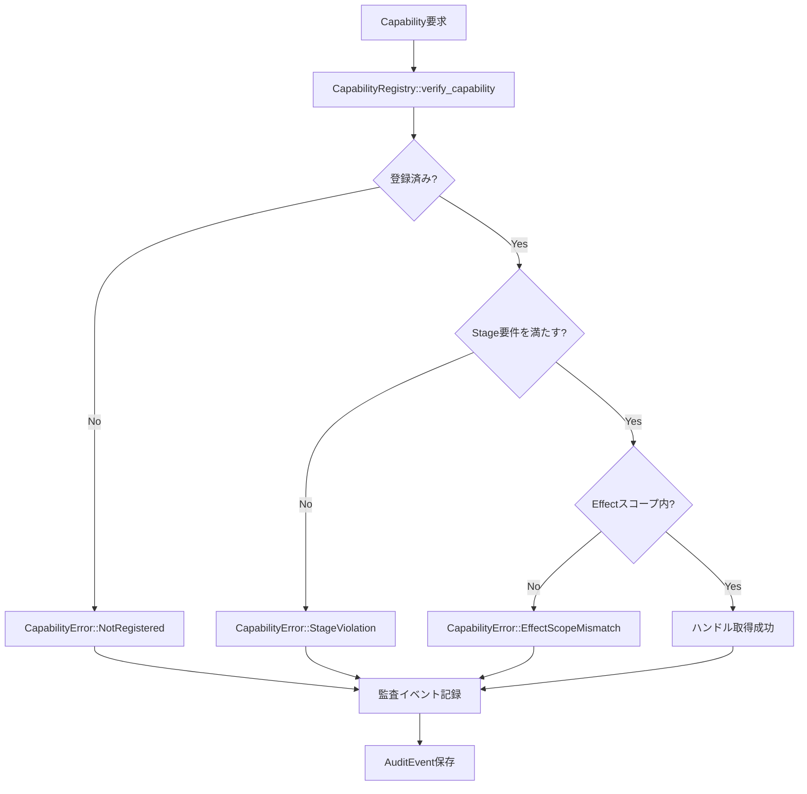

# 第14章: Capability と監査

## 1. 概要 (Introduction)

本章では、Reml ランタイムのセキュリティモデルの中核を担う「Capability（権限）」と、その実行履歴を記録する「Audit（監査）」の仕組みについて解説します。

Reml のランタイムは、ファイルアクセスやネットワーク通信などの副作用を伴う操作を `Capability` として抽象化し、それらの使用を厳密に管理します。各 Capability は `Stage`（成熟度）や `effect_scope`（副作用の範囲）といったメタデータを持ち、実行時には `CapabilityRegistry` がこれらを検証してアクセスの可否を判断します。

同時に、セキュリティ監査の観点から「いつ、誰が、どの権限を行使したか（あるいは拒否されたか）」を記録することが重要です。Reml では `AuditEnvelope` と `AuditEvent` という統一されたデータ構造を用いて、Capability の検証結果やシステムイベントを一貫した形式で記録します。

### 本章のゴール

- **CapabilityRegistry**: 権限の集中管理と検証ロジックを理解する。
- **Audit Logging**: 構造化された監査ログの生成と検証の仕組みを学ぶ。
- **Security Model**: Stage と Effect に基づくアクセス制御の設計思想を知る。

## 2. データ構造 (Key Data Structures)

Capability と Audit の実装は、メタデータと契約（Contract）の定義から始まります。

### 2.1 CapabilityDescriptor と Security

すべての Capability は、静的な定義情報として `CapabilityDescriptor` を持ちます。これは `id`（識別子）、`stage`（開発ステージ）、`effect_scope`（許可される副作用タグ）などの基本情報に加え、詳細なメタデータを内包しています (`compiler/runtime/src/capability/descriptor.rs`)。

```rust
// compiler/runtime/src/capability/descriptor.rs

pub struct CapabilityDescriptor {
    pub id: CapabilityId,
    pub stage: StageId,
    pub effect_scope: BTreeSet<EffectTag>,
    #[serde(flatten)]
    metadata: CapabilityMetadata,
}
```

ここで重要なのが `CapabilityMetadata` に含まれる `security` フィールド (`CapabilitySecurityMetadata`) です。これは監査の要否 (`audit_required`)、隔離レベル (`isolation_level`)、サンドボックス設定 (`sandbox_profile`) などを定義し、その Capability が「何をできるか」だけでなく「どのように安全に扱われるべきか」を記述します。

プロバイダ情報 (`CapabilityProvider`) もここで定義され、その Capability がコア機能 (`Core`) なのか、プラグイン (`Plugin`) や外部ブリッジ (`ExternalBridge`) なのかを識別します。

### 2.2 CapabilityHandle

`CapabilityHandle` は、特定の機能（IO, Memory, Network など）に対するアクセス権を表現する型付きのラッパーです (`compiler/runtime/src/capability/handle.rs`)。

```rust
// compiler/runtime/src/capability/handle.rs

#[derive(Debug, Clone)]
pub enum CapabilityHandle {
    Io(IoCapability),
    Collections(CollectionsCapability),
    Audit(AuditCapability),
    // ... 他の Capability 型
}
```

この Enum 構造により、ランタイム内のコンポーネントは具体的な Capability 型（例: `IoCapability`）としてハンドルを受け取りつつ、システム全体としては統一的な `CapabilityDescriptor` を通じて管理することが可能になっています。

### 2.3 AuditEnvelope と AuditEvent

監査ログは、高い信頼性と解析のしやすさが求められます。そのために Reml は `AuditEnvelope` と `AuditEvent` という二層構造を採用しています (`compiler/runtime/src/audit/mod.rs`)。

- **AuditEnvelope**: 監査データの最小単位です。`metadata`（キーバリュー）、`audit_id`（一意識別子）、`capability`（関連する権限ID）などを保持します。
- **AuditEvent**: Envelope にタイムスタンプや拡張データを付与した、時系列イベントとしての記録単位です。

`AuditEventKind` はイベントの種類（例: `CapabilityCheck`, `PipelineStarted`, `BridgeReload`）を定義し、夫々のイベント種別に対して「必須のメタデータキー」を規定しています。これにより、不完全な監査ログが生成されることを防いでいます。

```rust
// compiler/runtime/src/audit/mod.rs

pub enum AuditEventKind {
    PipelineStarted,
    CapabilityCheck,
    BridgeReload,
    // ...
}
```

## 3. アルゴリズムと実装 (Core Logic)

Capability の登録から検証、そして監査ログの記録までの一連の流れを見ていきます。主なロジックは `CapabilityRegistry` (`compiler/runtime/src/capability/registry.rs`) に集約されています。

### 3.1 レジストリの初期化 (Singleton & Bootstrap)

`CapabilityRegistry` はシステム全体で唯一の「権限の管理者」であるため、シングルトンとして実装されています。

```rust
// compiler/runtime/src/capability/registry.rs

static REGISTRY: Lazy<RwLock<Option<&'static CapabilityRegistry>>> = ...;

pub fn registry() -> &'static Self {
    // ... (初期化ロジック)
    leaked.bootstrap_default_capabilities();
    // ...
}
```

初期化時には `bootstrap_default_capabilities()` が呼ばれ、標準ライブラリが提供する基本 Capability（ファイルシステム操作、メモリ管理、時間取得など）が一括で登録されます。これにより、ランタイム起動直後からコア機能へのアクセス制御が有効になります。

### 3.2 検証と監査のフロー (Verify & Record)

特定の機能を利用したいコンポーネントは、`verify_capability` メソッドを通じてハンドルの取得を試みます。このメソッドは以下のステップで実行されます。

1. **登録確認**: 指定された ID の Capability がレジストリに存在するか確認します。
2. **Stage 検証**: 要求された Stage（例: `Stable`）と、実際の Capability の Stage を比較します (`StageRequirement::matches`)。
3. **Effect 検証**: 要求された副作用タグ（Effects）が、Capability の `effect_scope` に含まれているか確認します。
4. **監査記録**: 検証の結果（成功/失敗に関わらず）を `record_capability_check` で記録します。
5. **ハンドル発行**: すべてのチェックを通過した場合のみ、`CapabilityHandle` を返します。

特徴的なのは、**検証の失敗も監査される**という点です。これにより、「誰かが許可されていない権限を取得しようとした」というセキュリティインシデントを追跡可能にしています。



### 3.3 マニフェスト整合性の保証

Reml では、アプリケーションが必要とする権限を `reml.yaml` (マニフェスト) で宣言します。実行時には、コード内で要求された権限 (`ConductorCapabilityContract`) が、マニフェストの宣言と一致しているかを検証する必要があります。

`verify_conductor_contract` および `ensure_manifest_alignment` メソッドは、以下の整合性をチェックします。

- **Stage の一致**: 要求 Stage と宣言 Stage が一致しているか。
- **Effects の一致**: 要求された副作用が、宣言された Effects 集合と一致しているか。
- **Source Span**: コード上の位置情報が正しいか（エラー報告用）。

不一致が見つかった場合は `CapabilityError::ContractViolation` が発生し、これは「実装と宣言の乖離」として監査ログに記録されます。

### 3.4 監査イベントの構造化

`record_capability_check` は、検証結果を詳細な JSON メタデータとして組み立てます。

- `event.kind`: `"capability_check"`
- `capability.result`: `"success"` または `"error"`
- `capability.error.code`: エラーコード（失敗時のみ）
- `effect.stage.actual`: 実際に解決された Stage
- `effect.required_effects`: 要求された Effects

このように構造化されたログを出力することで、後から `jq` などのツールやログ分析基盤を用いて、セキュリティ監査を効率的に行うことができます。

## 4. エラー処理 (Error Handling)

Capability 周りのエラーは `CapabilityError` として定義されており (`compiler/runtime/src/capability/registry.rs`)、以下の種類があります。

- **NotRegistered**: 存在しない権限を要求した。
- **StageViolation**: プロダクション環境で実験的機能 (`Experimental`) を使おうとした場合など。
- **EffectScopeMismatch**: 許可された範囲外の副作用を要求した。
- **ContractViolation**: マニフェスト宣言とコード要求の不一致。

監査システム側では、`AuditEnvelope::validate` がログ自体の健全性をチェックします。例えば `CapabilityCheck` イベントなのに `capability.id` が欠落しているような場合、イベント生成の段階でエラーを検出し、システムのバグとして報告します。

## 5. 発展的トピック (Advanced Topics)

### 5.1 Stage システムの拡張

現在の実装 (`compiler/runtime/src/stage.rs`) では `Experimental`, `Alpha`, `Beta`, `Stable` の4段階が定義されています。仕様上の定義との整合性を保ちつつ、将来的に「LTS (Long Term Support)」などの区分が追加される可能性があります。

### 5.2 監査イベントの汎用性

`AuditEventKind` は Capability 以外にも拡張されています。例えば `BridgeReload`（外部連携モジュールの再読み込み）や `SnapshotUpdated`（スナップショットテストの更新）といったイベントも同じ監査基盤上で扱われます。これにより、開発時の操作履歴と実行時のセキュリティログを一元管理できる設計になっています。

## 6. 章末まとめ (Checkpoint)

- **集約管理**: Capability は `CapabilityRegistry` ですべて管理され、シングルトンとして動作します。
- **多層防御**: ID の有無だけでなく、Stage（成熟度）と Effect（副作用）による検証が行われます。
- **完全な監査**: アクセスの成功だけでなく失敗も記録され、いつ誰が何を試みたかが追跡可能です。
- **構造化ログ**: 監査ログは `AuditEnvelope` によりスキーマ検証され、機械可読性が保証されます。

次章では、このセキュリティ基盤の上で構築される「標準ライブラリのプリミティブ（IO, Collections, Text など）」について解説します。
