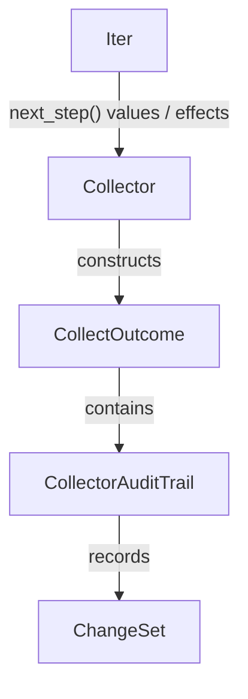

# 第15章: 標準ライブラリのプリミティブ

## 1. 概要 (Introduction)

本章では、Reml ランタイムの中核を成す「標準ライブラリのプリミティブ」について解説します。これらのモジュール群は `compiler/runtime/src` 配下に位置し、言語機能の基礎となるデータ構造やシステムインターフェースを提供しています。

具体的には、以下の基盤レイヤを対象とします。

- **Prelude** (`prelude`): `Iter` や `Collector`、`ensure` など、言語の中核的なデータフローを支える最小限のプリミティブ。
- **Collections** (`collections`): 永続データ構造と可変データ構造、およびそれらと監査システムをつなぐブリッジ。
- **Text/Unicode** (`text`): 文字列操作、Unicode 正規化、グラフェム（書記素）処理、表示幅の補正。
- **IO/Path** (`io`, `path`): Reader/Writer や ストリーミング処理、パスの検証とサンドボックス化。
- **Numeric/Time** (`numeric`, `time`): 統計関数と時刻・期間型。
- **Env** (`env`): プラットフォーム情報と環境変数へのアクセス。

Reml における「プリミティブ」の設計目標は、単に便利な機能を提供することだけではありません。**「効果（Effect）と監査メタデータを付与しやすい最小の API セットを揃えること」** が真の狙いです。

例えば、繰り返し処理を担う `Iter` は、内部に `EffectSet` を保持し、処理に伴う副作用を追跡します。収集を行う `Collector` は、結果とともに `CollectorAuditTrail` を生成し、そこにデータの変更内容（`ChangeSet`）を転写します。また、IO やパス操作では `IoContext` や `PathSecurityError` を通じて、操作の背景情報やセキュリティ検証の履歴を運搬する設計になっています。

### 入力と出力

- **入力**: `Iter` によるデータ列、`Reader`/`Writer`、`Str`/`String`、`Path`、数値列、環境変数キーなど。
- **出力**: `CollectOutcome`/`IoResult`/`UnicodeResult` といった `Result` 型のバリアント、`ChangeSet` や `EffectLabels` といったメタデータ、`Timestamp`/`Duration` などの基礎型。

`compiler/runtime/src/lib.rs` の公開モジュール一覧は、本章の全体像を把握するための地図として機能します。

- `compiler/runtime/src/lib.rs:5`

## 2. データ構造 (Key Data Structures)

標準ライブラリの中核となるデータ構造を見ていきましょう。これらは効率的な処理だけでなく、監査可能性を考慮して設計されています。

### 2.1 Iter と Collector

Reml のイテレーションは、`Iter<T>` と `Collector` の連携によって行われます。

`Iter<T>` は遅延評価される列の共有ハンドルであり、内部状態として `IterState` を持ちます。ここには現在のステージ情報や発生した副作用（Effect）が記録されており、単なる「値の列」ではなく、**「監査情報と効果を伝播するパイプライン」** として機能します。

- `compiler/runtime/src/prelude/iter/mod.rs:42`
- `compiler/runtime/src/prelude/iter/mod.rs:460` (`IterState`)

一方、`Collector` は列の終端操作を担当し、その結果は `CollectOutcome` に包まれて返されます。`CollectOutcome` は、計算結果（`value`）に加えて、必ず監査証跡（`audit: CollectorAuditTrail`）を保持します。

- `compiler/runtime/src/prelude/collectors/mod.rs:52`

```rust
pub struct CollectOutcome<C> {
    value: C,
    audit: CollectorAuditTrail,
}
```

ステージ情報は `CollectorStageProfile` や `CollectorStageSnapshot` によって抽象化され、最終的に監査ログへ出力可能な形式に整形されます。これにより、どの安定度（Stable/Beta/Experimental）の収集ロジックが使用されたかが記録に残ります。

- `compiler/runtime/src/prelude/collectors/mod.rs:108`

### 2.2 永続コレクション

不変（Immutable）データの扱いは、関数型言語としての Reml の特徴の一つです。

永続リスト `List<T>` は、Finger Tree に似た構造を持つノードと `PersistentArena` を組み合わせて実装されており、構造共有によってメモリ効率を高めています。`push_front`、`push_back`、`concat` といった操作は、新しいノードを生成しつつ、既存の構造を可能な限り再利用します。

- `compiler/runtime/src/collections/persistent/list.rs:9`
- `compiler/runtime/src/collections/persistent/list.rs:78`

永続マップ `PersistentMap<K, V>` は、LLRB（Left-Leaning Red-Black）ツリー風の平衡二分探索木として実装されています。`get`、`insert`、`merge_with` といった操作を提供し、更新時には変更差分を `ChangeSet` へ変換する機能を持っています。これが監査システムと直結し、データの変更履歴を追跡可能にします。

- `compiler/runtime/src/collections/persistent/btree.rs:21`
- `compiler/runtime/src/collections/persistent/btree.rs:140`

### 2.3 可変コレクション

パフォーマンスが必要な場面や、一時的なバッファとして、可変（Mutable）データ構造も提供されています。`mutable` モジュールでは、`Vec`、`Cell`、`Ref`、`Table` などが定義されています。これらは `Effectful*` というプレフィックスを持つ型（例: `EffectfulVec`）としてラップされることがあり、変更操作に伴う効果の伝播を強制しやすくしています。

- `compiler/runtime/src/collections/mutable/mod.rs:1`

### 2.4 Text / Unicode

テキスト処理は現代のアプリケーションにおいて非常に重要かつ複雑な領域です。`text` モジュールは、`Str`、`String`、`Bytes` といった基本型に加え、正規化、識別子の安全性確認、グラフェム（書記素）分割、表示幅の補正機能を提供します。

- `compiler/runtime/src/text/mod.rs:24`

特に `NormalizationForm` とそれを使用する `normalize`、`is_normalized` 関数は、Unicode 正規化形式（NFC/NFD など）を扱うための基盤です。

- `compiler/runtime/src/text/normalize.rs:5`

`prepare_identifier` 関数は、識別子として安全な文字列かどうかを検証します。NFC 正規化を強制し、双方向（BiDi）制御文字などの危険な文字を排除することで、字句解析（Lexer）レベルでの安全性を担保しています。

- `compiler/runtime/src/text/identifier.rs:14`

また、`GraphemeSeq` と `segment_graphemes` は Unicode セグメンテーションの中核であり、キャッシュ構造と統計情報の計測機能を備えています。

- `compiler/runtime/src/text/grapheme.rs:7`

`width_map` は文字の表示幅を計算するための最小 API です。`WidthMode` によって計算ルール（East Asian Width など）を切り替えることができます。

- `compiler/runtime/src/text/width.rs:8`

### 2.5 IO / Path

入出力とファイルパスの扱いは、セキュリティ上の懸念が大きい領域です。

`IoError` と `IoErrorKind` は IO エラーを統一的に表現し、`IoContext` を通じてエラー発生時のコンテキスト（ファイルパスや操作内容など）とメタデータを保持します。

- `compiler/runtime/src/io/error.rs:15`
- `compiler/runtime/src/io/context.rs:10`

`TextDecodeOptions` と `TextEncodeOptions` は、ストリーミング処理におけるエンコーディングやバッファリングのパラメータを定義します。

- `compiler/runtime/src/io/text_stream.rs:32`

パス操作においては、`PathBuf`、`PathError`、`PathErrorKind` が抽象化の中核を担います。特に `PathSecurityError` と `SecurityPolicy` は、サンドボックス検証を担当し、許可されていないパスへのアクセスを阻止します。

- `compiler/runtime/src/path/mod.rs:32`
- `compiler/runtime/src/path/security.rs:22`

### 2.6 Numeric / Time

数値計算と時間は、精度と副作用の管理が重要です。

`numeric` モジュールでは、`Numeric` や `Floating` といったトレイトが数値型の振る舞いを定義し、統計関数は `Iter<T>` から入力を受け取る設計になっています。入力がイテレータであるため、メモリ効率良く統計量を計算できます。

- `compiler/runtime/src/numeric/mod.rs:39`

`time` モジュールは、`Timestamp`、`Duration`、`TimeFormat` を中心に構成されています。`now` や `sleep` といった操作はシステムクロックへのアクセスを伴うため、最小限の API として提供され、効果の追跡が行われます。

- `compiler/runtime/src/time/mod.rs:27`
- `compiler/runtime/src/time/mod.rs:188`

### 2.7 Env

環境へのアクセスも抽象化されています。`PlatformInfo` と `EnvError` は環境変数操作の基盤を提供します。`env` モジュールは、より低レイヤの `system::env` への薄いラッパーとして機能し、プラットフォーム間の差異を吸収します。

- `compiler/runtime/src/system/env.rs:8`
- `compiler/runtime/src/env.rs:1`

## 3. アルゴリズムと実装 (Core Logic)

ここでは、いくつかの主要な処理フローについて、その実装詳細を解説します。

### 3.1 Iter → Collector のパイプライン

`Iter` は `next_step` メソッドを繰り返し呼び出すことで、要素を一つずつ生成します。`collect_list` や `collect_vec` などの終端操作が呼ばれると、対応する `Collector` が起動します。`Collector` は要素を受け取りながら内部状態を更新し、最終的に `CollectOutcome` を返します。

このとき重要なのが、**効果と監査情報のバケツリレー**です。`Iter` が蓄積した効果は `Collector` へと渡され、`Collector` 自身の処理で発生した効果（メモリ割り当てなど）と合わさり、最終的な `CollectorAuditTrail` に集約されます。

- `compiler/runtime/src/prelude/iter/mod.rs:140`
- `compiler/runtime/src/prelude/iter/mod.rs:158`

`Collector` 側の `record_change_set` メソッドは、コレクションの変更差分（`ChangeSet`）を監査証跡に「貼り付ける」役割を果たします。これにより、データがどう変化したかが監査ログの末端まで到達します。

- `compiler/runtime/src/prelude/collectors/mod.rs:94`



図15-1: Iter と Collector の監査連携

### 3.2 永続 Map の差分生成

永続マップの `merge_with_change_set` メソッドは非常に興味深い実装になっています。これは `merge_with`（マージ操作）を行った後、その結果と元のマップとの差分を `diff_change_set` で計算し、**「マージ後の新しいマップ」と「変更差分」のペア**を返します。

この設計により、コレクション操作の内部で監査ログ向けのデータ生成が完結しており、呼び出し側は意識することなく詳細な監査情報を得ることができます。

- `compiler/runtime/src/collections/persistent/btree.rs:168`

### 3.3 IO と Text のストリーミング統合

`io::copy` は `IoCopyBuffer` を使用して Reader から Writer へデータを転送します。この際、転送量（mem）やブロッキング操作（io.blocking）といった効果が逐次記録されます。

- `compiler/runtime/src/io/mod.rs:54`

`decode_stream` は、バイト列のストリームを文字列のストリームへ変換します。この関数はループ内で BOM（Byte Order Mark）の判定、UTF-8 デコード、不正なシーケンスの置換処理を行いながら、Text 処理に関連する効果を記録します。IO 処理で発生した効果と、テキスト処理の効果がメタデータとして統合される点が特徴です。

- `compiler/runtime/src/io/text_stream.rs:103`

### 3.4 Text の識別子正規化と幅補正

`prepare_identifier` は、セキュリティ上重要な役割を果たします。入力された文字列に対して NFC 正規化を適用し、さらに双方向制御文字などの「ソースコードとして誤解を招く恐れのある文字」が含まれていないかをチェックします。これにより、コンパイラの早い段階（Lexer）で脆弱性の芽を摘むことができます。

- `compiler/runtime/src/text/identifier.rs:14`

`width_map_with_stats` は、文字列の表示幅を計算する際に、グラフェム単位での補正を行います。そして、補正が行われた回数や、補正による幅の増減量を統計情報として返します。これはエディタの表示位置計算などで有用です。

- `compiler/runtime/src/text/width.rs:63`

### 3.5 Numeric の統計関数

`mean`（平均）や `variance`（分散）といった統計関数は、Welford のアルゴリズムを採用しています。これにより、`Iter<T>` を一度走査するだけで、誤差を抑えつつ統計量を計算できます。一方、`percentile`（パーセンタイル）や `median`（中央値）はデータのソートが必要となるため、内部でバッファを確保し、`record_mem_copy` を呼び出してメモリ使用の影響を効果として記録します。

- `compiler/runtime/src/numeric/mod.rs:79`

### 3.6 Time の基本 API

`Timestamp` と `Duration` はナノ秒精度の値を扱い、オーバーフローなどの範囲チェックを厳密に行います。`now` や `sleep` などの関数は、直接 OS の API を呼ぶのではなく、`SystemClockAdapter` を介して実行されます。これによりテスト時の時刻モック化が容易になると同時に、副作用の発生が正しく記録されます。

- `compiler/runtime/src/time/mod.rs:27`
- `compiler/runtime/src/time/mod.rs:188`

### 3.7 Path の glob とセキュリティ

`path::glob` は、glob パターンを用いたファイル検索機能を提供します。パターン検証後に、各パスに対して Capability のチェック（アクセス権限の確認）と IO 効果の記録を行い、結果を `PathBuf` のリストとして返します。

- `compiler/runtime/src/path/glob.rs:13`

`SecurityPolicy` と `PathSecurityError` は、ファイルシステムアクセスの門番です。許可されたルートディレクトリ以下へのアクセスか、シンボリックリンクが安全かなどを検証し、ポリシー違反があれば即座にエラーを返します。

- `compiler/runtime/src/path/security.rs:22`

## 4. エラー処理 (Error Handling)

標準ライブラリでは、エラーが発生した場合でも可能な限り豊かなコンテキスト情報を利用者に提供するように設計されています。

- **Prelude**: `ensure` や `ensure_not_null` は、条件チェックを行い、失敗時には `Result` 型のエラーを返します。この際、`EnsureErrorBuilder` が診断メタデータ（エラーコードや深刻度など）の組み立てを補助します。
  - `compiler/runtime/src/prelude/ensure.rs:307`
- **IO**: 型としての `IoError` は `IoContext` を保持しています。`into_diagnostic` メソッドを呼び出すことで、操作の種類（`operation`）、必要な権限（`capability`）、処理済みバイト数（`bytes_processed`）などの拡張フィールドを含む診断情報に変換されます。
  - `compiler/runtime/src/io/error.rs:15`
- **Path**: `PathError` は、glob 展開失敗時の `GlobContext` などを含みます。`PathSecurityError` は特に詳細で、サンドボックス違反や Capability 拒否の理由を明確に示します。
  - `compiler/runtime/src/path/mod.rs:44`
  - `compiler/runtime/src/path/security.rs:101`
- **Text**: `UnicodeError` は、`prepare_identifier` などで不正な文字が検出された場合に、字句解析（`lex`）フェーズのエラーであることを明示して返されます。
  - `compiler/runtime/src/text/identifier.rs:19`
- **Numeric**: 統計関数においては、入力が空の場合のエラーを避けるため、戻り値を `Option` 型（`Option<f64>` など）とすることで、型レベルでの安全性と使いやすさを両立させています。
  - `compiler/runtime/src/numeric/mod.rs:79`

## 5. 発展的トピック (Advanced Topics)

### 5.1 効果ラベルと監査の連携

Reml のランタイムにおいて、`Iter` と `Collector` は `EffectSet` および `EffectLabels` という仕組みを通じて深く連携しています。

`EffectSet` はビットフラグの集合で、どのような副作用が発生したかを効率的に追跡します。`Collector` はさらに詳細な `CollectorEffectMarkers` を持ち、メモリ予約回数、IO 操作回数、セキュリティチェック回数などをカウントします。これらの情報は最終的に監査メタデータへと転写され、システムの挙動を詳細に分析するためのデータソースとなります。

- `compiler/runtime/src/prelude/collectors/mod.rs:183`

### 5.2 Text のキャッシュ戦略

Unicode 処理は計算コストが高いため、最適化が重要です。`grapheme` モジュールでは、Unicode セグメンテーションの結果をキャッシュする仕組みを備えています。また、Unicode のバージョンが変わると結果が変わる可能性があるため、バージョンの不一致を検知する機構も組み込まれています。これにより、例えばエディタでのシンタックスハイライト計算やカーソル移動の計算を高速化しつつ、正確性を維持しています。

- `compiler/runtime/src/text/grapheme.rs:12`

### 5.3 Feature Gate の前提

標準ライブラリの一部、特に `numeric` と `time` モジュールは、コンパイル時の Feature Flag (機能フラグ) によって有効化・無効化が切り替えられます。これは組込み環境など、リソース制約の厳しい環境での利用を想定しているためです。この解説書を読む際には、ビルド設定によってはこれらのモジュールが存在しない場合がある点に留意してください。

- `compiler/runtime/src/lib.rs:21`

## 6. 章末まとめ (Checkpoint)

本章では、Reml ランタイムの標準ライブラリプリミティブについて学びました。

- **Prelude の役割**: `Iter` と `Collector` は、単なる繰り返し処理だけでなく、効果と監査情報を伝播するデータフローのバックボーンとして機能します。
- **永続コレクション**: `List` や `Map` は、関数型言語らしい不変性と構造共有を提供しつつ、変更差分を `ChangeSet` として監査システムに接続します。
- **ストリーミング統合**: IO と Text 処理は密接に統合されており、バイト列から文字列への変換過程でも監査情報が途切れることはありません。
- **Unicode 基盤**: Text モジュールは、正規化、グラフェム分割、表示幅補正といった複雑な Unicode 処理を隠蔽し、安全なテキスト操作を提供します。
- **統計と時間**: Numeric と Time モジュールは、副作用の管理を徹底しながら、実用的な計算機能を提供します。
- **セキュリティの境界**: Path と Env モジュールは、サンドボックスやプラットフォーム抽象化を通じて、外部環境との境界を明確に定義し、安全性を担保しています。

次章では、これらのプリミティブの上に構築される、より高度な解析機能や DSL について解説します。

## 7. 仕様との対応 (Spec Sync)

本章の内容は、以下の仕様書に基づいています。

- Prelude / Iter / Collector: `docs/spec/3-1-core-prelude-iteration.md`
- Collections: `docs/spec/3-2-core-collections.md`
- Text / Unicode: `docs/spec/3-3-core-text-unicode.md`
- Numeric / Time: `docs/spec/3-4-core-numeric-time.md`
- IO / Path: `docs/spec/3-5-core-io-path.md`
- Env: `docs/spec/3-10-core-env.md`
