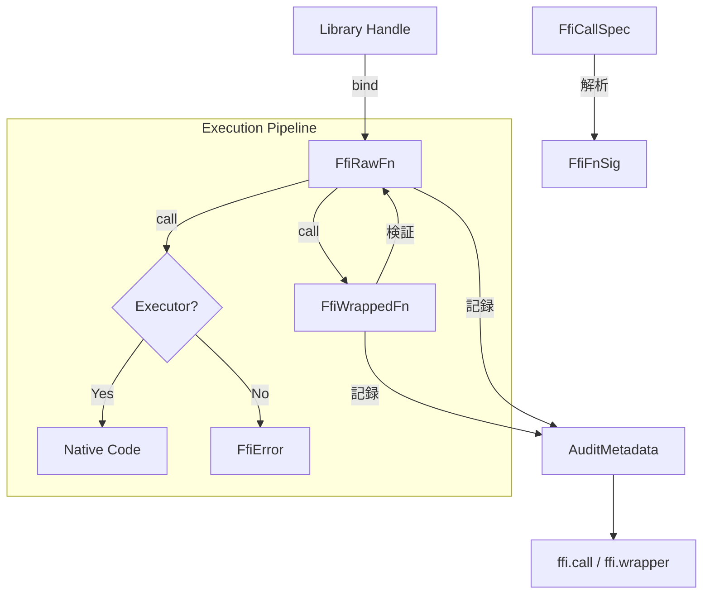

# 第17章: FFIとネイティブ連携

## 1. 概要 (Introduction)

本章では、Reml ランタイムにおける **FFI（Foreign Function Interface）呼び出し** のメカニズムと、**ネイティブ実行の監査（Audit）** について解説します。

Reml の FFI システムは、単に外部関数を呼び出すだけでなく、「どのような権限で、何が呼び出されたか」を厳密に追跡するように設計されています。対象となる主なモジュールは `compiler/runtime/src/ffi` と `compiler/runtime/src/native` です。

ここでは、動的ライブラリ（.so/.dll）のロードプロセスそのものよりも、以下の点に重点を置いて解説します。

1. **型とシグネチャの表現**: MIR（中間表現）から渡される型情報の実行時表現。
2. **呼び出しの検証**: 安全ラッパーによる事前・事後条件のチェック。
3. **監査メタデータ**: セキュリティ監査のために記録される `ffi.call` や `native.*` といった構造化ログ。

### 参照ファイル

- **FFI DSL定義と実装**: `compiler/runtime/src/ffi/dsl/mod.rs`
- **FFI エントリポイント**: `compiler/runtime/src/ffi/mod.rs`
- **ネイティブ監査ヘルパ**: `compiler/runtime/src/native/mod.rs`
- **埋め込みAPI**: `compiler/runtime/src/embedding.rs`

### 入力と出力

- **入力**: コンパイラバックエンドから出力された MIR 由来の呼び出し仕様 (`FfiCallSpec`)、対象ライブラリ名、および実行時の引数値 (`FfiValue`)。
- **出力**: 実行結果としての `FfiValue`、または安全性を侵害した場合の診断エラー (`GuardDiagnostic`)。同時に、副作用として監査ログ（`AuditEnvelope`）にメタデータが記録されます。

## 2. データ構造 (Key Data Structures)

FFI モジュールの中核となるデータ構造は、`runtime/src/ffi/dsl/mod.rs` に集約されています。これらは「定義（DSL）」と「実行（Runtime）」の両方の側面を持ちます。

### 2.1 FFI 型とシグネチャ

Reml の型システムは複雑ですが、FFI 境界では C ABI (Application Binary Interface) に適合する最小限の型セットに還元されます。

- **`FfiType`**: `I32`, `F64`, `Ptr`, `Struct` など、C 言語互換の型を表現する列挙型です。
  - `compiler/runtime/src/ffi/dsl/mod.rs:24-66`
- **`FfiFnSig`**: 関数の引数リストと戻り値の型を定義します。可変長引数 (`variadic`) もサポートしています。
  - `compiler/runtime/src/ffi/dsl/mod.rs:61-66`
- **`FfiCallSpec`**: コンパイル済みバイナリ（MIR の JSON 表現など）から読み込まれる呼び出し仕様です。ここから `FfiFnSig` が生成されます。
  - `compiler/runtime/src/ffi/dsl/mod.rs:77-105`

### 2.2 ライブラリと関数バインド

関数を呼び出すためには、まずライブラリを解決し、シンボルをバインドする必要があります。

- **`FfiLibrary` / `FfiLibraryHandle`**: ライブラリシステム上の識別子（例: `libc.so` のパスや論理名）を保持します。
  - `compiler/runtime/src/ffi/dsl/mod.rs:221-256`
- **`FfiRawFn`**: バインドされた「生の（Raw）」関数ハンドルです。物理的な関数ポインタそのものではなく、呼び出しを抽象化したオブジェクトです。
  - `compiler/runtime/src/ffi/dsl/mod.rs:296-303`

### 2.3 ラッパーと安全性

Reml では、生の FFI 呼び出しを直接行うことは推奨されません。多くの場合、安全性制約を付与したラッパーを経由します。

- **`FfiWrapSpec`**: ラッパーの検証ルールを定義します。NULL チェックの有無や、所有権（`Ownership`）の移動などを指定します。
  - `compiler/runtime/src/ffi/dsl/mod.rs:381-388`
- **`Ownership`**: リソース管理のポリシーです。`Borrowed`（借用）、`Owned`（所有）、`Transferred`（所有権移転）などが定義されています。
  - `compiler/runtime/src/ffi/dsl/mod.rs:392-396`
- **`FfiWrappedFn`**: `FfiRawFn` に `FfiWrapSpec` を適用し、検証ロジックを組み込んだ関数オブジェクトです。
  - `compiler/runtime/src/ffi/dsl/mod.rs:424`

### 2.4 エラーと監査情報

- **`FfiError` / `FfiErrorKind`**: 実行時エラーを表現します。単なる失敗だけでなく、「どの監査権限に違反したか」というセキュリティ文脈を含みます。
  - `compiler/runtime/src/ffi/dsl/mod.rs:648-669`
- **`FfiCallAuditInfo`**: `ffi.call` 監査イベントに記録される詳細情報（ライブラリ名、シンボル名、レイテンシなど）です。
  - `compiler/runtime/src/ffi/dsl/mod.rs:760-771`

## 3. アルゴリズムと実装 (Core Logic)

FFI 実行のフローは、型解析、バインド、そして検証付き呼び出しの3段階で構成されます。

### 3.1 MIR 由来の FFI 型解析

`parse_mir_ffi_type` 関数は、文字列表現の型（例: `"i32"`, `"&mut u8"`, `"[i32]"`）を正規化された `FfiType` に変換します。

- **ポインタの正規化**: 上位レベルの `&mut T` や `&T` は、FFI レベルではそれぞれ `Ptr<T>`, `ConstPtr<T>` に変換されます。
- **スライスの扱い**: Reml のスライス `[T]` はファットポインタ（ポインタ + 長さ）ですが、C FFI では一般的な表現がないため、単純な「要素へのポインタ」として降格されます。長さ情報は別途引数として渡す必要があります。
  - `compiler/runtime/src/ffi/dsl/mod.rs:107-167`

### 3.2 ライブラリ解決と関数バインド

`bind_library` でライブラリハンドルを取得し、`FfiLibrary::bind_fn` で関数シンボルをバインドします。
現時点のランタイム実装では、OS の `dlopen` を直接呼ぶのではなく、**監査ラベルの生成とハンドルの確立** に主眼が置かれています。実際のバイナリロードは、後述する `FfiCallExecutor` に委譲されます。

- `compiler/runtime/src/ffi/dsl/mod.rs:258-294`

### 3.3 呼び出しと実行委譲

`FfiRawFn::call` メソッドが呼び出しのエントリポイントです。Reml ランタイムは純粋な Rust で書かれていますが、実際の動的な関数呼び出し（特にシグネチャが動的な場合）には低レベルな操作が必要です。

そのため、ランタイムは `FFI_CALL_EXECUTOR` というグローバルなトレイトオブジェクトを通じて、実際の呼び出し処理を外部（通常は LLVM JIT や `libffi` バインディングを持つレイヤ）に委譲します。Executor が未登録の場合は `ffi.call.executor_missing` エラーとなります。

- `compiler/runtime/src/ffi/dsl/mod.rs:331-342`

図17-1: FFI 呼び出しと監査フロー

### 3.4 安全ラッパーの検証ロジック

`FfiWrappedFn::call` は、実際の呼び出し前後で契約（Contract）を強制します。

1. **引数数と型のチェック**: シグネチャと実引数が一致するか確認します。
2. **実行**: 内部の `FfiRawFn` を呼び出します。
3. **戻り値チェック**:
    - **型一致**: 戻り値の型が正しいか。
    - **NULL チェック**: `spec.null_check` が有効かつ戻り値が NULL ポインタの場合、`ffi.wrap.null_return` エラーとします。
    - **所有権**: `spec.ownership` に基づき、ポインタの所有権ルールに違反していないか簡易的にチェックします（例えば NULL ポインタで所有権を主張するなど）。

- `compiler/runtime/src/ffi/dsl/mod.rs:438-506`

### 3.5 ネイティブ監査と Intrinsic

FFI ではないネイティブ機能（CPU 命令や組み込み関数）も、`compiler/runtime/src/native` モジュールを通じて同様の監査対象となります。

- **Intrinsic**: `sqrt_f64` や `memcpy` などの組み込み関数は、実行時に `native.intrinsic.*` という監査ログを記録するフックを持っています。
  - `compiler/runtime/src/native/mod.rs:129-172`
- **埋め込み API**: Reml を C 言語などから利用する場合のコンテキスト作成 (`reml_create_context`) なども、`native.embed.*` として記録されます。
  - `compiler/runtime/src/embedding.rs:214-230`

## 4. エラー処理 (Error Handling)

FFI 境界でのエラーは、通常の例外よりも深刻なシステム不整合を示すことが多いため、詳細な診断情報が添付されます。

- **診断コード**: エラー原因を特定するためのコード体系（例: `ffi.signature.invalid`）が定義されています。
- **GuardDiagnostic への変換**: `FfiError` は `into_guard_diagnostic` を通じて、コンパイラの標準的な診断レポート形式に変換可能です。これにより、IDE や CLI で統一的なエラー表示が可能になります。
  - `compiler/runtime/src/ffi/dsl/mod.rs:702-713`

## 5. 発展的トピック (Advanced Topics)

### 5.1 実行エンジンの差し替え (Pluggable Executor)

`FfiRawFn` は `call_handler` を個別に保持できるほか、グローバルな `FFI_CALL_EXECUTOR` を利用できます。この設計により、ユニットテスト時にはモックの Executor を差し込み、実際の `.so` をロードしなくても FFI ロジックをテストすることが可能です。

- `compiler/runtime/src/ffi/dsl/mod.rs:371-379`

### 5.2 監査キーの整形

`insert_call_audit_metadata` などのヘルパ関数は、JSON 形式の監査ログ構築を隠蔽します。これにより、監査ログのスキーマ変更（例えばフィールド名の変更など）がランタイムの実装変更だけで完結し、呼び出し元のロジックに影響を与えないようになっています。

- `compiler/runtime/src/ffi/dsl/mod.rs:774-805`

## 6. 章末まとめ (Checkpoint)

本章では、Reml が外部世界と安全に接するための仕組みを見てきました。

- **FFI DSL**: `ffi/dsl` モジュールは、外部関数の型とシグネチャ、および呼び出し規約をランタイム上で表現します。
- **レイヤ化された呼び出し**: `FfiRawFn`（生呼び出し）と `FfiWrappedFn`（検証付き呼び出し）を分離することで、柔軟性と安全性を両立しています。
- **監査の不変性**: どのような経路で外部コードが実行されたとしても、必ず `AuditEnvelope` を通じて記録が残る設計になっています。
- **委譲モデル**: 実際のバイナリロードや CPU 命令実行は `FfiCallExecutor` に委譲され、ランタイム自体は純粋性を保っています。

次章「第18章: LSP/システム補助」では、これらのランタイム機能を開発者が利用するためのツール連携や、システムレベルの補助機能について解説します。
