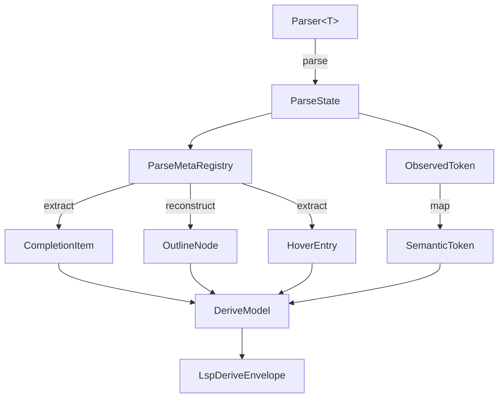

# 第18章: LSP/システム補助

## 1. 概要 (Introduction)

本章では、Reml ランタイムにおける「開発体験の向上」と「安全な OS 連携」を支える補助モジュールについて解説します。対象となるのは `compiler/runtime/src/lsp` と `compiler/runtime/src/system` です。

`lsp` モジュールは、Reml 言語サーバー (Language Server) を構築するための最小限の基盤を提供します。これには、LSP プロトコルで定義される基本型、JSON-RPC の簡易ヘルパ、そして構文解析メタデータ (`Core.Parse`) から補完やアウトラインを自動導出する仕組みが含まれます。

一方、`system` モジュールは `Core.System` 仕様に基づく標準 API と、その監査ログのメタデータ生成を担います。ここでは、Capability（権限）システムを通じた検証が組み込まれており、安全な OS リソース（プロセス、シグナル、環境変数）へのアクセスを提供するための入口となっています。

### 参照ファイル

- **LSP 型と JSON-RPC ヘルパ**: `compiler/runtime/src/lsp/mod.rs`
- **LSP 自動導出**: `compiler/runtime/src/lsp/derive.rs`
- **埋め込み DSL の LSP ルーティング**: `compiler/runtime/src/lsp/embedded.rs`
- **埋め込み DSL の定義**: `compiler/runtime/src/parse/embedded.rs`
- **System API 定義**: `compiler/runtime/src/system/mod.rs`
- **Env/Process/Signal/Daemon**:
  - `compiler/runtime/src/system/env.rs`
  - `compiler/runtime/src/system/process.rs`
  - `compiler/runtime/src/system/signal.rs`
  - `compiler/runtime/src/system/daemon.rs`
- **System 監査メタデータ**: `compiler/runtime/src/system/audit.rs`

### 入力と出力

- **LSP 連携**:
  - **入力**: 診断情報 (`GuardDiagnostic`)、構文解析メタデータ (`ParseMetaRegistry`)、トークン列 (`ObservedToken`)。
  - **出力**: LSP 診断 (`LspDiagnostic`)、JSON-RPC メッセージ (`JsonRpcMessage`)、自動導出結果 (`LspDeriveEnvelope`)。
- **System 連携**:
  - **入力**: Capability Registry (`core.process`, `core.signal` 等)、各種操作要求（プロセス起動、シグナル送信、環境変数取得）。
  - **出力**: 実行結果ハンドル (`ProcessHandle`, `SignalDetail`)、エラー (`EnvError`, `ProcessError`)、監査メタデータ (`AuditEnvelope.metadata`)。

## 2. データ構造 (Key Data Structures)

### 2.1 LSP の最小型定義

LSP 実装にあたっては、プロトコル仕様に準拠したデータ型が必要です。`lsp/mod.rs` では以下の基本型を定義しています。

- **`Position` / `Range`**:
  ソースコード上の位置を 0-based（0 始まり）の行番号と文字番号で表現します。負の値が渡された場合は `0` に丸められるよう設計されています (`compiler/runtime/src/lsp/mod.rs:15-27`)。
- **`LspCapabilities` / `LspServer`**:
  サーバーがサポートする機能（補完、アウトライン、セマンティックトークン、ホバー）をフラグとして保持します (`compiler/runtime/src/lsp/mod.rs:29-58`)。
- **`LspDiagnostic`**:
  エラーや警告を表す診断型です。`DiagnosticSeverity` と共に、クライアント（エディタ）が解釈可能な形式で保持されます (`compiler/runtime/src/lsp/mod.rs:61-77`)。
- **`JsonRpcMessage`**:
  JSON-RPC 通信のメッセージ構造です。メソッド名とパラメータのマップを持ち、デコードエラーを表す `LspError` も定義されています (`compiler/runtime/src/lsp/mod.rs:79-106`)。

### 2.2 LSP 自動導出モデル

構文解析の結果から IDE 機能を自動生成するためのモデルが `lsp/derive.rs` に定義されています。

- **`DeriveModel`**:
  補完候補、アウトライン、セマンティックトークン、ホバー情報のコレクションです (`compiler/runtime/src/lsp/derive.rs:9-15`)。
- **`LspDeriveEnvelope`**:
  CLI ツールなどが標準出力に書き出す際のラッパー構造体です。`format = "lsp-derive"`、`version = 1` というメタデータを持ち、外部ツールが識別しやすい形式になっています (`compiler/runtime/src/lsp/derive.rs:42-67`)。
- **構成要素**:
  `CompletionItem`（補完）、`OutlineNode`（階層構造）、`SemanticToken`（シンタックスハイライト）、`HoverEntry`（ドキュメント表示）といった個別の型が定義されています (`compiler/runtime/src/lsp/derive.rs:17-40`)。

### 2.3 埋め込み DSL の LSP ルーティング

Reml は言語内に別の DSL を埋め込む機能を持ちますが、LSP もそれに追従する必要があります。

- **`EmbeddedLspRegistry`**:
  ソースコード内の特定の範囲 (`Span`) と、その範囲を担当する `LspServer` を紐付けるレジストリです (`compiler/runtime/src/lsp/embedded.rs:13-35`)。
- **`EmbeddedDslSpec`**:
  DSL の定義自体にも `lsp: Option<LspServer>` フィールドが存在し、パーサと LSP サーバーの関連付けが行われています (`compiler/runtime/src/parse/embedded.rs:9-17`)。

### 2.4 System のコア型

OS 機能を安全に扱うための型が定義されています。

- **`EnvContext` / `PlatformInfo`**:
  環境変数操作や実行中の OS 情報（OS 名、アーキテクチャ）を保持し、エラー時に詳細なコンテキストを提供します (`compiler/runtime/src/system/env.rs:8-46`)。
- **`Command` / `ProcessHandle`**:
  外部プロセスの起動コマンドと、起動後のプロセスを一意に識別するハンドルです (`compiler/runtime/src/system/process.rs:26-68`)。
- **`SignalDetail`**:
  シグナルの送信元やペイロードなどの詳細情報をまとめた構造体です (`compiler/runtime/src/system/signal.rs:28-34`)。

## 3. アルゴリズムと実装 (Core Logic)

### 3.1 LSP 変換と JSON-RPC ヘルパ

`lsp/mod.rs` には、Reml 内部の型を LSP 形式に変換するロジックが含まれています。

- **位置と言語診断の変換**:
  `to_lsp` 関数は、Reml の `GuardDiagnostic` を受け取り、`severity` やエラーコードを維持したまま `LspDiagnostic` へ変換します。この際、行番号や列番号の調整（1-based から 0-based へ）も行われます (`compiler/runtime/src/lsp/mod.rs:139-152`)。

- **メッセージの送受信**:
  `encode_publish` は診断情報を通知する `textDocument/publishDiagnostics` メソッドの JSON を生成します。一方、`decode_message` は受信した JSON 文字列からメソッド名とパラメータを抽出します。堅牢性を高めるため、パラメータ内の値はすべて文字列型に正規化して扱われます (`compiler/runtime/src/lsp/mod.rs:154-193`)。

### 3.2 Lsp.Derive の導出フロー

`Derive::collect_with_source` は、パーサを実行して得られたメタデータ (`ParseMetaRegistry`) から IDE 機能を自動的に導出します。

1. **解析の実行**: まず `Parser` を実行し、`ParseState` を生成します。
2. **情報の抽出**:
   - **補完**: `Keyword` および `Symbol` として登録されたトークンを集めます。
   - **アウトライン**: `Rule` 間の親子関係（呼び出しグラフ）を解析し、ツリー構造を再構築します。
   - **ホバー**: ドキュメントコメント (`doc`) が付与されているルールやトークンを抽出します。
   - **セマンティックトークン**: 解析中に記録された `ObservedToken` の種類 (`kind`) と位置情報を使用します。

このプロセスにより、開発者が個別に LSP サーバーを実装しなくても、パーサ定義からある程度の IDE サポートが自動的に得られるよう設計されています (`compiler/runtime/src/lsp/derive.rs:80-120`)。

図18-1: Lsp.Derive による IDE 機能の自動導出フロー

### 3.3 埋め込み DSL のルーティング

`EmbeddedLspRegistry::resolve_route` は、指定されたカーソル位置（`InputPosition`）がどの埋め込み DSL の範囲に含まれるかを判定します。`span_contains` 関数は行と列の境界を厳密にチェックし、適切な `LspServer`（DSL 固有の言語サーバーインスタンス）を返します。これにより、単一のファイル内で複数の言語モードを扱う Polyglot な編集体験が可能になります (`compiler/runtime/src/lsp/embedded.rs:30-49`)。

### 3.4 System API の Capability ゲート

System モジュールの API は、実際の OS コールを行う前に必ず Capability（権限）のチェックを行います。

- **Process 操作**:
  `process::spawn` や `kill` は、`ensure_process_capability` を呼び出し、現在のコンテキストが `core.process` 権限を持っているか、そしてステージが `Experimental` 以上であるかを確認します。現状の実装では、これらの API は権限チェック後に `Unsupported` エラー（未配線）を返すようになっていますが、セキュリティモデルとしては機能しています (`compiler/runtime/src/system/process.rs:151-186`)。

- **環境変数**:
  `env::get_env` は Rust 標準の `std::env` をラップしていますが、返す値が UTF-8 でない場合は `InvalidEncoding` エラーとして処理します。これにより、Reml 内での文字列扱いの安全性を保証しています (`compiler/runtime/src/system/env.rs:77-88`)。

- **監査ログ生成**:
  `system/audit.rs` は、システム操作に伴う監査ログのメタデータを整形します。特筆すべきはシグナル情報の扱いで、`signal.raw_code`（生のシグナル番号）はポリシーで許可されない限り `masked` という文字列に置換され、ログに機微な情報が不用意に残らないよう配慮されています (`compiler/runtime/src/system/audit.rs:153-163`)。

## 4. エラー処理 (Error Handling)

このモジュール群におけるエラー処理は、堅牢性と情報の可視性を重視しています。

- **JSON-RPC**:
  `decode_message` は JSON のパースエラーや必須フィールドの欠落を `LspErrorKind::DecodeFailed` として明確に報告します (`compiler/runtime/src/lsp/mod.rs:167-179`)。
- **プロセス操作**:
  `ProcessError` は `IntoDiagnostic` を実装しており、エラー発生時には自動的に `process` 拡張フィールドや監査メタデータが生成されます。Capability 不足時は `system.capability.missing` という専用のエラーコードが割り当てられます (`compiler/runtime/src/system/process.rs:109-149`)。
- **環境変数**:
  OS から返される環境変数が不正なバイト列を含む場合、パニックするのではなく `EnvError` を返して呼び出し元でハンドリングできるようにしています (`compiler/runtime/src/system/env.rs:82`)。

## 5. 発展的トピック (Advanced Topics)

### 5.1 仕様と実装の対応状況

現在の実装には、仕様 (`docs/spec`) との間にいくつかの差異や将来の実装待ちが存在します。

- **スレッド API**: `Core.System` 仕様にはスレッド操作 (`create_thread`) が含まれていますが、現在の実装にはまだ反映されていません。
- **実処理の未配線**: `process` や `signal` の API はインターフェースと権限チェックのみが実装されており、実際のシステムコールを行うバックエンドは将来のフェーズで接続される予定です。これは、セキュリティ機構を先行して確立するアプローチを採っているためです。

### 5.2 LSP 実装の最小性

`lsp` モジュールは、完全な言語サーバーの実装（通信ループや並行処理など）を行うのではなく、あくまでデータ型と変換ロジック、そして自動導出という「コア」機能の提供に留まっています。実際の通信処理やエディタとの対話は、上位の `tooling` レイヤや `ffi_bindgen` で生成される外部ツールに委譲される設計です。

## 6. 章末まとめ (Checkpoint)

本章では、開発者支援とシステム連携のための基盤について学びました。

- **Core.Lsp**: パーサ定義から補完やアウトラインを自動生成する `Derive` モデルを持ち、最小限のコストで IDE サポートを実現しています。
- **JSON-RPC**: 診断情報の通知などに必要な最小限のメッセージ処理機能が提供されています。
- **Core.System**: プロセスや環境変数へのアクセスは、すべて Capability システムによる権限チェックと監査ログ生成によってガードされています。
- **未配線の実装**: 現段階ではセキュリティモデルの確立が優先されており、実際のシステムコールの多くは将来の実装待ちとなっています。

**関連する仕様書**:

- `docs/spec/3-14-core-lsp.md`
- `docs/spec/3-18-core-system.md`

次章「第19章: Adapter レイヤ」では、これらのシステム機能が実際にどのようにプラットフォームごとの差異を吸収しているのか、OS アダプタの仕組みについて掘り下げていきます。
