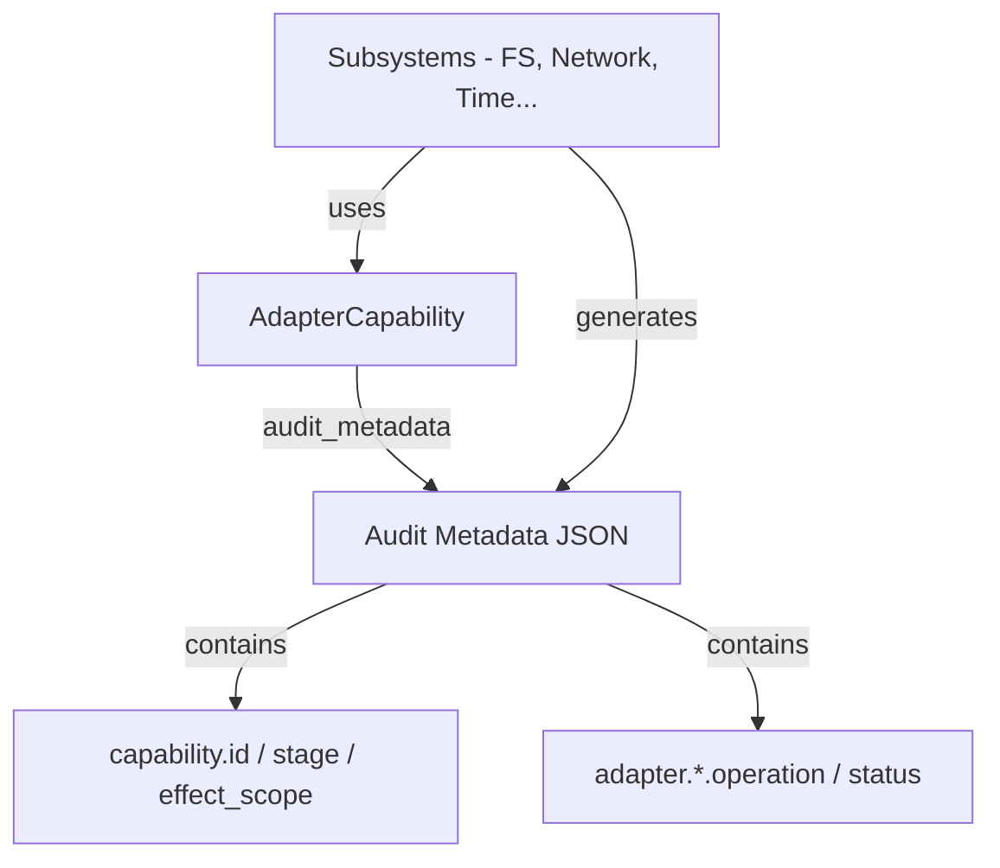

# 第19章: Adapter レイヤ

## 1. 概要 (Introduction)

本章では、プラットフォーム間の差異を吸収し、統一されたインターフェースを提供する `compiler/adapter` レイヤについて解説します。

Reml コンパイラは、Linux、macOS、Windows など複数の OS 上で動作することを前提としています。しかし、環境変数の扱いやファイルシステム、ネットワーク、時刻取得といったシステム操作は、OS ごとに微妙に異なる API や挙動を持っています。`Adapter` レイヤの主たる責務は、これらのシステム依存処理を「薄いラッパ（Thin Wrapper）」で包み込み、上位の Runtime に対して統一された操作手段を提供することです。

さらに、`Adapter` レイヤは **Capability（権限）と監査（Audit）の基盤** としても機能します。各システム操作が実行される際、どの Capability に基づいているか、どのような操作が行われたかという監査メタデータを統一的な形式で生成します。これにより、セキュリティと可観測性（Observability）の要件を、個別の OS 実装に埋もれさせることなく、一元的に管理可能にしています。

### このモジュールの役割

1. **プラットフォーム抽象化**: OS 固有の API を Rust の標準的なインターフェースでラップします。
2. **監査メタデータの標準化**: `capability.*` や `adapter.*` といった監査キーの生成ロジックを集約します。
3. **ターゲット推論**: 実行環境（ホスト）の情報を収集し、コンパイルターゲットの設定（Target Profile）を推論します。

### 参照ファイル

- **公開モジュール一覧**: `compiler/adapter/src/lib.rs`
- **Capability 共通モデル**: `compiler/adapter/src/capability.rs`
- **環境変数 API**: `compiler/adapter/src/env.rs`
- **FS ラッパ**: `compiler/adapter/src/fs.rs`
- **Network ラッパ**: `compiler/adapter/src/network.rs`
- **Process ラッパ**: `compiler/adapter/src/process.rs`
- **Random ラッパ**: `compiler/adapter/src/random.rs`
- **Target 推論**: `compiler/adapter/src/target.rs`
- **Time ラッパ**: `compiler/adapter/src/time.rs`
- **設計指針**: `docs/plans/rust-migration/2-2-adapter-layer-guidelines.md`

### 入力と出力

- **入力**:
  - OS のシステムリソース（環境変数、ファイルシステム、ネットワーク、時刻、乱数源など）。
  - `REML_TARGET_*` などの設定用環境変数。
- **出力**:
  - 統一された `Result` 型（`io::Result<T>` や `AdapterResult<T>`）。
  - 監査ログ用のメタデータ（`serde_json::Map` 形式）。
  - 推論されたターゲットプロファイル（`TargetInference`）。

## 2. データ構造 (Key Data Structures)

`Adapter` レイヤのデータ構造は、主に「Capability 管理」と「コンテキスト情報」の2点に集約されます。

### 2.1 AdapterCapability

各サブシステム（FS, Network, Time など）が共通して持つ Capability 情報の定義です。

- `compiler/adapter/src/capability.rs`

```rust
pub struct AdapterCapability {
    pub id: &'static str,
    pub stage: &'static str,
    pub effect_scope: &'static [&'static str],
    pub audit_key_prefix: &'static str,
}
```

この構造体は、サブシステムごとの静的な定義（IDやステージ）を保持します。重要なのは `audit_metadata` メソッドです。これにより、`capability.id` や `adapter.fs.operation` といったキーを持つ監査用 JSON オブジェクトを生成します。各モジュールでバラバラにログ出力を実装するのではなく、この構造体を通じて統一的な監査フォーマットを保証しています。

### 2.2 Env モデル

環境変数（Environment Variables）の扱いは、セキュリティ上の重要度が高いため、他のサブシステムよりも詳細なモデルを持っています。

- **EnvOperation / EnvScope**:
    操作の種類（Get/Set/Remove）と、そのスコープ（Process/Session/System）を定義します。
    `compiler/adapter/src/env.rs:5-38`

- **PlatformSnapshot / EnvContext**:
    エラー発生時や監査時に、「どのような環境で」「どのような操作を行っていたか」を記録するためのコンテキスト情報です。
    `compiler/adapter/src/env.rs:41-97`

- **EnvAuditHandle**:
    環境変数の変更（Set/Remove）を行う際に必須となる、監査用のハンドルです。これにより、監査ロガー（`EnvAuditor` トレイと）が渡されない限り、環境変数の変更ができないような API 設計になっています（`set_env` のシグネチャを参照）。
    `compiler/adapter/src/env.rs:175-192`

### 2.3 Target 推論モデル

コンパイル対象のターゲット環境を表現するための構造体群です。

- **TargetProfile**:
    OS、アーキテクチャ、機能フラグ（features）、Capability などの詳細なターゲット設定を保持します。
    `compiler/adapter/src/target.rs:10-27`

- **TargetInference**:
    「要求された設定（requested）」と「検出された環境（detected）」の両方を保持し、最終的なターゲット設定を導出するための構造体です。
    `compiler/adapter/src/target.rs:87-92`

## 3. アルゴリズムと実装 (Core Logic)

### 3.1 Capability と監査メタデータの共通化

`Adapter` レイヤの核心は、各サブシステムが `AdapterCapability::new` を使用して自身の Capability を定義し、操作のたびに `audit_metadata` を呼び出してログ情報を生成することにあります。

例えば、ファイルシステム操作であれば `compiler/adapter/src/fs.rs` 内で以下のように定義されています。

```rust
pub const FS_CAPABILITY: AdapterCapability = AdapterCapability::new(
    "IoCapability.fs",
    "Stable",
    &["io.blocking"],
    "adapter.fs",
);
```

これにより、すべてのサブシステムで `capability.id`, `capability.stage`, `capability.effect_scope` といった共通フィールドが自動的に付与され、後段の監査システムでの検索やフィルタリングが容易になります。

- 関連コード: `compiler/adapter/src/capability.rs:12-65`



図19-1: Adapter による監査メタデータ生成フロー

### 3.2 Env 操作と監査フロー

`compiler/adapter/src/env.rs` では、環境変数の読み書きに対して厳格なチェックと監査が行われます。

1. **キーと値の検証**:
    `ensure_valid_key` および `ensure_valid_value` により、空文字や NULL バイトを含む不正なキー/値を事前に拒否します。失敗した場合は、詳細なコンテキストを持つ `EnvError` を返します。
    - `compiler/adapter/src/env.rs:305-349`

2. **Panic 安全な実行**:
    Rust の `std::env::set_var` や `remove_var` は特定条件下で panic する可能性があります。`Adapter` レイヤでは `panic::catch_unwind` を使用してこれを捕捉し、`IoFailure` エラーとして安全に呼び出し元へ返します。
    - `compiler/adapter/src/env.rs:234-247`

3. **監査ログの記録**:
    変更操作には `EnvAuditHandle` が必要であり、操作の成功・失敗（panic 含む）に関わらず、結果が必ず監査ロガー（`EnvAuditor`）に通知されます。

### 3.3 Target 推論の組み立て

実行環境からコンパイルターゲットの設定を推論するロジックは `compiler/adapter/src/target.rs` に集約されています。

`infer_target_from_env` 関数は以下の手順で動作します：

1. **ホスト環境の検出**: `PlatformSnapshot::detect()` で現在の OS やアーキテクチャを取得し、デフォルトのプロファイルとします。
2. **環境変数による上書き**: `REML_TARGET_*` 形式の環境変数をスキャンし、値を上書きします。
    - `REML_TARGET_ARCH` や `REML_TARGET_OS` などの基本情報。
    - `REML_TARGET_FEATURES` や `REML_TARGET_CAPABILITIES` などのリスト情報（カンマ区切り）。
    - `REML_TARGET_DIAGNOSTICS` などのブール値。
    - `REML_TARGET_EXTRA_*` による拡張パラメータ。
3. **JSON ペイロード生成**: 推論結果は `inferred_payload` メソッドによって正規化された JSON オブジェクトに変換され、CLI などの出力に使用されます。

- 関連コード: `compiler/adapter/src/target.rs:274-314`

### 3.4 サブシステム別ラッパの実装

各サブシステムは、基本的には Rust 標準ライブラリへの委譲ですが、Adapter 層としての付加価値を提供しています。

- **FS (`fs.rs`)**:
    `read_to_string` や `create_dir_all` などを提供。単純な委譲に見えますが、将来的にパスの正規化や権限チェックを挟むためのポイントとなります。
- **Network (`network.rs`)**:
    `TcpStream::connect` などをラップ。`adapter.net` プレフィックスを持つ監査キーを提供し、`effect {io.async}` や `effect {security}` といったエフェクトスコープを定義しています。
- **Process (`process.rs`)**:
    `current_pid` や `spawn` を提供。`adapter.process` プレフィックスを使用します。
- **Random (`random.rs`)**:
    `getrandom` 関数をラップし、OS の乱数源からの取得失敗を `io::Error` に統一して返します。
- **Time (`time.rs`)**:
    `Instant` や `SystemTime` をラップ。`adapter.time` プレフィックスを提供します。

## 4. エラー処理 (Error Handling)

`Adapter` レイヤのエラー処理は、システム操作の失敗を、文脈情報を含んだ構造化エラーに変換することを目的としています。

- **詳細な環境エラー**:
    `EnvError` は `EnvErrorKind`（NotFound, PermissionDenied, InvalidEncoding など）を持ち、さらに `EnvContext`（操作種別やプラットフォーム情報）を保持することで、エラー発生時の状況を完全に再現可能にします。
  - `compiler/adapter/src/env.rs:99-117`
- **共通エラー型**:
    `AdapterError` は、環境エラーと監査エラーを統合する Enum です。
  - `compiler/adapter/src/env.rs:119-126`
- **Target 設定のバリデーション**:
    `parse_bool` 関数などでは、不正な値が渡された場合に `InvalidEncoding` エラーとして詳細なメッセージと共に報告します。
  - `compiler/adapter/src/target.rs:360-371`

## 5. 発展的トピック (Advanced Topics)

### 5.1 最小ラッパ設計と Capability の分離

`docs/plans/rust-migration/2-2-adapter-layer-guidelines.md` では、Adapter 層がプラットフォーム差異を吸収する野心的な計画が示されていますが、現在の実装は意図的に「最小限のラッパ」に留められています。

これは**責務の分離（Separation of Concerns）**によるものです。
`Adapter` は「メタデータの生成」と「API の提供」に責任を持ちますが、実際の「Capability の検証」や「Stage のゲートチェック」は、このレイヤを利用する上位の `Runtime`（具体的には `AuditEnvelope` や `CapabilityRegistry`）が担います。これにより、Adapter 層自体は軽量で移植性の高い状態を保ち、ポリシーの変更に影響を受けにくい設計となっています。

### 5.2 CI 環境とネットワークテスト

`compiler/adapter/src/network.rs` のテストには、`REML_ADAPTER_SKIP_NETWORK_TESTS` という環境変数によるスキップ機構が含まれています。これは、サンドボックス化されたビルド環境や、ネットワーク権限が制限された CI 環境において、テストが誤って失敗するのを防ぐための配慮です。インフラ側の制約をコード側で吸収する、Adapter 層ならではの実装詳細と言えます。

- `compiler/adapter/src/network.rs:69-79`

## 6. 章末まとめ (Checkpoint)

- **OS 抽象化**: `Adapter` レイヤは、OS 依存のシステム API を、Capability・監査対応の統一されたインターフェースでラップします。
- **監査の正規化**: `AdapterCapability` 構造体により、すべてのシステム操作で統一されたフォーマットの監査メタデータが生成されます。
- **Env の堅牢性**: 環境変数の操作は特に詳細にモデル化され、コンテキスト付きのエラーと必須の監査フックによって保護されています。
- **ターゲット推論**: ホスト環境の検出と、環境変数によるオーバーライド（`REML_TARGET_*`）を組み合わせ、柔軟なクロスコンパイル設定を実現する基盤を提供しています。

次章では、この Adapter レイヤの上で動作する **FFI（Foreign Function Interface）** のバインディング生成ツールである `compiler/ffi_bindgen` について解説します。
