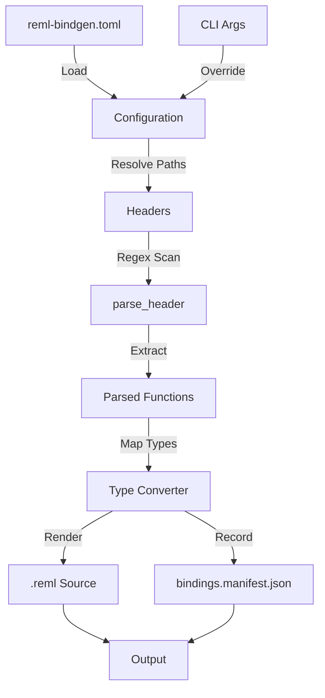

# 第20章: FFI Bindgen

## 1. 概要 (Introduction)

本章では、C言語のヘッダファイルからRemlの `extern "C"` 定義を自動生成するツール、`compiler/ffi_bindgen`（コマンド名: `reml-bindgen`）の内部構造について解説します。

RemlにおけるFFIバインディング生成は、**意図的に機能を制限した低レベルなアプローチ**を採用しています。`reml-bindgen` が生成するのは、C言語の型をほぼそのまま `Ptr<T>` などのプリミティブに写像した `unsafe` な定義のみです。Rustの `bindgen` クレートのように、複雑なマクロやC++テンプレートを完全に解析しようとはしません。これは、生成されたコードの予測可能性を高め、最終的な安全性の保証を `Core.Ffi.Dsl` などの上位レイヤ（Remlコード側）で行うという設計思想に基づいています。

`remlc build` コマンドは `reml.json` 内の設定を読み取り、必要に応じてこのツールを呼び出します。生成されたファイルは単なるビルド成果物ではなく、バージョン管理されるソースコードの一部として扱われ、人間によるレビューの対象となります。

### このモジュールの役割

1. **ヘッダ解析と型変換**: 正規表現を用いた軽量な解析により、C関数の宣言を抽出し、対応するRemlの型定義へ変換します。
2. **整合性の保証**: 入力ファイル群のハッシュ値や診断情報を `bindings.manifest.json` に記録し、ビルドの再現性を担保します。
3. **ツール統合**: コンパイラドライバ（`remlc`）と連携し、キャッシュ機構や監査ログの一環として機能します。

### 参照ファイル

- **コア実装**: `compiler/ffi_bindgen/src/lib.rs`
- **CLIエントリポイント**: `compiler/ffi_bindgen/src/main.rs`
- **ビルドシステム統合**: `compiler/frontend/src/bin/remlc.rs`

### 入力と出力

- **入力**:
  - 設定ファイル（`reml-bindgen.toml`）: ヘッダパス、インクルードパス、除外パターンなどを定義。
  - C/C++ ヘッダファイル: 解析対象のソーステキスト。
- **出力**:
  - `.reml` ファイル: `extern "C"` ブロックを含むRemlソースコード。
  - `bindings.manifest.json`: 型変換の対応表、警告、入力ハッシュを含むメタデータ。
  - 診断ログ（標準出力）: JSON Lines形式で出力される進捗やエラー情報。

## 2. データ構造 (Key Data Structures)

### 2.1 設定と CLI オプション

ツールの挙動は設定ファイルとCLI引数の組み合わせで決定されます。

- **`BindgenConfig`** (`compiler/ffi_bindgen/src/lib.rs:9`)
  - `headers`: 解析対象のヘッダファイルパスのリスト。
  - `include_paths`: コンパイラのインクルードパス（`-I`相当）。
  - `exclude`: 生成から除外する関数名の正規表現パターン。
- **`CliOptions`** (`compiler/ffi_bindgen/src/lib.rs:53`)
  - CLIから渡された上書き設定を保持します。`config.apply_overrides` メソッドにより、設定ファイルの値とマージされます。

### 2.2 診断とマニフェスト

生成結果の品質管理のために、詳細なメタデータが出力されます。

- **`Manifest`** (`compiler/ffi_bindgen/src/lib.rs:78`)
  - `bindings.manifest.json` のルート構造体です。使用したヘッダの一覧、計算された入力ハッシュ、変換された型の詳細を含みます。
- **`ManifestType`** (`compiler/ffi_bindgen/src/lib.rs:88`)
  - C言語の型（`c`）とRemlの型（`reml`）の対応関係を記録します。`const` などの修飾子も `qualifiers` として保存され、将来的な静的解析に役立てられます。
- **`DiagnosticEntry`** (`compiler/ffi_bindgen/src/lib.rs:65`)
  - 解析中に遭遇した「未対応の型」や「構文エラー」を構造化して記録します。これにより、ユーザは生成されなかった関数やその理由を追跡できます。

### 2.3 解析用の中間表現

正規表現によるパース結果を一時的に保持するための構造体です。

- **`ParsedFunction` / `ParsedParam` / `ParsedType`** (`compiler/ffi_bindgen/src/lib.rs:262`)
  - C言語の関数シグネチャを表現します。完全なASTではなく、Remlが必要とする情報（名前、型文字列、ポインタの段数など）に特化しています。

## 3. アルゴリズムと実装 (Core Logic)

`reml-bindgen` の処理フローは、**設定ロード → 解析 → 生成** という古典的なパイプライン構造をしています。

図20-1: reml-bindgen の生成フロー

### 3.1 ヘッダ解析 (Parsing Headers)

`reml-bindgen` の最大の特徴は、Clangなどの完全なCコンパイラフロントエンドを使用せず、**正規表現によるパターンマッチング**を採用している点です（`compiler/ffi_bindgen/src/lib.rs:289`: `parse_header`）。

これは、不完全なヘッダファイルや、複雑なプリプロセッサマクロが含まれる環境でも、頑健に関数宣言だけを抽出するためです。解析器は以下の手順で行単位の走査を行います。

1. **コメント除去**: `//` 以降を削除します。ブロックコメント（`/* ... */`）は現時点では単純な行処理では扱えないため、制限事項となります。
2. **宣言の抽出**: `型名 関数名(引数リスト);` というパターンを探します。
3. **除外判定**: 抽出された関数名が `exclude` パターンにマッチする場合、処理をスキップします。

### 3.2 型変換 (Type Conversion)

抽出された型文字列は `parse_type` (`compiler/ffi_bindgen/src/lib.rs:454`) によって分解されます。

1. **トークン化**: `*` や `const` を区切り文字として分割します。
2. **基本型のマッピング**: `int` → `I32`、`void` → `Unit` などの単純な置換を行います（`compiler/ffi_bindgen/src/lib.rs:516`）。
3. **ポインタの再構築**: ポインタの深さ（`*` の数）に応じて、Remlの `Ptr<T>` をネストさせます。例えば `char**` は `Ptr<Ptr<I8>>` になります。

配列（`[...]`）や関数ポインタ（`(*)(...)`）、可変長引数（`...`）などの複雑な型は、現段階（Phase 1）ではサポートされていません。これらに遭遇した場合、変換を諦めて `diagnostics` に「未対応」として記録し、関数の生成をスキップします。

### 3.3 出力とマニフェスト生成

変換された関数群は `render_reml` (`compiler/ffi_bindgen/src/lib.rs:568`) によって `.reml` ファイルとして整形されます。

このとき、単にファイルを出力するだけでなく、入力の一貫性を検証するためのハッシュ計算が行われます（`compiler/ffi_bindgen/src/lib.rs:223`: `calculate_input_hash`）。このハッシュは以下の要素から算出されます。

- ツール自体のバージョン (`CARGO_PKG_VERSION`)
- ヘッダファイルの内容
- インクルードパスと定義済マクロ
- 除外パターン

これにより、「設定やツールが変われば、出力も再検証が必要」という原則が守られます。

### 3.4 remlc との統合

`reml-bindgen` は通常、人間が直接叩くのではなく、`remlc build` プロセスの一部として起動されます。

`compiler/frontend/src/bin/remlc.rs` の `run_bindgen_if_enabled` 関数（`compiler/frontend/src/bin/remlc.rs:518`）がその責務を担います。

- **キャッシュ制御**: 計算した入力ハッシュに基づき、`cache_dir` 内に生成物をキャッシュします。入力に変更がなければツールを起動せず、キャッシュから復元します。
- **監査ログ**: バインディング生成の成功・失敗、使用されたバージョンなどの情報を監査ログ（audit log）に記録します。これはサプライチェーンセキュリティの観点で重要です。

## 4. エラー処理 (Error Handling)

`reml-bindgen` は、エラーを「ツールの実行エラー」と「解析時の警告」に区別しています。

- **実行エラー** (`BindgenError`): 設定ファイルが見つからない、出力先への書き込み権限がないなど、プロセスが続行不可能な状態。これは終了コード 1 で直ちに報告されます。
- **解析診断** (`DiagnosticEntry`): 特定の関数が無視された、型が不明であるなどの情報。これは生成処理を中断せず、マニフェストファイルと標準出力（JSON Lines）に記録されます。

特に注意すべきは「出力の上書き保護」です。生成先のファイルが既に存在する場合、意図しない上書きを防ぐために警告を出したり（CLI実行時）、キャッシュ復元時には上書きを拒否したりする安全策が講じられています。

## 5. 発展的トピック (Advanced Topics)

### 5.1 正規表現アプローチの限界と利点

正規表現によるパースは、完全なCプリプロセッサやAST解析を持たないため、以下のような限界があります。

- **構造体定義の無視**: `struct` の定義そのものを解析してRemlの `record` を生成することはまだできません。
- **複雑なマクロ**: 関数宣言に見えないマクロ展開後のシグネチャは認識されません。

一方で、これにより「ヘッダ単体でコンパイルが通らない状態」でも、プロトタイプ宣言さえ整っていればバインディングを生成できるという強力な利点があります。これは既存の巨大なCコードベースに対する漸進的な導入を容易にします。

### 5.2 将来の拡張 (Phase 2)

コード内のコメントや診断コード（`hint: "phase2"`）からも分かるように、以下の機能が将来的な拡張として計画されています。

- 構造体 (`struct`) および列挙体 (`enum`) の定義生成。
- 配列型と関数ポインタのサポート。
- 可変長引数 (`varargs`) の対応。

### 5.3 モジュール名の推論

生成される `.reml` ファイル内の `module` 宣言は、出力パスから自動的に推論されます（[`infer_module_name`](file:///compiler/ffi_bindgen/src/lib.rs#L597)）。リポジトリルート（`AGENTS.md` や `.git` がある場所）からの相対パスを用い、ディレクトリ区切りを `.` に置換することで、Remlのモジュールシステムに適合させます。

## 6. 章末まとめ (Checkpoint)

- **単純さと堅牢性**: `reml-bindgen` は正規表現を用いた軽量なツールであり、Cヘッダの不完全生に対して寛容です。
- **透明性**: 生成プロセスはブラックボックスではなく、すべての型変換と除外理由が `bindings.manifest.json` に記録されます。
- **ビルド統合**: `remlc` はハッシュベースのキャッシュを通じて、ツール実行のコストを最小化しつつ、再現性を保証しています。

次の章では、開発プロセス全体を支えるタスクランナーである `compiler/xtask` について解説します。
