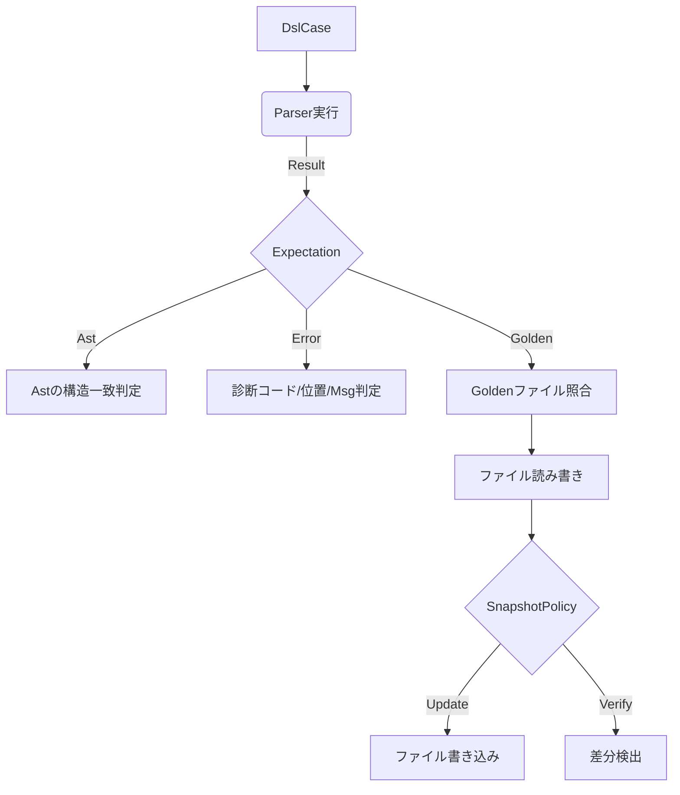

# 第22章: テスト戦略

## 22.1 概要

Remlコンパイラの品質保証は、**実装検証（Implementation Verification）**と**仕様回帰（Specification Regression）**という2つの柱で支えられています。

前者はRust標準のテスト機能を用いたユニットテスト群であり、`compiler/frontend/tests/` や `compiler/runtime/tests/` に配置されています。これらはモジュール単位での機能的正しさを保証し、開発サイクルの中で頻繁に実行されることを意図しています。

後者は、言語仕様の安定性を保証するためのゴールデンテスト（スナップショットテスト）群であり、`examples/` 以下のサンプルコードと `expected/` 以下の期待値ファイルを対にして管理します。これは「Phase4」と呼ばれる統合テストフェーズで実行され、エンドツーエンドでの振る舞いが意図せず変更されていないか（リグレッションがないか）を厳密にチェックします。

本章では、これらを支える `Core.Test` モジュールの設計と、DSL（ドメイン固有言語）を用いたテスト記述、そして監査ログと連携したユニークなテスト運用戦略について解説します。

### この章で扱う主な領域

- **Core.Test**: `compiler/runtime/src/test/mod.rs` - テスト結果モデルとスナップショット管理。
- **DSL Test Kit**: `compiler/runtime/src/test/dsl/mod.rs` - パーサや診断の検証を行うDSL。
- **Regression Suite**: `tooling/examples/run_examples.sh` - ゴールデンファイルの更新と検証フロー。

## 22.2 データ構造

`Core.Test` は、テストの結果やエラー、スナップショットの方針を表現するためのデータ構造を提供しています。

### 22.2.1 テスト結果とエラーモデル

Remlのテスト実行結果は `TestResult = Result<(), TestError>` という型で表現されます。特筆すべきは、失敗が単なる不可解なパニックではなく、構造化されたエラー情報として扱われる点です（`compiler/runtime/src/test/mod.rs:27-85`）。

```rust
pub struct TestError {
    pub kind: TestErrorKind,
    pub message: String,
    pub context: BTreeMap<String, String>,
}
```

`TestErrorKind` には以下の種類があり、失敗の性質を明確にします（`compiler/runtime/src/test/mod.rs:77-85`）。

- **`AssertionFailed`**: 値の不一致など、論理的な検証失敗。
- **`SnapshotMismatch`**: 事前に記録された期待値（スナップショット）と現在の結果が異なる。
- **`SnapshotMissing`**: 期待値が存在しない（新規テストケースなど）。
- **`HarnessFailure`**: ファイル読み書きの失敗や、スナップショットサイズの超過など、テスト基盤自体の問題。
- **`FuzzCrash`**: ファジングによるクラッシュ。

これらのエラーは `into_diagnostic` メソッドを通じて、コンパイラの標準的な診断メッセージ（`test.failed`）へと変換可能であり、テスト結果もまた一つの「コンパイル診断」として統一的に処理されます。

### 22.2.2 スナップショットポリシー

スナップショットテストの挙動は `SnapshotPolicy` 構造体によって制御されます（`compiler/runtime/src/test/mod.rs:87-127`）。

- **`SnapshotMode`**:
  - `Verify`: 現在の結果を記録済みの値と比較します。不一致があれば失敗とします。
  - `Update`: 現在の結果で記録を上書きします。意図的な仕様変更時に使用します。
  - `Record`: 記録がない場合のみ新規作成し、既存の場合は検証します。
- **`max_bytes`**: スナップショットの肥大化を防ぐための安全弁です。これを超過すると `HarnessFailure` となります。

### 22.2.3 DSL Test Kit の構造

構文解析や意味解析のテストを記述するために、`Core.Test.Dsl` モジュールは宣言的なテストケース定義を提供します（`compiler/runtime/src/test/dsl/mod.rs`）。

- **`DslCase<T>`**: テスト名、入力ソース、期待値をセットにした構造体。
- **`DslExpectation<T>`**: 期待値のバリアント。
  - `Ast(AstMatcher)`: ASTの構造を検証します。
  - `Error(ErrorExpectation)`: 発生すべき診断エラー（コード、位置、メッセージ）を定義します。
  - `Golden(GoldenCase)`: 外部ファイルを用いたゴールデンテストを行います。

`GoldenCase` は、`*.input`（入力）、`*.ast`（期待されるASTダンプ）、`*.error`（期待される診断JSON）の3点セットを管理し、仕様書（`docs/spec`）の記述ともリンクする重要な構造です。

## 22.3 アルゴリズムと実装

### 22.3.1 スナップショット検証のフロー

`assert_snapshot_with` 関数は、以下の手順で検証を行います（`compiler/runtime/src/test/mod.rs:170-321`）。

1. **正規化**: 改行コードの違いなどを吸収するため、入力を正規化します。
2. **サイズチェック**: `max_bytes` を超えていないか確認します。
3. **ストアアクセス**: プロセス内メモリ上の `SNAPSHOTS` ストアをロックしてアクセスします。現時点の `Core.Test` はファイルI/Oを持たず、メモリ上での一時的な検証にフォーカスしています。
4. **モード別処理**:
    - `Verify`: ハッシュ値を比較し、不一致であれば `SnapshotMismatch` エラーを生成します。コンテキストには期待値と実際のハッシュが含まれます。
    - `Update`/`Record`: ストアを更新し、`record_snapshot_updated` を呼び出して監査イベントを発行します。

### 22.3.2 DSLによるテスト実行

`test_parser` ファサード関数は、パーサの実行結果と期待値を照合するロジックを集約しています（`compiler/runtime/src/test/dsl/mod.rs:122-259`）。



特筆すべきは `Golden` バリアントの処理です。`Core.Test` 本体はメモリ内スナップショットに留まりますが、DSL層では `std::fs` を用いて実際にファイルを読み書きします。これにより、大規模なリグレッションテストスイートの構築を可能にしています。

### 22.3.3 回帰スイート（Phase4）の実行

Remlの統合テストは「Phase4」として定義されており、`tooling/examples/run_examples.sh` がそのエントリーポイントとなります。

1. **対象の収集**: `spec_core`（言語仕様）、`practical`（実用例）、`core_io` などのカテゴリからテスト対象ディレクトリを決定します。
2. **実行と出力**: コンパイラのフロントエンド（`reml_frontend`）を `--output json` オプション付きで実行し、診断結果と監査ログを取得します。
3. **ゴールデン検証**:
    - 通常実行時は、出力されたJSONが `*.expected.diagnostic.json` と一致するか検証します。
    - `--update-golden` 指定時は、現在の出力で期待値ファイルを上書きします。

この仕組みはPythonスクリプト `tooling/examples/run_phase4_suite.py` によって制御され、CI/CDパイプライン上で厳密なリグレッション検知を行います。

## 22.4 エラー処理

Core.Testのエラー処理設計は、「テストの失敗もまた診断情報の一つである」という哲学に基づいています。

`test_with` や `assert_snapshot` 等で発生した `TestError` は、即座にパニックするのではなく、`record_test_diagnostic` を通じてグローバルな診断リストに蓄積されます（`compiler/runtime/src/test/mod.rs:361-367`）。これにより、複数のアサーション失敗を一度に報告したり、他のコンパイラ診断と合わせてフォーマット出力したりすることが可能になっています。

## 22.5 発展的トピック

### 22.5.1 監査ログによる「変更の追跡」

Remlのテストシステムで最もユニークな点は、スナップショットの更新が**監査イベント（Audit Event）**として記録されることです（`compiler/runtime/src/test/mod.rs:329-359`）。

`snapshot.updated` イベントには、スナップショット名、ハッシュ値、更新モード（Update/Record）、サイズが含まれます。これは、「いつ、どのテストの期待値が変更されたか」をシステム的に追跡可能にするための設計であり、言語仕様の変更を伴うコミットのレビュー負荷を下げ、透明性を高める効果があります。

### 22.5.2 Core.Test の制約と将来

現在、`Core.Test` モジュール自体（`compiler/runtime/src/test`）はファイルシステムへのアクセス権を持たず、インメモリでの動作に限定されています。これは、Remlの「Capabilityベースセキュリティ」の原則に従い、コアランタイムが必要以上の権限を持たないようにするためです。

将来的には、Capabilityシステムを通じて安全に外部ストレージへアクセスし、永続化されたスナップショットをコア機能として扱えるよう拡張される計画です（参照: `docs/spec/3-11-core-test.md`）。

## 22.6 章末まとめ

1. **二層のテスト戦略**: Rustユニットテストによる局所的な検証と、ゴールデンファイルによる広範な仕様回帰テストを組み合わせています。
2. **構造化された失敗**: テスト失敗は `TestError` として型定義され、診断システムと統合されています。
3. **DSLの活用**: 構文木の構造やエラー位置を宣言的に記述できるDSLにより、メンテナビリティの高いコンパイラテストを実現しています。
4. **監査との連携**: スナップショットの変更自体をイベントとして記録し、仕様変更のトレーサビリティを確保しています。
5. **Phase4**: 統合テストスイートは `expected/` ディレクトリ以下の期待値ファイルによって管理され、自動化された更新フローを持っています。

### 次のステップ

- **仕様との同期**: `docs/spec/3-11-core-test.md`
- **テスト追加ガイド**: `docs/guides/tooling/testing.md`
