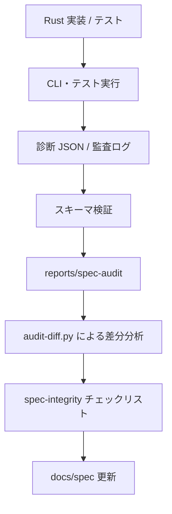

# 第23章: 仕様との同期

本章では、Reml における「仕様（Specification）」と「実装（Implementation）」をどのように同期させ、乖離（Drift）を防いでいるかについて解説します。

言語処理系の開発において、ドキュメントとしての仕様書と、実際に動作するコードとしての実装は、時とともに容易に乖離してしまいます。Reml プロジェクトでは、この問題を解決するために、**監査ログ（Audit Log）** と **スキーマ検証（Schema Validation）** を中心とした同期システムを構築しています。

本章を読むことで、Reml の CI パイプラインがどのように仕様への準拠を自動的に検証し、開発者がどのようにしてその整合性を維持しているかを理解できます。

## 23.1 概要 (Introduction)

Reml の仕様同期システムは、**「ドキュメント、テスト結果、監査ログを『単一の事実（Single Source of Truth）』として整合させる」** ことを目的としています。

通常、仕様書は静的なテキストであり、実装は動的なプログラムです。この間をつなぐために、Reml では以下のサイクルを回しています。

1. **事実の保存（Evidence）**: テストや CLI の実行結果を、機械可読な構造化ログとして保存する。
2. **差分の可視化（Visualization）**: 保存されたログを仕様（スキーマ）と照合し、乖離を定量的な KPI として可視化する。
3. **プロセスの追跡（Tracking）**: 発生した差分をチェックリストで管理し、ドキュメントの更新か実装の修正かを判断する。

このプロセスにより、Reml は「仕様書にある機能は動き、動いている機能は仕様書にある」状態を維持しようとしています。

### 参照すべき主要な定義

この同期プロセスは、複数のスクリプトとドキュメントによって定義されています。

- **監査・診断の運用ルール**: `docs/guides/tooling/audit-metrics.md:5-66`
- **仕様監査チェックリスト**: `docs/notes/process/spec-integrity-audit-checklist.md:5-49`
- **検証ツール群**: `tooling/ci/` および `tooling/json-schema/` 配下のスクリプト。

## 23.2 データ構造 (Key Data Structures)

仕様同期の基盤となるのは、**診断（Diagnostic）**、**監査（Audit）**、**差分（Diff）** という 3 つのデータ構造です。これらはすべて JSON ベースで定義され、厳格なスキーマによって管理されています。

### 23.2.1 診断 JSON と監査ログ

コンパイラが出力する情報は、以下のスキーマに従っている必要があります。

- **診断 JSON (`diagnostic-v2.schema.json`)**:
    コンパイラがユーザーに報告するエラーや警告の形式です。`tooling/json-schema/validate-diagnostic-json.sh` は、`tests/` や `expected/` ディレクトリ内のすべての JSON ファイルがこのスキーマに適合しているかを検証します。これにより、エラーメッセージの構造がリリース間で一貫していることを保証します。
  - 関連コード: `tooling/json-schema/validate-diagnostic-json.sh:1-108`
- **監査ログ (`audit-schema.json`)**:
    コンパイラの内部挙動（どの関数が呼ばれたか、どの機能が使われたか）を記録するための形式です。`tooling/ci/ci-validate-audit.sh` は、出力された監査ログが `audit-schema.json` に適合しているかを AJV（Another JSON Schema Validator）を用いて検証します。
  - 関連コード: `tooling/ci/ci-validate-audit.sh:1-150`

### 23.2.2 監査インデックス (`index.json`)

膨大な監査ログを管理するために、`reports/audit/index.json` というインデックスファイルが生成されます。これは `create-audit-index.py` によって作成され、各ログファイルの場所、ビルド ID、テスト通過率などのメタデータを保持します。これにより、「どのバージョンのコンパイラで、どのテストが成功し、どのような監査ログが残されたか」を追跡可能にしています。

- 関連コード: `tooling/ci/create-audit-index.py:31-173`

### 23.2.3 監査差分レポート

仕様と実装の乖離は、差分（Diff）として表現されます。`tooling/review/audit-diff.py` は、過去の監査ログと現在のログを比較し、以下の情報を集計します。

- **`diagnostic.regressions`**: 以前は検出されていなかったエラーが増えていないか。
- **`metadata.changed`**: 構成情報や依存関係に意図しない変更がないか。

この差分は Markdown や HTML レポートとして出力され、プルリクエスト（PR）のレビュー資料として活用されます。

- 関連コード: `tooling/review/audit-diff.py:94-176`

## 23.3 アルゴリズムと実装 (Core Logic)

仕様同期のワークフローは、CI パイプラインの中で自動的に実行されます。その中心的なロジックを見ていきましょう。

### 23.3.1 監査の入口: チェックリストと実行

プロセスは `spec-integrity-audit-checklist.md` から始まります。このドキュメントは、「どの仕様章を」「どのコマンドでテストし」「どのログに結果を保存するか」を定義したマスタープランです。開発者はこのリストに従ってテストを実行し、エビデンスを `reports/spec-audit/` にコミットします。

- 関連コード: `docs/notes/process/spec-integrity-audit-checklist.md:5-49`

### 23.3.2 検証の連鎖: スキーマ検証から KPI へ

テストが実行され、JSON ログが生成されると、検証スクリプトが起動します。

1. **スキーマ検証**: `validate-diagnostic-json.sh` と `ci-validate-audit.sh` が、生成された JSON がスキーマに違反していないかチェックします。
2. **KPI 更新**: 検証結果（成功数、失敗数、カバレッジなど）は KPI として集計され、`docs/guides/tooling/audit-metrics.md` の基準に基づいて評価されます。

この自動化により、人間が見落としがちな形式上のミスを機械的に排除しています。

### 23.3.3 メタデータ検証による仕様欠落の検知

監査ログがスキーマに適合していても、必要な情報が欠けていては意味がありません。`verify-audit-metadata.py` は、監査ログ内に必須のキー（例: `bridge.*` や `effect.*`）が含まれているかを確認します。

もし `effect` 関連のキーが欠落していれば、それは「エフェクトシステムの仕様検証が不十分である」ことを示唆しており、開発者に警告を発します。

- 関連コード: `tooling/ci/verify-audit-metadata.py:28-117`

### 23.3.4 回帰テストと仕様の安定化

仕様の中核部分（Spec Core）の安定性は、`audit-diff.py` による回帰テストで担保されます。`phase4-scenario-matrix.csv` で定義されたシナリオと、`reports/spec-audit/ch5/` などに保存された「正解データ」を比較することで、意図しない仕様変更（Breaking Change）を検出します。

- データフロー図:

図23-1: 仕様同期のデータフロー

## 23.4 エラー処理 (Error Handling)

同期プロセスにおけるエラー処理は、「CI を止めるべきエラー」と「警告にとどめるべきエラー」を明確に区別しています。

- **寛容な検証**: `ci-validate-audit.sh` には `--allow-missing` オプションがあり、一部のログファイルが存在しなくても検証を続行できます。これは、開発初期段階や部分的なテスト実行時に有用です。
  - 関連コード: `tooling/ci/ci-validate-audit.sh:12-149`
- **情報の欠落の記録**: `validate-diagnostic-json.sh` は、検証対象のファイルが見つからない場合にエラーではなく `info` レベルのログを出力して終了します。「テストが存在しない」という事実自体を記録に残すためです。
  - 関連コード: `tooling/json-schema/validate-diagnostic-json.sh:72-108`

発見された差分やエラーは、即座に修正されるか、あるいは「既知の課題」として `docs/notes/process/docs-update-log.md` に記録されます。

## 23.5 発展的トピック (Advanced Topics)

### 23.5.1 ガイドから仕様への昇格プロセス

Reml では、新機能のドキュメントはまず「ガイド（Guides）」として書かれ、API が安定した後に「仕様（Spec）」へと昇格するというプロセスを採用しています。`docs/notes/process/guides-to-spec-integration-plan.md` はこの移行計画を管理しており、監査ツールはこの移行がスムーズに行われているかも監視対象としています。

### 23.5.2 ドキュメント同期の自動化

現在、`docs/plans/bootstrap-roadmap/checklists/doc-sync-text.md` のようなチェックリストを用いて手動で管理しているドキュメント間のリンク整合性も、将来的には同様のツールチェーンで自動検証されることが計画されています。

### 23.5.3 既知の同期ギャップ

現在、`docs/guides/tooling/audit-metrics.md` 内の記述において、参照しているスクリプトのパスが古いままになっている箇所があります（例: `scripts/` vs `tooling/json-schema/`）。このようなドキュメント自体のバグも、監査プロセスによって発見・修正されていきます。

## 23.6 章末まとめ (Checkpoint)

- **単一の事実**: Reml は、ドキュメント・テスト・監査ログを整合させることで、仕様と実装の乖離を防いでいます。
- **スキーマ駆動**: すべての監査ログと診断出力は、JSON Schema によって厳格に定義・検証されています。
- **差分管理**: `reports/spec-audit/` に保存されたエビデンスと現在の動作を比較することで、回帰を検知します。
- **プロセス**: 自動化ツール (`tooling/`) と人力のチェックリスト (`docs/notes/process/`) が連携して品質を維持しています。

次のステップとして、実際にこれらのツールがどのようなデータを扱っているのかを理解するために、**第24章（付録）: エンドツーエンド実行トレース** を参照するとよいでしょう。
