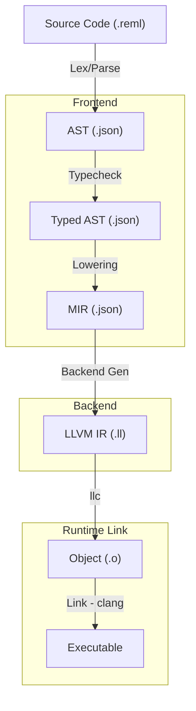

# 付録B: エンドツーエンド実行トレース

## B.1 目的とスコープ

この付録は、Reml コンパイラの内部動作を具体的に理解するための実践的なガイドです。最小限のソースコードが **フロントエンド (Frontend)**、**バックエンド (Backend)**、**ランタイム (Runtime)** を通過し、最終的に実行可能なバイナリとなるまでの全工程を、実際のデータ構造とともに追跡します。

『Lions' Commentary on UNIX』がコードの流れを追ったように、本章では各フェーズの「入力」と「出力」を可視化することに重点を置きます。これにより、あるモジュールの出力が次のモジュールでどのように利用されるか、その接続関係（Interface）を明確にします。

なお、本付録では「最小経路（Happy Path）」を扱います。エラー処理や複雑な言語機能（ジェネリクス、マクロなど）は割愛し、最も基本的な整数を返すだけのプログラムがどのようにコンパイルされるかを解説します。

## B.2 最小サンプルと成果物

### B.2.1 トレーシング対象のコード

以下の 3 行の Reml プログラム (`trace_test.reml`) を対象とします。これは `main` 関数が整数 `0` を返すだけのプログラムです。

```reml
fn main() -> Int {
  0
}
```

このプログラムは単純ですが、字句解析、構文解析、型推論、MIR生成、LLVM IR生成、リンクというコンパイラの全工程を通過します。

### B.2.2 成果物の取得方法

`reml_frontend` バイナリを使用することで、各中間表現を JSON ファイルとして出力できます。以下のコマンドで今回紹介するすべての成果物を生成できます。

```bash
# フロントエンドの成果物を一括生成するコマンド例
./target/debug/reml_frontend trace_test.reml \
  --emit-ast trace_ast.json \
  --emit-typed-ast trace_typed_ast.json \
  --emit-mir trace_mir.json \
  --emit-constraints trace_constraints.json \
  --emit-parse-debug trace_parse_debug.json
```

| フラグ | 出力ファイル | 内容 | 解説箇所 |
| --- | --- | --- | --- |
| `--emit-ast` | `trace_ast.json` | 構文解析木 (AST) | [B.3.2](#b32-構文解析-ast) |
| `--emit-typed-ast` | `trace_typed_ast.json` | 型付き AST | [B.3.3](#b33-型検査と型付き-ast) |
| `--emit-mir` | `trace_mir.json` | 中間表現 (MIR) | [B.3.4](#b34-mir-生成) |
| `--emit-constraints` | `trace_constraints.json` | 型制約と統計 | [B.3.3](#b33-型検査と型付き-ast) |
| `--emit-parse-debug` | `trace_parse_debug.json` | Packrat パース統計など | [B.3.1](#b31-字句解析とパース戦略) |

## B.3 フロントエンドのトレース

フロントエンドの責務は、テキストを検証可能な意味モデル（MIR）に変換することです。

### B.3.1 字句解析とパース戦略

`reml_frontend` は Packrat Parsing を採用しており、解析の過程や統計情報を `trace_parse_debug.json` に記録します。

```json
/* trace_parse_debug.json (抜粋) */
{
  "parse_result": {
    "trace_events": [
      {
        "event_kind": "expr_enter",
        "label": "block",
        "span": { "start": 17, "end": 24 },
        "trace_id": "syntax:expr::block"
      },
      {
        "event_kind": "expr_enter",
        "label": "literal",
        "span": { "start": 21, "end": 22 },
        "trace_id": "syntax:expr::literal"
      }
      /* ... expr_leave イベント ... */
    ],
    "packrat_stats": {
      "queries": 3,
      "hits": 2
    }
  }
}
```

- **trace_events**: 再帰下降パーサがどの規則（`node`）に入り（`enter`）、出たか（`leave`）を記録しています。ここでは `source` -> `block` -> `literal` という階層構造が見て取れます。
- **packrat_stats**: メモ化（Memoization）の効果を示しています。`hits: 2` は、既に解析済みの結果を再利用した回数です。

### B.3.2 構文解析 (AST)

パーサの最終出力である AST (`trace_ast.json`) は、プログラムの構造を忠実に表した木構造です。

```json
/* trace_ast.json (抜粋) */
{
  "functions": [
    {
      "name": { "name": "main", "span": { "start": 3, "end": 7 } },
      "body": {
        "kind": {
          "kind": "block",
          "statements": [
            {
              "kind": {
                "kind": "expr",
                "expr": {
                  "kind": {
                    "kind": "literal",
                    "value": { "kind": "int", "value": 0, "raw": "0" }
                  },
                  /* ... span ... */
                }
              }
            }
          ]
        },
        "ret_type": { "kind": { "kind": "ident", "name": { "name": "Int" } } }
      }
    }
  ]
}
```

- **functions**: モジュールレベルの関数定義のリストです。
- **kind**: Tagged Union (Rustのenum) を JSON で表現するため、`kind` フィールドで型を識別しています（例: `block`, `expr`, `literal`）。
- **span**: ソースコード上の位置情報（バイトオフセット）がすべてのノードに付与されています。

### B.3.3 型検査と型付き AST

型検査器（Typechecker）は AST をトラバースし、型制約を解決して各ノードに型情報を付与します。その結果が Typed AST (`trace_typed_ast.json`) です。

```json
/* trace_typed_ast.json (抜粋) */
{
  "module": {
    "functions": [
      {
        "name": "main",
        "return_type": "Int",
        "body": {
          "kind": {
            "kind": "block",
            "tail": {
              "kind": { "kind": "literal", "value": { "value": 0 } },
              "ty": "Int"  /* 型が付与されている */
            }
          },
          "ty": "Int"
        },
        "scheme_id": 0
      }
    ],
    "schemes": [
      {
        "id": 0,
        "ty": "() -> Int" /* 関数の型シグネチャ */
      }
    ]
  }
}
```

- **ty**: AST には存在しなかった `ty` フィールドが追加されています。リテラル `0` が `Int` 型であること、ブロック全体も `Int` 型であることが確定しています。
- **schemes**: 多相型や関数型などの複雑な型情報は `schemes` テーブルで管理され、ID参照されます。ここでは `main` が引数なしで `Int` を返す関数 (`() -> Int`) として登録されています。

### B.3.4 MIR 生成

バックエンドへ渡すための中間表現 (MIR) は、よりフラットで単純化された構造を持ちます (`trace_mir.json`)。

```json
/* trace_mir.json (抜粋) */
{
  "schema_version": "frontend-mir/0.2",
  "functions": [
    {
      "name": "main",
      "return_type": "i64", /* マシン語に近い型表現 */
      "body": 2,            /* 本体となる式ID */
      "exprs": [
        {
          "id": 0,
          "ty": "i64",
          "kind": { "kind": "literal", "value": { "value": 0 } }
        },
        {
          "id": 1, /* ブロックの末尾式 */
          "kind": { "kind": "literal", "value": { "value": 0 } }
        },
        {
          "id": 2,
          "kind": {
            "kind": "block",
            "statements": [
              { "kind": { "kind": "expr", "expr": 0 } }
            ],
            "tail": 1
          }
        }
      ]
    }
  ]
}
```

- **exprs**: 木構造ではなく、フラットな配列（Arena）として式が管理されています。`body: 2` は `exprs[2]` を指し、そこから `statements` 内で `expr: 0` を参照するというグラフ構造になっています。
- **return_type**: フロントエンドの `Int` 型が、バックエンドで扱いやすい `i64` にマッピングされています。

## B.4 バックエンドのトレース (MIR → LLVM IR)

バックエンド (`compiler/backend/llvm`) は、フロントエンドが出力した MIR JSON を読み込み、LLVM IR へと変換します。

### B.4.1 MIR の読み込みとスナップショット

バックエンドの `integration::generate_snapshot_from_mir_json` 関数がエントリーポイントとなります。

- **入力**: `trace_mir.json` (MirModuleSpec)
- **処理**:
    1. MIR の `functions` を走査し、LLVM の Basic Block と Instruction へ変換（Lowering）します。
    2. 監査（Audit）ログを生成し、セキュリティ制約のチェックを行います。
- **出力**: `BackendDiffSnapshot`（JSON形式の差分情報）

### B.4.2 生成される LLVM IR

今回のサンプルコード `main` 関数は、最終的に以下のような LLVM IR に変換されます（概念図）。

```llvm
define i64 @main() {
entry:
  ret i64 0
}
```

実際には、RemlのABIや呼び出し規約（ccc）、デバッグ情報などが付与されます。バックエンドのテスト出力である `snapshot` には、以下のような詳細情報が含まれます。

```json
/* BackendFunctionRecord (概念) */
{
  "name": "main",
  "return_layout": "primitive(i64)",
  "calling_conv": "ccc",
  "basic_blocks": [
    "entry: ret i64 0"
  ],
  "llvm_ir": "define i64 @main() { ... }"
}
```

## B.5 ランタイムリンク (LLVM IR → Executable)

最後に、生成された LLVM IR は `runtime_link` モジュールによってネイティブバイナリに変換されます。

### B.5.1 リンクの手順

1. **オブジェクトファイルの生成**: `llc` (LLVM Static Compiler) を呼び出し、LLVM IR (`.ll`) をオブジェクトファイル (`.o`) にコンパイルします。
2. **ランタイムライブラリの解決**: `REML_RUNTIME_PATH` 環境変数などから、Reml の標準ランタイムライブラリ（`libreml_runtime.a` など）の場所を特定します。
3. **リンク**: `clang` またはシステムリンカ (`ld`) を呼び出し、ユーザコードのオブジェクトファイルとランタイムライブラリを結合します。

### B.5.2 実行

生成されたバイナリを実行すると、OS は `main` シンボルをエントリーポイントとして呼び出します。Reml の `main` は整数を返すため、シェルの終了ステータスとして確認できます。

```bash
./a.out
echo $?
# => 0
```

## B.6 まとめ：データフロー図

以上の流れをまとめると、以下のようになります。



この付録で紹介した `--emit-*` フラグは、コンパイラのデバッグや、新しい言語機能を追加する際の挙動確認に非常に役立ちます。まずは小さなコードで出力を確認し、徐々に複雑なコードを試していくことをお勧めします。
