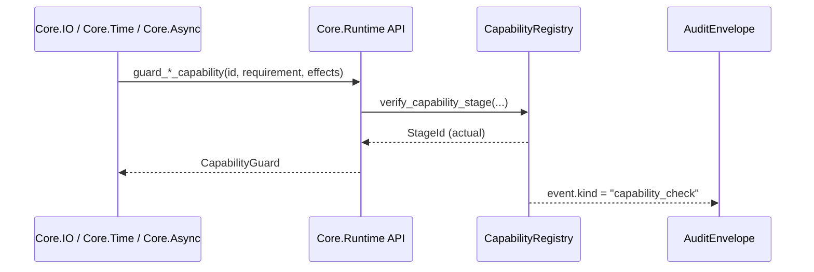

# 3.8 Core Runtime & Capability Registry

> 目的：Reml ランタイムの能力（GC、メトリクス、監査、プラグイン）を統一的に管理する `Capability Registry` を定義し、標準ライブラリ各章から利用できる公式 API を提供する。

## 0. 仕様メタデータ

| 項目 | 内容 |
| --- | --- |
| ステータス | 正式仕様 |
| 効果タグ | `@pure`, `effect {runtime}`, `effect {audit}`, `effect {unsafe}`, `effect {security}` |
| 依存モジュール | `Core.Prelude`, `Core.Diagnostics`, `Core.Numeric & Time`, `Core.IO`, `Core.Config`, `Core.Env` |
| 相互参照 | [3.4 Core Numeric & Time](3-4-core-numeric-time.md), [3.5 Core IO & Path](3-5-core-io-path.md), [3.6 Core Diagnostics & Audit](3-6-core-diagnostics-audit.md), [3.9 Core Async / FFI / Unsafe](3-9-core-async-ffi-unsafe.md), [3-10 Core Env & Platform Bridge](3-10-core-env.md), [3-18 Core System](3-18-core-system.md) |

> **段階的導入ポリシー**: Capability の追加や効果カテゴリの拡張は `-Z` 実験フラグ経由で opt-in し、`CapabilityRegistry::register` に渡すメタデータで `stage = Experimental | Beta | Stable` を明示する。`stage` が `Experimental` の Capability は `@requires_capability(stage="experimental")` を伴う API からのみ呼び出せる。ベータ／安定化の手順は `../notes/algebraic-effects-implementation-roadmap-revised.md` を参照し、`@pure`/`@dsl_export` 契約との整合チェックを完了してから `stage = Stable` へ更新すること。
> 効果構文（`perform` / `handle`）を公開する Capability は Phase 2-5 では `StageId::Experimental` として登録し、`-Zalgebraic-effects` フラグを必須とする。[^effects-syntax-poc-phase25]

## 1. Capability Registry の基本構造

```reml
pub type CapabilityId = Str

pub struct CapabilityRegistry {
  gc: Option<GcCapability>,
  io: IoCapability,
  async_runtime: Option<AsyncCapability>,
  actor: Option<ActorRuntimeCapability>,
  audit: AuditCapability,
  metrics: MetricsCapability,
  plugins: PluginCapability,
  system: Option<SyscallCapability>,
  process: Option<ProcessCapability>,
  memory: Option<MemoryCapability>,
  signal: Option<SignalCapability>,
  hardware: Option<HardwareCapability>,
  realtime: Option<RealTimeCapability>,
  security: SecurityCapability,
}

fn registry() -> CapabilityRegistry                  // `effect {runtime}`
fn register(cap: CapabilityId, value: CapabilityHandle) -> Result<(), CapabilityError> // `effect {runtime}`
fn get(cap: CapabilityId) -> Option<CapabilityHandle>          // `effect {runtime}`
fn describe(cap: CapabilityId) -> Option<CapabilityDescriptor> // `effect {runtime}`
```

- `CapabilityHandle` は実装依存のポインタ/関数テーブルをラップする型（不透明指針）。
- `register` は起動時に呼び出され、重複登録時は `CapabilityError::AlreadyRegistered` を返す。
- セキュリティ強化のため、Capability は署名検証とアクセス制御をサポートする。
- `describe` は登録済み Capability のメタデータ（`CapabilityDescriptor`）を返し、診断や監査で Stage 情報・効果タグ・提供者を共有する際の公式 API として利用する。`None` が返る場合は Capability が未登録であることを示す。

### 1.1 CapabilityHandle のバリアント

```reml
pub type GcCapability = Int
pub type IoCapability = Int
pub type AsyncCapability = Int
pub type ActorRuntimeCapability = Int
pub type AuditCapability = Int
pub type MetricsCapability = Int
pub type PluginCapability = Int
pub type SyscallCapability = Int
pub type ProcessCapability = Int
pub type MemoryCapability = Int
pub type SignalCapability = Int
pub type HardwareCapability = Int
pub type RealTimeCapability = Int
pub type SecurityCapability = Int

pub enum CapabilityHandle =
  | Gc(GcCapability)
  | Io(IoCapability)
  | Async(AsyncCapability)
  | Actor(ActorRuntimeCapability)
  | Audit(AuditCapability)
  | Metrics(MetricsCapability)
  | Plugin(PluginCapability)
  | System(SyscallCapability)
  | Process(ProcessCapability)
  | Memory(MemoryCapability)
  | Signal(SignalCapability)
  | Hardware(HardwareCapability)
  | RealTime(RealTimeCapability)
  | Security(SecurityCapability)
```

各 Capability の概要は以下の通りで、OS／プラットフォーム依存コンポーネントは公式プラグイン仕様（Chapter 5）に詳細を委ねる。表は `reml_capability list --format json` の結果を `scripts/capability/generate_md.py` で生成し、Stage/効果スコープ/Provider/Manifest 情報を常に最新化できるようにしている。

<!-- capability-table:start -->
| Capability | Stage | Effect Scope | Provider | Manifest Path |
| --- | --- | --- | --- | --- |
| `io.fs.read` | `Stable` | `fs.read`<br>`io` | Core | - |
| `io.fs.write` | `Stable` | `fs.write`<br>`io`<br>`mem` | Core | - |
| `fs.permissions.read` | `Stable` | `io`<br>`security` | Core | - |
| `fs.permissions.modify` | `Stable` | `io`<br>`security` | Core | - |
| `fs.symlink.query` | `Stable` | `fs.symlink`<br>`io` | Core | - |
| `fs.symlink.modify` | `Stable` | `fs.symlink`<br>`io`<br>`security` | Core | - |
| `fs.watcher.native` | `Stable` | `io`<br>`watcher` | Core | - |
| `fs.watcher.recursive` | `Stable` | `io`<br>`watcher` | Core | - |
| `watcher.resource_limits` | `Stable` | `io`<br>`watcher` | Core | - |
| `memory.buffered_io` | `Stable` | `mem` | Core | - |
| `security.fs.policy` | `Stable` | `security` | Core | - |
| `net.http.client` | `Experimental` | `net`<br>`io` | Core | - |
| `net.tcp.connect` | `Experimental` | `net`<br>`io` | Core | - |
| `net.tcp.listen` | `Experimental` | `net`<br>`io` | Core | - |
| `net.udp.bind` | `Experimental` | `net`<br>`io` | Core | - |
| `net.udp.send` | `Experimental` | `net`<br>`io` | Core | - |
| `core.time.timezone.lookup` | `Beta` | `time` | Core | - |
| `core.time.timezone.local` | `Beta` | `time` | Core | - |
| `core.collections.audit` | `Stable` | `audit`<br>`mem` | Core | - |
| `metrics.emit` | `Stable` | `audit` | Core | - |
| `native.intrinsic` | `Experimental` | `native`<br>`audit`<br>`unsafe` | Core | - |
| `native.embed` | `Experimental` | `native`<br>`audit`<br>`unsafe` | Core | - |
| `native.inline_asm` | `Experimental` | `native`<br>`audit`<br>`unsafe` | Core | - |
| `native.llvm_ir` | `Experimental` | `native`<br>`audit`<br>`unsafe` | Core | - |
<!-- capability-table:end -->

Capability Registry は上記バリアントを通じてシステム API を表面化し、効果タグと runtime 権限を整合させる。

### 1.2 セキュリティモデル

```reml
pub type DigitalSignature = Str
pub type CapabilityHandle = Int
pub type Set<T> = List<T>
pub type EffectTag = Str
pub type SecurityPolicyRef = Str
pub type SandboxProfile = Str
pub type PathPattern = Str
pub type NetworkPattern = Str
pub type RuntimeOperation = Str
pub type SecurityError = Int

pub type CapabilitySecurity = {
  signature: Option<DigitalSignature>,
  permissions: Set<Permission>,
  isolation_level: IsolationLevel,
  audit_required: Bool,
  effect_scope: Set<EffectTag>,
  policy: Option<SecurityPolicyRef>,
  sandbox: Option<SandboxProfile>,
}

pub enum Permission =
  | ReadConfig
  | WriteConfig
  | FileSystem(PathPattern)
  | Network(NetworkPattern)
  | Runtime(RuntimeOperation)

pub enum IsolationLevel = None | Sandboxed | FullIsolation

fn verify_capability_security(cap_handle: CapabilityHandle, security: CapabilitySecurity) -> Result<(), SecurityError> = ()
```

> **NOTE**: 本章の `Set<T>` は [3.2 Core Collections](3-2-core-collections.md) の永続コレクションとして扱う。実行時表現の概要は [3.2 §2.2.1](3-2-core-collections.md#set-runtime-abi) を参照。

* `EffectTag` は [1.3 効果と安全性](1-3-effects-safety.md) に定義された `Σ` のタグ名。Capability が生成し得る効果を宣言し、`register` 時に `effect_scope ⊇ actual_effects` を検証する。
* `SecurityPolicyRef` は `SecurityCapability` が管理するポリシーへの参照で、`enforce_security_policy` 実行時に `verify_capability_security` と一致することを要求する。
* `SandboxProfile` は CPU・メモリ・ネットワークの制約を記述する共通構造体で、§6.1 の `SandboxConfig` を再利用して定義する。

#### 効果ステージとハンドラ契約 {#capability-stage-contract}

| 効果 `stage` | 必須属性 | Capability Registry の検証 | 備考 |
| --- | --- | --- | --- |
| `Experimental` | `@requires_capability(stage="experimental")` を必須とし、`@handles` で捕捉する際も同属性を付与する。 | `register` 時に `effect_scope` と合わせて Stage 情報を格納し、ハンドラ適用時に `CapabilityRegistry::get` へ問い合わせて許可済みか検査する。 | PoC/社内実験用途。CI では `--deny experimental` フラグで一括拒否可能。 |
| `Beta` | `@requires_capability(stage="beta")` を推奨（省略時は `experimental` と同等の検査を行う）。 | Stage 昇格時に `SecurityCapability` が監査証跡を確認し、`effect_scope` の差分が無いか検証する。 | 機能フリーズ前の互換性検証フェーズ。 |
| `Stable` | Capability 属性は任意。`@handles` のみで捕捉可能。 | `register` 後は Stage 情報を `CapabilityRegistry::stage_of(effect_tag)` にキャッシュし、ドキュメント生成と IDE へ公開する。 | LTS ポリシー対象。 |

ハンドラが捕捉する効果タグ `Σ_handler` を評価する際、ランタイムは次の手順で認証を行う。

1. `EffectDecl`（1-3 §I.1）から `stage` と `effect_scope` を取得し、Capability Registry に登録済みか照会する。
2. ハンドラに付与された `@requires_capability` / `@handles` 属性から宣言済みの Stage を抽出し、表の条件を満たしているかを比較する。
3. 不一致の場合は `CapabilityError::SecurityViolation` を生成し、`effects.contract.stage_mismatch` 診断で呼び出し元に伝播する。
4. 診断メッセージは 0-1-project-purpose.md §1.2 の安全性基準に従い、拒否理由と必要な Capability/Stage を列挙する。

この検査結果は §4 で定義する `AuditCapability` のシンクへ送信され、`Core.Diagnostics`（3.6 節）の `audit` 効果経由で共有される。IDE/LSP から参照する場合は、[notes/dsl-plugin-roadmap.md §5](../notes/dsl/dsl-plugin-roadmap.md#effect-handling-matrix) の比較表を利用してガイダンスを提示する。

- 型クラス辞書（とくに `Iterator`）は `CapabilityId::IteratorRuntime` を `StageRequirement` と共に格納し、`effect.stage.iterator.required`／`effect.stage.iterator.actual`／`effect.stage.iterator.capability`／`effect.stage.iterator.source` を `AuditEnvelope.metadata` に出力する。[`tooling/ci/collect-iterator-audit-metrics.py`](../../tooling/ci/collect-iterator-audit-metrics.py) と [`tooling/ci/sync-iterator-audit.sh`](../../tooling/ci/sync-iterator-audit.sh) がこれらメタデータを検証し、`iterator.stage.audit_pass_rate` を `0-3-audit-and-metrics.md` の記録フォーマットに整形する。【F:1-2-types-Inference.md†L90-L140】【F:3-1-core-prelude-iteration.md†L160-L220】
- CLI/LSP 診断と AuditEnvelope は `required_capabilities` / `actual_capabilities` を配列で保持し、複数 Capability の Stage 判定を欠落なく照合する。[^effect003-phase25-capability-array]

```reml
pub enum StageId = Experimental | Beta | Stable

pub enum StageRequirement = Exact(StageId) | AtLeast(StageId)

pub type ConductorCapabilityRequirement = {
  id: CapabilityId,
  stage: StageRequirement,
  declared_effects: Set<EffectTag>,
  source_span: SourceSpan,
}

pub type ConductorCapabilityContract = {
  requirements: List<ConductorCapabilityRequirement>,
  manifest_path: Option<Path>,
}

fn verify_capability(id: CapabilityId) -> Result<CapabilityHandle, CapabilityError>
fn verify_capability_stage(id: CapabilityId, requirement: StageRequirement) -> Result<CapabilityHandle, CapabilityError>
fn verify_conductor_contract(contract: ConductorCapabilityContract) -> Result<(), CapabilityError>
```

- `StageRequirement` は 1-1 §B.8.5 で定義した契約と互換で、`Exact` は厳密一致、`AtLeast` は `StageId` の順序（`Experimental < Beta < Stable`）での下限を意味する。順序関係は 0-1 §1.2 の「安全性の確保」に基づき、より高い Stage での運用を許容しつつ、下限を破る構成を拒否する。
- `verify_capability` は Capability の存在検証のみを行い、Stage 条件は評価しない。`verify_capability_stage` は Stage 条件と `effect_scope` の両方を検査し、不足時は `CapabilityError::StageViolation` を返す。このバリアントには `required_stage`・`actual_stage`・`capability_metadata` が必須で含まれ、`Diag.EffectDiagnostic.stage_violation`（3-6 §2.4.1）と `effects.contract.stage_mismatch` 診断が直ちに生成できるようになっている。
- `verify_conductor_contract` は `with_capabilities`（1-1 §B.8.5）から生成された契約集合を受け取り、各要素に `verify_capability_stage` を適用する。`manifest_path` が存在する場合は `reml.toml` の `run.target.capabilities` と突き合わせ、CLI/IDE が同一結果を共有できるようにする。
- `@cfg(capability = "...")` で除外された分岐は契約から自動的に削除されるが、`verify_conductor_contract` は `ConductorCapabilityRequirement.source_span` を監査ログに残すため、実行環境ごとの差異を追跡できる。差分は `AuditEvent::CapabilityMismatch`（3-6 §1.1.1 / §6.1.2）に集約され、0-1 §1.2 の安全性レビュー資料に添付する。
- `verify_conductor_contract` は `dsl_id` ごとの契約境界を保持し、監査ログの `dsl.id` と整合する形で Capability 検証結果を記録する。`dsl_id` が重複する場合は契約生成段階で拒否し、`conductor.dsl_id.duplicate` 診断を優先する。

```reml
pub type CapabilityDescriptor = {
  id: CapabilityId,
  stage: StageId,
  effect_scope: Set<EffectTag>,
  provider: CapabilityProvider,
  manifest_path: Option<Path>,
  last_verified_at: Option<Timestamp>,
}

pub enum CapabilityProvider = Core
  | Plugin { package: Str, version: Option<SemVer> }
  | ExternalBridge { name: Str, version: Option<SemVer> }
  | RuntimeComponent { name: Str };
```

- `CapabilityDescriptor` は `CapabilityRegistry::describe` が返す公開メタデータであり、監査ログや診断へ転写することを想定する。`effect_scope` と `stage` は登録時点の設定を示し、0-1 §1.2 の安全性基準に合致するかを確認する根拠となる。
- `provider` は Capability を提供する主体を特定し、`Core`（標準組み込み）、`Plugin`（プラグインモジュール）、`ExternalBridge`（外部 DSL ブリッジなど）、`RuntimeComponent`（ランタイム内部構成要素）を区別する。`manifest_path` は `reml.toml` など構成ファイル上の位置を指し、`last_verified_at` は `verify_capability_stage` が成功した最新時刻（3-4 §1 `Timestamp`）を格納する。
- `verify_capability_stage` が失敗した場合は `CapabilityDescriptor.stage` を `CapabilityError.actual_stage` として埋め込み、診断側で要求 Stage との差分を即座に計算できるようにする。成功時は `last_verified_at` を更新し、キャッシュの鮮度を維持する。
- CLI からは `reml_frontend --capability describe <CapabilityId> [--output human|json]` を利用して Descriptor を即時取得できる。デフォルトは JSON 形式であり、人が読む際は `--output human` を指定する。

```shell
$ reml_frontend --capability describe io.fs.read --output json
{
  "id": "io.fs.read",
  "stage": "stable",
  "effect_scope": [
    "io",
    "fs.read"
  ],
  "provider": {
    "kind": "core"
  },
  "manifest_path": null,
  "last_verified_at": null,
  "security": {
    "audit_required": false,
    "isolation_level": "none",
    "permissions": [],
    "sandbox_profile": null,
    "signature": null,
    "policy": null
  }
}
```

```reml
pub type CapabilitySet = Set<CapabilityId>
```

- `CapabilitySet` は DSL プラグインやランタイムブリッジが公開する Capability ID の集合を表し、Chapter 5（とくに [5-7](5-7-core-parse-plugin.md)）の登録 API と共有する共通表現である。

### 1.3 プラットフォーム情報と能力 {#platform-info}

```reml
pub type Set<T> = List<T>
pub type SemVer = Str

pub type PlatformInfo = {
  os: OS,
  arch: Architecture,
  family: TargetFamily,
  variant: Option<Str>,
  features: Set<Str>,
  runtime_capabilities: Set<RuntimeCapability>,
  target_capabilities: Set<TargetCapability>,
  profile_id: Option<Str>,
  triple: Option<Str>,
  stdlib_version: Option<SemVer>,
  runtime_revision: Option<Str>,
}

pub enum OS = Windows | Linux | MacOS | FreeBSD | Wasm | Other(Str)
pub enum Architecture = X64 | ARM64 | X86 | ARM | WASM32 | RISCV64 | Other(Str)
pub enum TargetFamily = Unix | Windows | Wasm | Other(Str)

pub enum RuntimeCapability =
  | SIMD
  | HardwareRng
  | CryptoExtensions
  | GPU
  | ThreadLocal
  | AsyncScheduler
  | AsyncBackpressure
  | ActorMailbox
  | DistributedActor
  | AsyncTracing
  | AsyncSupervisor
  | Vector512
  | RegexJit
  | RegexMetrics

pub enum TargetCapability =
  | UnicodeNfc                 // 対応: `unicode.nfc`
  | UnicodeExtendedGrapheme    // 対応: `unicode.grapheme`
  | FilesystemCaseSensitive    // 対応: `fs.case_sensitive`
  | FilesystemCaseInsensitive  // 対応: `fs.case_insensitive`
  | FilesystemCasePreserving   // 対応: `fs.case_preserving`
  | PathUtf8Encoding           // 対応: `fs.path_utf8`
  | ThreadLocalStorage         // 対応: `thread.local`
  | JobControl                 // 対応: `process.job_control`
  | MonotonicClock             // 対応: `clock.monotonic`
  | HighResolutionClock        // 対応: `clock.highres`
  | FfiCallConvC               // 対応: `ffi.callconv.c`
  | FfiCallConvSysv            // 対応: `ffi.callconv.sysv`
  | FfiCallConvWin64           // 対応: `ffi.callconv.win64`
  | FfiCallConvWasm            // 対応: `ffi.callconv.wasm`

fn platform_info() -> PlatformInfo                       // `effect {runtime}`
fn platform_features() -> Set<Str>                        // `effect {runtime}`
fn platform_capabilities() -> Set<RuntimeCapability>      // `effect {runtime}`
fn runtime_capabilities() -> Set<RuntimeCapability>       // `effect {runtime}`
fn target_capabilities() -> Set<TargetCapability>         // `effect {runtime}`
fn platform_variant() -> Option<Str>                      // `effect {runtime}`
fn has_capability(cap: RuntimeCapability) -> Bool         // `effect {runtime}`
fn has_target_capability(cap: TargetCapability) -> Bool   // `effect {runtime}`
fn capability_name(cap: TargetCapability) -> Str // `@pure`
fn family_tag(info: PlatformInfo) -> Str                  // `@pure`
```

* `PlatformInfo` は `Core.Env`（[3-10](3-10-core-env.md)）や `RunConfig.extensions["target"]` と同期させる。CLI が指定したターゲットと実行時情報が乖離した場合は `DiagnosticDomain::Target` で `target.config.mismatch` を発行し、`Diagnostic.extensions["target"]` に `profile_id` / `triple` / 差異一覧を記録する。Phase 2-5 DIAG-003 Step5 で `Target` / `Plugin` / `Lsp` ドメイン向けの監査メタデータと脚注を整備した。
* `features` は `@cfg(feature = "...")` と連携し、ビルドプロファイルや CLI オプションで有効にした拡張機能の集合を表す。`runtime_capabilities` にはハードウェア検出結果を格納し、`RunConfig` の最適化スイッチ（Packrat/左再帰/トレース等）の既定値に利用できる。`target_capabilities` はターゲット固有挙動（Unicode/ファイルシステム/ABI 等）を表し、`@cfg(capability = "...")` や `RunConfigTarget.capabilities` と同期する。
* `config.manifest` は `RunConfigManifestOverrides` により `manifest_path`・`project.stage`・`build.targets`・`config.compatibility` を集約したサブオブジェクトで、`CapabilityRegistry` が Stage 判定や DSL 契約（3-7 §1.2）と突き合わせる際のソースオブトゥルースとなる。CLI・LSP は `extensions["config"].manifest` をそのまま `AuditEnvelope.metadata["config.*"]` にコピーし、`effect.stage.*` や `bridge.stage.*` 診断の根拠として使用する。
* `profile_id` / `triple` / `stdlib_version` / `runtime_revision` は `TargetProfile` 由来のメタデータを保持し、コンパイラが生成した `RunArtifactMetadata`（2-6 §B-2-1-a）と一致することを保証する。
* `family_tag` は `"unix"` や `"windows"` といったスカラー文字列を返し、`RunConfig.extensions["target"]` の `family` フィールドを埋める際に使用する。
* Capability Registry は `register("platform", handle)` を通じてプラットフォーム情報提供者を差し替え可能。未登録時はホスト依存の既定実装が自動登録される。
* `platform_features()` はビルド時フィーチャ集合を直接返し、`platform_capabilities()` / `runtime_capabilities()` は検出済みハードウェア機能（`RuntimeCapability`）を提供する。`target_capabilities()` はターゲット挙動能力（`TargetCapability`）を返す。`platform_variant()` には libc バージョンやベンダー拡張など追加識別子を格納できる。

#### 1.3.1 `@dsl_export` との整合

- `@dsl_export` で宣言された `allows_effects` と効果宣言の `effect_scope` は、Capability Registry 登録時に比較される。差分がある場合は登録を拒否し、`CapabilityError::SecurityViolation` を返す。
- Stage 昇格 (`reml capability stage promote`) のたびに `Diagnostic.extensions["effects"].stage` と `DslExportSignature.stage_bounds.declared` が一致しているか確認し、必要であれば `stage_bounds.minimum`・`stage_bounds.maximum` を再評価したうえでマニフェストの `expect_effects` / `expect_effects_stage` を更新する。
- `requires_capabilities` の各要素は `CapabilityRegistry::verify_capability_stage` で逐次検査し、Stage 下限を満たさない Capability があれば `CapabilityError::StageViolation` に `required_stage` と `actual_stage` を格納する。`effect_scope` の差分は `diagnostic("dsl.capability.effect_scope_mismatch")` で報告する。
- CLI は今後追加予定の `manifest.dsl.stage_mismatch` 診断を通じて、未更新の DSL エントリが残っていないか検査する。

* `TargetCapability` の列挙値は `capability_name(cap)` により `unicode.nfc` 等のカノニカル文字列へ変換され、`@cfg(capability = "...")`、`RunConfigTarget.capabilities`、および環境変数 `REML_TARGET_CAPABILITIES` で利用される。列挙外のカスタム Capability を導入する際は、実装側で `CapabilityRegistry::register_custom_target_capability(name: Str)` を提供し、名前と診断を登録することが推奨される。
* ランタイム最適化時は次のように利用する：

```reml
pub type PlatformInfo = {
  runtime_capabilities: Set<RuntimeCapability>,
}

pub type RunConfigTarget = {
  features: Set<Str>,
  extra: Map<Str, Str>,
}

pub type RunConfigExtensions = {
  target: RunConfigTarget,
}

pub type RunConfig = {
  extensions: RunConfigExtensions,
}

pub enum RuntimeCapability = SIMD
pub enum TargetCapability = FilesystemCaseInsensitive

fn platform_info() -> PlatformInfo = todo
fn platform_features() -> Set<Str> = todo
fn enable_simd_pipeline() -> () = ()
fn has_target_capability(cap: TargetCapability) -> Bool = todo

fn apply_platform_defaults(cfg: RunConfig) -> RunConfig {
  let info = platform_info()
  let _ = if info.runtime_capabilities.contains(RuntimeCapability::SIMD) then enable_simd_pipeline() else ()
  let _ = if platform_features().contains("packrat_default") then cfg.extensions.target.features.insert("packrat_default") else cfg.extensions.target.features
  let _ = if has_target_capability(TargetCapability::FilesystemCaseInsensitive) then cfg.extensions.target.extra.insert("fs.case", "insensitive") else cfg.extensions.target.extra
  cfg
}
```

* `FfiCapability`（[3-9](3-9-core-async-ffi-unsafe.md)）は `platform_info()` と `resolve_calling_convention` を参照し、ターゲットごとの ABI を自動選択する。Capability Registry でプラットフォーム情報を更新すると FFI バインディングも同時に反映される。
* `Core.Env.resolve_run_config_target` / `merge_runtime_target`（3-10 §4）は `target_capabilities()` を利用して `RunConfigTarget.capabilities` を初期化し、`TargetProfile` の宣言値と実行時検出結果を統合する。不一致は `DiagnosticDomain::Target` の `target.capability.unknown` または `target.config.mismatch` として報告される。

### 1.4 非同期・Actor Capability {#async-actor-capability}

| Capability | 説明 | 主な利用者 |
| --- | --- | --- |
| `RuntimeCapability::AsyncScheduler` | マルチスレッドスケジューラと Waker 実装を提供し、`Core.Async` の `spawn`/`block_on` を安定化させる。 | `Core.Async`, `RunConfig.execution`, `2-7-core-parse-streaming.md` |
| `RuntimeCapability::AsyncBackpressure` | メールボックスやストリームの高水位制御をサポートし、`send`/`run_stream_async` が `Pending` を返せる。 | `Core.Async`, `StreamDriver`, `../guides/runtime/runtime-bridges.md` |
| `RuntimeCapability::ActorMailbox` | 固定長リングバッファ付き Mailbox と `link`/`monitor` 用の監査フックを有効化する。 | `Core.Async` §1.9, `3-6` 監査拡張 |
| `RuntimeCapability::DistributedActor` | `TransportHandle` によるリモート mail box 統合と TLS 設定検証を提供する。 | `Core.Async` §1.9.2, `../guides/runtime/runtime-bridges.md` §11 |
| `RuntimeCapability::AsyncTracing` | 非同期タスクの span 追跡（`DiagnosticSpan` の継承と `async.trace.*` メトリクス）を記録する。 | `Core.Diagnostics`, LSP トレース, 監査ログ |
| `RuntimeCapability::AsyncSupervisor` | `spawn_supervised`/`SupervisorSpec` の再起動制御と監査フックを有効化し、RestartBudget の強制と `async.supervisor.*` 診断を提供する。 | `Core.Async` §1.9.5, `Core.Diagnostics` §2.5.1 |
| `RuntimeCapability::ExternalBridge(id)` | Runtime Bridge Registry で登録されたブリッジを Capability として公開し、`bridge.contract.*` 診断と Stage 検証を統合する。 | `RuntimeBridgeRegistry`（§10.1）, `3-6` §8 |

- これら Capability は 0-1-project-purpose.md §1.1 の性能基準を満たすため、最低でも `AsyncScheduler` を安定ステージで登録することを求める。未登録の場合は `Core.Async` が逐次実行フォールバックへ切り替わり、`async.actor.capability_missing` 診断で通知される。
- `AsyncBackpressure` が無い環境では `send` の `Pending` が `DropNew` に置き換わるため、DSL は高水位閾値を保守的に設定し、`../guides/runtime/runtime-bridges.md §11` のテーブルに従って警告を発行する。
- `DistributedActor` を利用する場合は `SecurityCapability.permissions` に `Network` を含めること。暗号化オプションが未設定なら `SecurityCapability` が `CapabilityError::SecurityViolation` を返す。
- `AsyncTracing` が有効な環境では `DiagnosticSpan` を `CapabilityRegistry::get("tracing")` から取得し、`ActorContext.span` に継承する。メトリクス未対応環境ではトレースセクションをスキップする。
- `CapabilityRegistry::stage_of(RuntimeCapability)` はこれらの Capability についても Stage 管理を提供し、`experimental` から `beta` へ昇格させる際は `../notes/dsl/dsl-plugin-roadmap.md` のチェックリストを満たす必要がある。
- `RuntimeCapability::AsyncSupervisor` は登録時に `stage` を明示し、`Stage::Experimental` のまま提供する場合は `spawn_supervised`/`SupervisorSpec` 側で `@requires_capability(stage="experimental")` を必須とする。`stage >= Stage::Beta` へ昇格した後は `SupervisorSpec.health_check` と `RestartBudget` のリポートを監査に添付できることを確認してから `Stage::Stable` へ更新する。
- `CapabilityRegistry::require(RuntimeCapability::AsyncSupervisor)` は Stage 不整合時に `CapabilityError::SecurityViolation` を返し、`Core.Async` 側で `AsyncErrorKind::RuntimeUnavailable` として再マッピングする。診断は 3-6 §2.5.1 の `async.supervisor.capability_missing` を使用し、`extensions["async.supervisor"].stage_required` / `stage_actual` を記録する。CLI は `reml capability stage promote async.supervisor` を通じて昇格ログを生成し、0-1 §1.2 の安全性レビュー資料に添付する。

```reml
pub type SchedulerHandle = Int
pub type Future<T> = T
pub type Any = Int
pub type TaskMetrics = Int
pub type Uuid = Str
pub type ActorId = Int
pub type MailboxHandle<T> = T
pub type CapabilityError = Int
pub type TransportHandle = Int
pub type NodeId = Int
pub type ExitStatus = Int
pub type AsyncTracingHooks = Int

pub type AsyncCapability = {
  scheduler: SchedulerHandle,
  spawn_task: fn(Future<Any>) -> TaskHandle,
  supports_mailbox: fn() -> Bool,
  tracing: Option<AsyncTracingHooks>,
}

pub type TaskHandle = {
  id: Uuid,
  cancel: fn() -> Bool,
  metrics: TaskMetrics,
}

pub type ActorRuntimeCapability<Message> = {
  allocate_mailbox: fn(ActorId, MailboxConfig) -> Result<MailboxHandle<Message>, CapabilityError>,
  register_transport: fn(TransportHandle) -> Result<(), CapabilityError>,
  diagnostics: ActorDiagnosticsHooks,
}

pub type MailboxConfig = {
  capacity: Int,
  overflow: OverflowPolicy,
  priority: Option<PriorityPolicy>,
}

pub type ActorDiagnosticsHooks = {
  on_spawn: fn(ActorId, NodeId) -> (),
  on_exit: fn(ActorId, ExitStatus) -> (),
  on_backpressure: fn(ActorId, MailboxStats) -> (),
}

pub type MailboxStats = {
  pending: Int,
  dropped: Int,
  high_watermark: Int,
}

pub enum OverflowPolicy = DropNew | DropOld
pub enum PriorityPolicy = FIFO | Priority { levels: Int }
```

#### Core Runtime API シーケンス {#core-runtime-api}

- `Core.IO`/`Core.Time`/`Core.Async` は操作開始前に `Core.Runtime` のガード API（`guard_io_capability` / `guard_time_capability` / `guard_async_capability` in `compiler/runtime/src/runtime/api.rs`）を呼び出し、Stage 要件と効果タグを必ず検証する。ガードは `CapabilityGuard` として `actual_stage` を保持し、`AtLeast(StageId::Beta)` のような条件を `satisfies()` で即座に確認できる。
- ガード API は `CapabilityRegistry::verify_capability_stage` の薄いラッパであり、成功時に `AuditEventKind::CapabilityCheck` を発行して `AuditEnvelope.metadata["effect.*"]` を埋める。`docs/plans/bootstrap-roadmap/3-5-core-io-path-plan.md` の `core-io-capability-map.md` に列挙された Stage/効果要件と直接対応し、IO/Path API が `["io","fs.read"]` や `["security"]` といった仕様上のタグを要求することを保証する。
- `Core.Time` のタイムゾーン API (`compiler/runtime/src/time/timezone.rs`) は `guard_time_capability("core.time.timezone.lookup", StageRequirement::AtLeast(StageId::Beta), ["time"])` を経由して Stage 検証を行い、失敗時は `TimeError::system_clock_unavailable` に変換する。`core.async.scheduler` などのランタイム専用 Capability は `guard_async_capability` を通じて同じ検証を共有し、未登録環境では `CapabilityError::NotRegistered` を報告する。



- 上記シーケンスは Diagnostics/Audit 章（3-6）で要求される `effects.contract.stage_mismatch` と互換であり、Stage 判定結果が診断と監査の両方へ共通キーで転写される。`compiler/runtime/tests/core_runtime_capability_guard.rs` では `core.io`/`core.time`/`core.async` のガードが期待通り動くことを `cargo test -p reml_runtime core_runtime_capability_guard` で検証し、リグレッションを防止する。
- `FsAdapter::ensure_*` や `Timezone::timezone/local` といった API は本ガードを通じて `record_bridge_stage_probe` や `TimeError` に Stage 情報を転写し、RunConfig・RuntimeBridgePlan が参照する KPI を一貫させる。今後 `Core.Async` の API を追加する際も同じガードを再利用し、Stage ポリシーの抜け漏れを防ぐ。

### 1.4 監査イベント必須フィールド（Stage/Bridge/Effect） {#audit-required-fields}

Stage/Bridge/Effect の整合検証に関わる監査イベントは `AuditEnvelope.metadata` の必須キーを揃える。`AuditLevel::Summary` でも欠落を許容せず、[3-6 §2.4](3-6-core-diagnostics-audit.md#diagnostic-effect) の診断メタデータと同じキー体系で記録する。

| 区分 | 必須キー (`AuditEnvelope.metadata`) | 目的 |
| --- | --- | --- |
| Stage（Capability/Effect） | `effect.stage.required`, `effect.stage.actual`, `effect.capability`, `effect.provider`, `effect.manifest_path` | Stage 検証の根拠と Capability 参照元を監査ログへ残す。 |
| Bridge（Runtime Bridge） | `bridge.id`, `bridge.stage.required`, `bridge.stage.actual`, `bridge.capability` | Runtime Bridge の Stage/Capability 整合を追跡し、`bridge.contract.violation` の再現性を担保する。 |
| Effect（ハンドラ/効果行） | `effect.order.before`, `effect.order.after`, `effect.residual.diff`, `effect.type_row.requested_mode`, `effect.type_row.available_mode`, `effect.type_row.guard_stage` | 効果ハンドラの並び替え・効果行モードの差分を監査ログへ一貫して残す。 |

- `bridge.target.mismatch` などターゲット照合が関与する場合は `bridge.target.requested` / `bridge.target.detected` を追加必須キーとして扱う。
- `effect.provider` と `effect.manifest_path` は `CapabilityDescriptor` 由来であり、`CapabilityRegistry::describe` が `None` を返す場合は `null` を記録するが、省略は許容しない。

#### 1.4.1 Native Escape Hatches の Capability 整合

`native.intrinsic` / `native.embed` / `native.inline_asm` / `native.llvm_ir` は **Stage = Experimental** を既定とし、Phase 4 の最小実装では `@requires_capability(stage="experimental")` と同等の取り扱いを行う。昇格条件は `docs/notes/dsl/dsl-plugin-roadmap.md` の Stage 監査手順と揃え、監査ログが整備された時点で `Beta` へ進める。

| Capability | 目的 | 必須監査キー | 関連診断 |
| --- | --- | --- | --- |
| `native.intrinsic` | LLVM intrinsic / ネイティブ最適化呼び出し | `native.intrinsic.used`, `intrinsic.name`, `intrinsic.signature` | `native.intrinsic.invalid_type`, `native.intrinsic.signature_mismatch` |
| `native.embed` | 埋め込み API と ABI エントリポイント | `native.embed.entrypoint`, `embed.abi.version` | `native.embed.abi_mismatch`, `native.embed.unsupported_target` |
| `native.inline_asm` | Inline ASM によるネイティブ命令列の埋め込み | `native.inline_asm.used`, `asm.template_hash`, `asm.constraints` | `native.inline_asm.disabled`, `native.inline_asm.invalid_constraint` |
| `native.llvm_ir` | LLVM IR テンプレートの直書き | `native.llvm_ir.used`, `llvm_ir.template_hash`, `llvm_ir.inputs` | `native.llvm_ir.verify_failed`, `native.llvm_ir.invalid_placeholder` |

`Core.Runtime` のガード API は `effect {native}` を含む呼び出しに対して `CapabilityRegistry::verify_capability_stage` を適用し、Stage 不一致の場合は `effects.contract.stage_mismatch` を優先して報告する。`native.*` の監査キーは [3-6 §2.4.4](3-6-core-diagnostics-audit.md#diagnostic-native) と同じ表記を用い、`RuntimeBridgeAuditSpec` でもキー体系を統一する。

### 1.5 Regex Capability {#regex-capability}

| Capability | 説明 | 主な利用者 |
| --- | --- | --- |
| `RuntimeCapability::RegexJit` | 正規表現の JIT コンパイルとネイティブ実行を許可。JIT 未対応プラットフォームでは `Core.Regex` が自動的に NFA 実装へフォールバック。 | `Core.Regex`, `Core.Parse.Regex`, `RunConfig` (`RegexRunConfig.engine = "auto"`) |
| `RuntimeCapability::RegexMetrics` | マッチング時間・バックトラック深度などの計測値を収集し、監査ログとメトリクスに公開。 | `Core.Regex`, `Core.Diagnostics`, `AuditSink` |

* `RuntimeCapability::RegexJit` が無効な場合、`PatternFlag::Jit` は `RegexErrorKind::CapabilityRequired` を返し、`feature {regex}` は NFA/Hybrid 実装のみを利用する（2.6 §F）。
* `RuntimeCapability::RegexMetrics` を有効化すると `RunConfig.extensions["regex"].metrics=true` が要求され、`regex.match.duration` / `regex.backtrack.depth` をメトリクスストリームへ送信する。無効な場合はメトリクス計測を省略する。
* `RuntimeCapability::ExternalBridge(id)` は `RuntimeBridgeDescriptor.required_capabilities` の検証後に登録され、未整合時は `bridge.contract.violation` として報告される。`PlatformInfo.runtime_capabilities` にも同 ID を追加し、CLI/LSP がブリッジ可用性を可視化できるようにする。
* Capability Registry は `register("regex", CapabilityHandle::Plugin(...))` を通じてサードパーティエンジンを差し替え可能とし、登録時に `UnicodeClassProfile.version` を `platform_features()` と照合する。
* 監査ポリシー（3-6 §3.2）で `AuditLevel::Debug` 以上を要求する場合は `RegexRunConfig.audit` を省略できず、`RuntimeCapability::RegexMetrics` が未登録であれば `regex.audit.capability_missing` を発行する。

### 1.6 CapabilityError

```reml
pub type CapabilityId = Str
pub type StageRequirement = Int
pub type StageId = Int
pub type CapabilityDescriptor = Int

pub type CapabilityError = {
  kind: CapabilityErrorKind,
  message: Str,
  capability_id: Option<CapabilityId>,
  required_stage: Option<StageRequirement>,
  actual_stage: Option<StageId>,
  capability_metadata: Option<CapabilityDescriptor>,
}

pub enum CapabilityErrorKind =
  | AlreadyRegistered
  | NotFound
  | InvalidHandle
  | UnsafeViolation
  | SecurityViolation
  | StageViolation
```

- `capability_id` は失敗対象となった Capability を特定するための ID。登録前に失敗した場合は `None` となる。
- `required_stage` は呼び出し元が要求した Stage 条件を保持し、`verify_capability_stage` / `verify_conductor_contract` からのエラーで必須となる。
- `actual_stage` は Capability Registry に記録されている Stage を返し、存在しない場合（`CapabilityErrorKind::NotFound`）のみ `None` になる。Stage 違反は 0-1 §1.2 の安全性基準上クリティカルなため、`StageViolation` では必ず `Some` を返す。
- `capability_metadata` には `CapabilityDescriptor` を格納し、効果タグや提供主体を診断・監査へ転写できるようにする。`SecurityViolation` および `StageViolation` では Err 値に必須で含める。
- `InvalidHandle` は型不一致や ABI 不整合を検出した際に報告する。
- `UnsafeViolation` は `effect {unsafe}` 経由でのみ返される。
- `SecurityViolation` はアクセス制御違反や不正なケーパビリティ操作時に発生する。
- `StageViolation` は Stage 条件を満たさない場合の専用バリアントであり、`capability_id`/`required_stage`/`actual_stage` を全て埋めた上で `Diag.EffectDiagnostic`（3-6 §2.4.1）へ渡すことを前提とする。

## 2. システムプログラミング Capability 概要

`Σ_system` に対応する Capability は、低レベル API をランタイム経由で公開しつつ、安全性と監査を維持するためのゲートとして機能する。各 Capability は `CapabilitySecurity.effect_scope` と一致する効果タグを生成し、登録時に署名およびポリシー検証を受ける。

### 2.1 SyscallCapability

```reml
pub type SyscallNumber = Int
pub type SyscallError = Int
pub type PlatformSyscalls = Int
pub type SyscallDescriptor = Int
pub type SyscallRet = Int
pub type SyscallId = Int

pub type SyscallCapability = {
  raw_syscall: fn(SyscallNumber, List<Int>) -> Result<Int, SyscallError>,      // effect {syscall, unsafe}
  platform_syscalls: PlatformSyscalls,                                        // effect {syscall}
  audited_syscall: fn(SyscallDescriptor, SyscallThunk) -> Result<SyscallRet, SyscallError>, // effect {syscall, audit}
  supports: fn(SyscallId) -> Bool,
}

pub type SyscallThunk = fn() -> Result<SyscallRet, SyscallError>
```

* `PlatformSyscalls` は OS 別ラッパ（Linux/Windows/macOS 等）をカプセル化し、型安全な高レベル API を提供する。
* `audited_syscall` は [3-6](3-6-core-diagnostics-audit.md) の監査ロガーと統合し、`audit` 効果を標準化する。

### 2.2 ProcessCapability

```reml
pub type Command = Str
pub type Environment = Int
pub type ProcessHandle = Int
pub type ProcessError = Int
pub type Signal = Int
pub type Duration = Int
pub type ExitStatus = Int
pub type ThreadStart = Int
pub type ThreadOptions = Int
pub type ThreadHandle = Int
pub type ThreadError = Int
pub type ThreadResult = Int
pub type CpuId = Int
pub type Set<T> = List<T>

pub type ProcessCapability = {
  spawn_process: fn(Command, Environment) -> Result<ProcessHandle, ProcessError>,    // effect {process}
  kill_process: fn(ProcessHandle, Signal) -> Result<(), ProcessError>,               // effect {process, signal}
  wait_process: fn(ProcessHandle, Option<Duration>) -> Result<ExitStatus, ProcessError>, // effect {process, blocking}
  create_thread: fn(ThreadStart, ThreadOptions) -> Result<ThreadHandle, ThreadError>,    // effect {thread}
  join_thread: fn(ThreadHandle, Option<Duration>) -> Result<ThreadResult, ThreadError>,  // effect {thread, blocking}
  set_thread_affinity: fn(ThreadHandle, Set<CpuId>) -> Result<(), ThreadError>,          // effect {thread, hardware}
}
```

### 2.3 MemoryCapability

```reml
pub type MmapRequest = Int
pub type MappedMemory = Int
pub type MemoryError = Int
pub type MemoryProtection = Int
pub type SharedMemoryRequest = Int
pub type SharedMemory = Int
pub type SyncFlags = Int

pub type MemoryCapability = {
  mmap: fn(MmapRequest) -> Result<MappedMemory, MemoryError>,          // effect {memory, unsafe}
  munmap: fn(MappedMemory) -> Result<(), MemoryError>,                 // effect {memory}
  mprotect: fn(&mut MappedMemory, MemoryProtection) -> Result<(), MemoryError>, // effect {memory}
  shared_open: fn(SharedMemoryRequest) -> Result<SharedMemory, MemoryError>,    // effect {memory, process}
  msync: fn(&MappedMemory, SyncFlags) -> Result<(), MemoryError>,      // effect {memory, io}
}
```

### 2.4 SignalCapability

```reml
pub type Signal = Int
pub type SignalHandler = fn(Signal) -> ()
pub type PreviousHandler = SignalHandler
pub type SignalMask = Int
pub type ProcessId = Int
pub type Duration = Int
pub type SignalInfo = { signal: Signal, sender: ProcessId }
pub type SignalError = Int
pub type Set<T> = List<T>

pub type SignalCapability = {
  register_handler: fn(Signal, SignalHandler) -> Result<PreviousHandler, SignalError>, // effect {signal, unsafe}
  mask: fn(Set<Signal>) -> Result<SignalMask, SignalError>,                             // effect {signal}
  unmask: fn(SignalMask) -> Result<(), SignalError>,                                   // effect {signal}
  send: fn(ProcessId, Signal) -> Result<(), SignalError>,                              // effect {signal, process}
  wait: fn(Set<Signal>, Option<Duration>) -> Result<SignalInfo, SignalError>,          // effect {signal, blocking}
  raise: fn(Signal) -> Result<(), SignalError>,                                        // effect {signal}
}
```

#### 2.4.1 Core.System ブリッジ

- `Core.System.Signal` は `Core.Runtime.Signal` の型エイリアスとして定義し、`Core.System.SignalInfo` は本節の `SignalInfo` を再エクスポートする。
- `Core.System.SignalDetail` は `SignalInfo` を拡張する標準ライブラリ側の構造体であり、`from_runtime_info` が不足メタデータを `None` で補完する。
- `raw_code` の監査マスク方針や `SignalPayload` の定義は [3-18 Core System](3-18-core-system.md) に従い、ランタイム側の `SignalCapability` は低レベル情報のみを提供する。

### 2.5 HardwareCapability

```reml
pub type HardwareCapability = {
  read_cpu_id: fn() -> CpuId,                                  // effect {hardware}
  cpu_features: fn() -> CpuFeatures,                           // effect {hardware}
  rdtsc: fn() -> u64,                                          // effect {hardware, timing}
  rdtscp: fn() -> (u64, u32),                                  // effect {hardware, timing}
  prefetch: fn<T>(Ptr<T>, PrefetchLocality) -> (),              // effect {hardware}
  numa_nodes: fn() -> List<NumaNode>,                           // effect {hardware}
  bind_numa: fn(NumaNode) -> Result<(), HardwareError>,        // effect {hardware, thread}
}
```

### 2.6 RealTimeCapability

```reml
pub type RealTimeCapability = {
  set_scheduler: fn(SchedulingPolicy, Priority) -> Result<PreviousScheduler, RealTimeError>, // effect {realtime}
  lock_memory: fn(VoidPtr, usize) -> Result<(), MemoryError>,                                 // effect {realtime, memory}
  unlock_memory: fn(VoidPtr, usize) -> Result<(), MemoryError>,                               // effect {realtime, memory}
  sleep_precise: fn(Duration) -> Result<Duration, RealTimeError>,                             // effect {realtime, blocking}
  create_timer: fn(Duration, TimerHandler) -> Result<TimerHandle, RealTimeError>,             // effect {realtime, io.timer}
}
```

### 2.7 SecurityCapability

```reml
pub type SecurityCapability = {
  enforce_security_policy: fn(SecurityPolicy) -> Result<(), SecurityError>,    // effect {security, audit}
  current_policy: fn() -> SecurityPolicy,                                       // effect {security}
  verify_signature: fn(CapabilityId, DigitalSignature) -> Result<(), SecurityError>, // effect {security}
  audit_violation: fn(SecurityViolationReport) -> Result<(), CapabilityError>,  // effect {audit}
  policy_digest: fn() -> PolicyDigest,                                          // @pure
}
```

`SecurityPolicy` は [../guides/runtime/system-programming-primer.md](../guides/runtime/system-programming-primer.md) で提案された構造（許可システムコール、メモリ制限、ネットワーク範囲等）を採用し、`policy_digest` は監査ログやキャッシュで使用するハッシュ値を返す。

---

## 3. GC Capability インターフェイス

Chapter 2.9 のドラフトを正式化する。

```reml
pub type GcCapability = {
  configure: fn(GcConfig) -> Result<(), CapabilityError>;
  register_root: fn(RootSet) -> Result<(), CapabilityError>;
  unregister_root: fn(RootSet) -> Result<(), CapabilityError>;
  write_barrier: fn(ObjectRef, FieldRef) -> Result<(), CapabilityError>;
  metrics: fn() -> Result<GcMetrics, CapabilityError>;
  trigger: fn(GcReason) -> Result<(), CapabilityError>;
}
```

- すべて `Result` を返し、失敗時は `CapabilityError` にラップする。
- `GcMetrics` は [3.4](3-4-core-numeric-time.md) の `MetricPoint` と互換のフィールド構造を持つ。
- GC 操作は監査ログに記録され、パフォーマンス監視とデバッグを支援する。

### 3.1 メモリ管理の高度制御

```reml
fn configure_gc_advanced(config: AdvancedGcConfig) -> Result<(), CapabilityError>;

pub type AdvancedGcConfig = {
  heap_size_limit: Option<usize>,
  collection_frequency: GcFrequency,
  concurrent_collection: Bool,
  memory_pressure_threshold: Float,
  debug_mode: Bool,
}

pub enum GcFrequency = Aggressive | Normal | Conservative | Manual
```

## 4. Metrics & Audit Capability

```reml
pub type MetricsCapability = {
  emit: fn(MetricPoint<Float>) -> Result<(), CapabilityError>,
  list: fn() -> Result<List<MetricDescriptor>, CapabilityError>,
}

pub type AuditCapability = {
  emit: fn(Diagnostic) -> Result<(), CapabilityError>,       // `effect {audit}`
  status: fn() -> Result<AuditStatus, CapabilityError>,
}

pub struct ExecutionMetricsScope = {
  registry: MetricsRegistry,
  conductor_id: Str,
  pipeline_id: Str,
  node_path: List<Str>,
  resolved_limits: ResourceLimitDigest,
  execution_plan: Option<ExecutionPlanDigest>,
}

fn Runtime::execution_scope(conductor_id: Str,
  pipeline_id: Str,
  node_path: List<Str>,
  plan: Option<ExecutionPlan>,
  limits: Option<ResourceLimitSet>) -> Result<ExecutionMetricsScope, CapabilityError>

fn ExecutionMetricsScope::sub_scope(&self, node_path: List<Str>) -> ExecutionMetricsScope
fn ExecutionMetricsScope::registry(&self) -> &MetricsRegistry
fn ExecutionMetricsScope::resolved_limits(&self) -> &ResourceLimitDigest
```

- `MetricDescriptor` は登録済みメトリクスのメタデータ（名前、型、説明）。
- `AuditStatus` は監査シンクの状態（接続/遅延/停止）を表す。
- `ExecutionMetricsScope` は Conductor パイプライン単位の可観測性コンテキストを表現し、`registry` を DSL/チャネル間で共有する。`resolved_limits` と `execution_plan` はそれぞれ 3-6 §6.1.2 で定義された `ResourceLimitDigest` / `ExecutionPlanDigest` の形で保持され、監査診断とダッシュボードが同一情報を参照できる。
- `Runtime::execution_scope` は Conductor/DSL から宣言された `ExecutionPlan` と `ResourceLimitSet` を突き合わせ、未指定項目は `RunConfig.extensions["runtime"].resource_limits` を既定値として利用する。これにより 0-1 §1.1 の性能要件（リソース監視）と §1.2 の安全性（リミット強制）を同時に満たす。
- `ExecutionMetricsScope::sub_scope` は DSL ノード内のネスト（例: `map` 内で生成されるサブステップ）に対応し、上位スコープの `resolved_limits` を継承したうえで部分的な `node_path` を差し替える。これにより `register_dsl_metrics` と `channel_metrics` が必ず同一リソース文脈で動作する。


### 4.1 DSLメトリクス連携

- Conductor で宣言された DSL ID ごとに `execution_scope = Runtime::execution_scope(conductor_id, pipeline_id, [dsl_id], plan, resource_limits)` を取得し、`register_dsl_metrics(&execution_scope, dsl_id)` を通じて `dsl.latency` などのメトリクスを登録する。`MetricsCapability.emit` は `execution_scope.registry()` を共有バックエンドとして利用する。
- `MetricsCapability.list` は DSL メトリクスを含むディスクリプタを返し、ダッシュボードプラグインが自動検出できるようにする。
- トレース連携は [3-6 Core Diagnostics & Audit](3-6-core-diagnostics-audit.md) の `start_dsl_span` を利用し、`TraceContext` を Capability Registry 経由で伝搬させる。

## 5. IO / FFI Capability

### 5.1 IoCapability

```reml
pub type IoCapability = {
  open: fn(Path, FileOptions) -> Result<File, CapabilityError>,
  read: fn(File, Bytes) -> Result<usize, CapabilityError>,
  write: fn(File, Bytes) -> Result<usize, CapabilityError>,
  close: fn(File) -> Result<(), CapabilityError>,
}
```

- 3.5 の同期 IO API が内部で利用するバックエンドとして定義。
- 実装は OS ごとに差し替え可能。

### 5.2 FFI Capability

> 目的：ネイティブライブラリ呼び出しに必要な権限を明文化し、`Core.Ffi`（3-9 §2）と Capability Registry の Stage/効果ポリシーを同期する。

- `FfiCapability` は `call_with_capability` を通じて外部関数を実行し、`CapabilitySecurity.effect_scope` に `{ffi, audit, security}` を最低限含める。
- 監査ログは [3-6 §5.1](3-6-core-diagnostics-audit.md#ffi-呼び出し監査テンプレート) のテンプレートを `audit` シンクへ転送する。`CapabilitySecurity.audit_required = true` が既定値。
- `verify_capability_security` 実行時はプラットフォーム情報（§1.3）と `LibraryMetadata.required_capabilities` を突き合わせ、未登録 Capability を拒否する。

#### 5.2.1 CapabilitySecurity チェックリスト（FFI）

| 項目 | 必須条件 | 備考 |
| --- | --- | --- |
| 効果タグ | `CapabilitySecurity.effect_scope ⊇ { ffi, audit, security }` | `io.blocking` / `io.async` / `io.timer` は対応 API に応じて追加 | 
| Stage | `Stage::Stable` を推奨。`Experimental`/`Beta` の場合は `capability_stage` を監査ログに記録し CI で承認制にする | Stage 情報は 3-6 §5.1 の `capability_stage` へ連携 |
| 監査ハンドラ | `audit_required = true` かつ `FfiCapability.audit` が監査テンプレートを転送 | `AuditCapability.emit` へフォールバックする場合もテンプレ遵守 |
| サンドボックス | `CapabilitySecurity.sandbox` を設定し、`FfiSecurity.sandbox_calls = true` のときに CPU/メモリ制限を強制 | `../guides/ffi/reml-ffi-handbook.md` の運用セクションを参照 |
| シグネチャ検証 | `permissions` に `Runtime(RuntimeOperation::VerifyAbi)` を含め、`verify_abi` を必須化 | `FfiErrorKind::InvalidSignature` を `CapabilityError::SecurityViolation` に昇格 |
| 監査照合 | `policy` で FFI 呼び出し専用ポリシーを指定し、`AuditEnvelope.metadata["ffi"]` の `effect_flags` と比較 | 逸脱時は `CapabilityError::SecurityViolation` を返す |

- `CapabilityRegistry::register("ffi", CapabilityHandle::Ffi(...))` は上記チェックリストを満たさない場合、`CapabilityError::SecurityViolation` を返す。エラーには `capability_metadata` を含め、`effect_scope` や Stage の不足を診断できるようにする。
- `call_with_capability` で得られた監査情報は `ExecutionMetricsScope`（§4）と結合し、`capability_usage` メトリクス（§9.1）にも反映する。これにより、FFI 呼び出し頻度と Stage 状態をダッシュボードで追跡できる。

## 6. プラグイン Capability

```reml
pub type PluginCapability = {
  register_plugin: fn(ParserPlugin) -> Result<CapabilitySet, PluginError>,               // effect {runtime}
  register_bundle: fn(PluginBundleManifest) -> Result<List<CapabilitySet>, PluginError>, // effect {runtime}
  revoke_plugin: fn(PluginId) -> Result<(), PluginError>,                               // effect {runtime, audit}
  verify_signature: fn(PluginSignature, VerificationPolicy) -> Result<(), PluginError>, // effect {runtime, security}
  load: fn(Path) -> Result<PluginHandle, PluginError>,                                   // effect {runtime, security}
}
```

- `PluginId`, `PluginMetadata`, `ParserPlugin`, `ParserPluginCapability`, `PluginBundleManifest`, `PluginSignature`, `VerificationPolicy`, `PluginError` は [5-7 Core.Parse.Plugin](5-7-core-parse-plugin.md) で定義される。
- `register_plugin` / `register_bundle` は DSL プラグインの Capability 情報を Registry に公開し、戻り値として登録された Capability ID の集合（`CapabilitySet`）を返す。これにより `CapabilityDescriptor.provider = Plugin` として参照可能になる。
- `revoke_plugin` はアンインストール時の監査イベント `plugin.revoke` を必須化し、`CapabilityRegistry::describe` における `provider` を更新する。
- `verify_signature` は [3-6 §1.3](3-6-core-diagnostics-audit.md#signature-verification) の監査モジュールと連携して署名検証結果をログ化し、`VerificationPolicy` に応じた警告/エラーを生成する。
- `load` はプラグイン実装を安全なサンドボックスに配置し、戻り値の `PluginHandle`（将来のプラグイン拡張章で定義予定）を `register_plugin` 呼び出しへ提供する。

### 6.1 プラグインサンドボックス

```reml
fn load_plugin_sandboxed(metadata: PluginMetadata, sandbox: SandboxConfig) -> Result<PluginHandle, CapabilityError>

pub type SandboxConfig = {
  allowed_capabilities: Set<CapabilityId>,
  memory_limit: Option<MemoryLimit>,
  cpu_limit: Option<CpuQuota>,
  network_access: NetworkAccess,
  file_access: FileAccess,
}

pub enum NetworkAccess = None | Restricted(List<NetworkPattern>) | Full
pub enum FileAccess = None | ReadOnly(List<PathPattern>) | Restricted(List<PathPattern>) | Full
```

- `memory_limit` と `cpu_limit` は 3.5 §9 の `MemoryLimit` / `CpuQuota` を利用し、`load_plugin_sandboxed` 内で `MemoryLimit::resolve` と `CpuQuota::normalize` を必ず実行する。正規化結果は `CapabilityRegistry::registry().memory` 等と統合され、Stage/Capability 審査で監査ログへ記録する。
- 物理メモリや論理コア数は `PlatformInfo`（本章 §1.3）から取得し、`Relative` や `Fraction` 指定の妥当性を検証する。制限超過時は `CapabilityError::SecurityViolation` を返し、診断 `sandbox.limit.invalid`（3-6 §6.1.2）を生成する。
- `PluginCapability.load` は `load_plugin_sandboxed` が返す `CapabilityError` を受け取り、`PluginError::VerificationFailed` もしくは `PluginError::IO` に変換して呼び出し元へ伝播させる。


### 6.2 DSLプラグイン指針

- DSL テンプレート／オブザーバビリティ拡張は `PluginCapability.register_plugin` で Capability Registry に自己記述メタデータを登録する。
- プラグインの責務と配布ポリシーは [notes/dsl-plugin-roadmap.md](../notes/dsl/dsl-plugin-roadmap.md) および [../../AGENTS.md](../../AGENTS.md) を参照し、互換テストを必須化する。
- `plugins` セクションで FfiCapability や AsyncCapability を要求する場合は、Conductor 側の `with_capabilities` と同一IDを使用して権限を同期させる。

## 7. DSL Capability Utility {#dsl-capability-utility}

DSL エクスポートの互換性検証と性能推定をランタイムで支援するために、`Core.Runtime.DslCapability` 名前空間を定義する。Chapter 1 の `DslExportSignature`（1-2 §G）と Chapter 3.7 のマニフェスト API を連携させ、CLI や LSP からのクエリに応答できるようにする。

```reml
pub type DslCapabilityProfile = {
  category: DslCategory,
  produces: DslCategory,
  requires: List<DslCategory>,
  allows_effects: Set<EffectTag>,
  capabilities: Set<CapabilityId>,
  requires_capabilities: List<DslCapabilityRequirement>,
  stage_bounds: DslStageBounds,
  manifest: Option<DslEntry>,
  performance: Option<DslPerformanceHints>,
}

pub type DslPerformanceHints = {
  baseline_latency: Duration,
  throughput: Option<Float>,
  memory_ceiling: Option<usize>,
  notes: Option<Str>,
}

pub type DslCompatibilityReport = {
  compatible: Bool,
  missing_capabilities: Set<CapabilityId>,
  effect_delta: Set<EffectTag>,
  category_mismatch: Option<(DslCategory, DslCategory)>,
  stage_delta: Option<(StageId, StageRequirement)>,
  notes: List<Str>,
}

fn register_dsl_profile(profile: DslCapabilityProfile) -> Result<(), CapabilityError>       // `effect {runtime}`
fn resolve_dsl_profile(name: Str) -> Option<DslCapabilityProfile>                          // `effect {runtime}`
fn analyze_dsl_compatibility(lhs: DslCapabilityProfile, rhs: DslCapabilityProfile) -> DslCompatibilityReport // `@pure`
fn benchmark_dsl(entry: DslExportSignature<Json>, harness: BenchmarkHarness) -> Result<DslPerformanceHints, CapabilityError> // `effect {runtime, audit}`
```

```reml
pub type BenchmarkHarness = {
  input_generator: fn() -> Json,                     // `effect {runtime}`
  iterations: u32,
  warmup: u32,
  metrics: List<MetricPoint<Float>>,                // `@pure`
  trace: Option<TraceSink>,
}
```

- `register_dsl_profile` は `reml.toml` とコンパイラが収集した `DslExportSignature` を統合し、Capability Registry にキャッシュする。`requires_capabilities` が存在する場合は ID 集合を `capabilities` へ射影し、Stage 範囲を `stage_bounds` に格納する。
- `resolve_dsl_profile` は CLI が `reml dsl info <name>` のようなコマンドで利用し、互換性情報を JSON で返す際の基礎メタデータを提供する。
- `analyze_dsl_compatibility` は `requires` / `requires_capabilities` / `allows_effects` を比較し、Chapter 1.3 §I.1 の効果境界検査を再利用して差分を報告する。`stage_delta` には `stage_bounds.minimum` を満たさない側の Stage を格納し、`effect_delta` と `missing_capabilities` が空、かつ `stage_delta = None` の場合に互換と判定する。
- `benchmark_dsl` はパーサーのホットパスを計測し、`MetricsCapability.emit` を通じて `dsl.performance.*` メトリクスを収集する。`TraceSink` が指定された場合は [3-6](3-6-core-diagnostics-audit.md) のトレース API と連携して結果を可視化する。
- `DslPerformanceHints` は 0-2 指針の性能基準（10MB 線形解析等）を記録し、CLI/IDE が閾値を超過した場合に警告を出せるようにする。

### 7.1 プロファイル生成フロー

1. `load_manifest`（3-7 §1.2）で取得した DSL セクションを `register_dsl_profile` に渡す。
2. コンパイラが `@dsl_export` を解析して `DslExportSignature` を得たら、`benchmark_dsl` の事前ウォームアップにより性能ヒントを更新する。
3. `analyze_dsl_compatibility` を用いて、Conductor が依存する DSL の `requires` セット・`requires_capabilities` の Stage 条件・`allows_effects` の差異が許容範囲かを確認する。
4. 結果は `CliDiagnosticEnvelope.summary.stats["dsl_compat"]`（3-6 §9）に集計され、CLI 出力や LSP が利用できる。

### 7.2 互換性診断との連携

- `DslCompatibilityReport` が `compatible=false` を返した場合、`diagnostic("dsl.compatibility.failed")` を生成し、`missing_capabilities`・`effect_delta`・`stage_delta` を期待集合として提示する。`stage_delta` が存在する場合は `CapabilityError::StageViolation` と同一の監査メタデータを添付する。
- `category_mismatch` が発生した場合は型検査段階のエラー (`manifest.dsl.category_mismatch`) と同期し、重複報告を避ける。
- `performance.notes` に `baseline_latency` が 0-2 指針の閾値を超えた旨が記録されている場合は、`Severity::Warning` で CLI に表示し、CI では `--fail-on-performance` フラグでエラーに昇格できる。

### 7.3 テンプレート Capability プリセット

```reml
pub enum TemplateCapability =
  | RenderHtml
  | RenderText
  | RegisterFilter
  | BypassEscape

fn capability_name(cap: TemplateCapability) -> CapabilityId
fn requires_stage(cap: TemplateCapability) -> StageId
```

- `RenderHtml` は HTML/XML などエスケープ前提のテンプレート出力を許可し、Stage `runtime` を要求する。`Core.Text.Template.render` が HTML エスケープを有効にした状態で利用されることを前提とし、`template.escape.bypassed` が Warning を発生させた際は監査ログへ記録する。
- `RenderText` はログ・診断メッセージなどプレーンテキスト出力向けで、`Stage::audit` または `Stage::cli` と組み合わせる。`EscapePolicy` は緩和できるが、`RenderHtml` を要求するテンプレートと同時に利用する場合は `with_escape_policy` で明示する。
- `RegisterFilter` は `TemplateFilterRegistry.register_secure` に必要な Capability であり、フィルター実装側で追加の Capability を再確認する。プラグインがこの Capability を要求する場合、`CapAuthPolicy` は署名検証 (`verify_signature`) の成功を必須とする。
- `BypassEscape` は危険操作のためデフォルトで無効。`Stage::unsafe` を要求し、`CapabilityRegistry` 側でプロジェクト単位の許可が必要。CI では `--deny-capability template.bypass_escape` を推奨する。
- `capability_name(TemplateCapability::RenderHtml)` は `"template.render_html"` のようなカノニカル名を返し、`DSL` マニフェスト・`conductor` 設定と一致させる。
- `requires_stage` は Stage/Capability 整合を強制し、`RenderHtml`/`RenderText` は `Stage::runtime`、`RegisterFilter` は `Stage::build`、`BypassEscape` は `Stage::unsafe` を返す。Stage 不一致時は `CapabilityError::StageViolation` を返し、`diagnostic("template.capability.stage_violation")` を生成する。

---


### 7.4 Capability マニフェスト変換ユーティリティ {#capability-bridge}

```reml
pub type CapabilityBridgeRecord = {
  id: CapabilityId,
  stage: StageRequirement,
  effect_scope: Set<EffectTag>,
  aliases: List<Str>,
}

pub type CapabilityBridgeManifest = {
  capabilities: List<CapabilityBridgeRecord>,
  stage_bounds: Option<DslStageBounds>,
}

pub type CapabilityBridgeSnapshot = {
  requirements: List<DslCapabilityRequirement>,
  stage_bounds: DslStageBounds,
}

fn transform_capability_manifest_to_reml(
  manifest: CapabilityBridgeManifest,
  defaults: DslStageBounds
) -> Result<CapabilityBridgeSnapshot, CapabilityError>              // `@pure`
```

- `CapabilityBridgeRecord` は外部 DSL や GraphQL 等から取り込んだ Capability 情報を表し、`aliases` で外部 ID を保持しつつ Reml の `CapabilityId` へ正規化する。`effect_scope` は外部マニフェストが割り当てる効果タグ一覧で、`DslCapabilityRequirement.effect_scope` へ転写される。
- `CapabilityBridgeManifest.stage_bounds` は DSL 全体の Stage ポリシーを上書きできる。指定がない場合は `defaults` をそのまま返し、`StageRequirement::Exact` が指定された場合は `defaults.maximum` を `Some(stage)` に更新する。
- `transform_capability_manifest_to_reml` は 0-1 §1.2 の安全性指針に従い、Stage 順序 (`Experimental < Beta < Stable`) を厳守する。外部マニフェストが不正な Stage を要求した場合は `CapabilityError::StageViolation` を返し、`CapabilityBridgeSnapshot` を生成しない。成功時は `requirements` を `DslExportSignature.requires_capabilities` へ、`stage_bounds` を `DslExportSignature.stage_bounds` へ適用する。
- CLI/IDE が `CapabilityBridgeSnapshot` を利用する際は、`aliases` を監査ログへ記録し、外部システムの ID と Reml Capability ID の対応を追跡できるようにする。これにより 0-1 §2.2 の「分かりやすいエラーメッセージ」指針に沿った診断を提供できる。

---


## 8. 使用例（GC + Metrics 登録）

```reml
use Core;
use Core.Runtime;
use Core.Numeric;

fn bootstrap_runtime() -> Result<(), CapabilityError> =
  register("gc", CapabilityHandle::Gc(my_gc_capability()))?;
  register("metrics", CapabilityHandle::Metrics(my_metrics_capability()))?;
  Ok(())

fn collect_gc_metrics() -> Result<MetricPoint<Float>, CapabilityError> =
  let metrics = registry().metrics.metrics()?;
  Ok(metric_point("gc.pause_ms", metrics.last_pause_ms))
```

- 起動時に `gc` と `metrics` を登録し、`registry()` 経由で取得可能とする。
- 取得したメトリクスは Chapter 3.4 の `metric_point` を再利用して監査へ送出する。

## 9. ランタイム監視とデバッグ

### 9.1 リアルタイムメトリクス

```reml
fn start_metrics_collection(interval: Duration) -> Result<MetricsCollector, CapabilityError>
fn get_runtime_statistics() -> RuntimeStatistics

pub type RuntimeStatistics = {
  uptime: Duration,
  memory_usage: MemoryUsage,
  gc_statistics: GcStatistics,
  capability_usage: Map<CapabilityId, UsageStats>,
  thread_pool_status: ThreadPoolStatus,
}

pub type MemoryUsage = {
  heap_used: usize,
  heap_total: usize,
  stack_size: usize,
  gc_overhead: Float,
}
```

### 9.2 パフォーマンスプロファイリング

```reml
fn enable_profiling(config: ProfilingConfig) -> Result<Profiler, CapabilityError>
fn collect_profile_data(profiler: Profiler) -> ProfileData

pub type ProfilingConfig = {
  sample_rate: Float,
  track_allocations: Bool,
  track_io: Bool,
  track_capability_calls: Bool,
}

pub type ProfileData = {
  call_graph: CallGraph,
  allocation_profile: AllocationProfile,
  hotspots: List<Hotspot>,
}
```

### 9.3 ランタイムデバッグ

```reml
fn attach_debugger(config: DebuggerConfig) -> Result<Debugger, CapabilityError>  // `effect {debug, unsafe}`
fn set_breakpoint(location: CodeLocation) -> Result<BreakpointId, DebugError>    // `effect {debug}`
fn inspect_capability_state(cap_id: CapabilityId) -> Result<CapabilityState, DebugError> // `effect {debug}`
```

> 関連: [3.4 Core Numeric & Time](3-4-core-numeric-time.md), [3.6 Core Diagnostics & Audit](3-6-core-diagnostics-audit.md), [3.9 Core Async / FFI / Unsafe](3-9-core-async-ffi-unsafe.md)

> 注意: 本章は 2.9 実行時基盤ドラフトの内容を Chapter 3 に移行し、正式化したものです。

## 10. Runtime Bridge 契約 {#runtime-bridge-contract}

> 目的：`RuntimeBridge` を通じて外部ランタイムやホットリロード機構と統合する際の公式契約を定義し、Capability Registry と同一の Stage/監査ポリシーで運用できるようにする。`../guides/runtime/runtime-bridges.md` は実運用ケーススタディと CLI 手順に限定し、本節で定義する契約を参照する。

### 10.1 RuntimeBridgeRegistry とメタデータ

```reml
pub type RuntimeBridgeId = Str

pub struct RuntimeBridgeRegistry

fn runtime_bridge_registry() -> RuntimeBridgeRegistry                     // `effect {runtime}`
fn register_bridge(descriptor: RuntimeBridgeDescriptor) -> Result<(), RuntimeBridgeError> // `effect {runtime}`
fn describe_bridge(id: RuntimeBridgeId) -> Option<RuntimeBridgeDescriptor>         // `effect {runtime}`
fn acquire_bridge(id: RuntimeBridgeId) -> Result<RuntimeBridgeHandle, RuntimeBridgeError> // `effect {runtime}`
```

- `RuntimeBridgeRegistry` は Capability Registry と同じライフサイクルで初期化され、ランタイム起動時にブリッジ定義を登録する。登録順序は定義に依存せず、`register_bridge` は重複 ID を `RuntimeBridgeError::AlreadyRegistered` として拒否する。
- `acquire_bridge` はブリッジ種別ごとのハンドルを返し、Capability 契約・Stage 条件・ターゲット互換性を検証した上で実行コンテキストに結び付ける。検証詳細は診断として `Diagnostic.code = Some("bridge.contract.violation")` を生成し、`extensions["bridge"].id` に ID を格納する。
- `describe_bridge` から得られるメタデータは監査ログや IDE 連携に使用され、Capability Registry の `CapabilityDescriptor` と同一の Stage/効果タグを利用して整合性を保つ。

```reml
pub type RuntimeBridgeDescriptor = {
  id: RuntimeBridgeId,
  stage: StageId,
  required_capabilities: Set<CapabilityId>,
  required_effects: Set<EffectTag>,
  target_profiles: Set<Str>,          // 例: "native-x86_64", "wasi-preview2"
  reload: Option<RuntimeBridgeReloadSpec>,
  audit: RuntimeBridgeAuditSpec,
  manifest_path: Option<Path>,
}

pub struct RuntimeBridgeHandle {
  id: RuntimeBridgeId,
  stage: StageId,
  reload: Option<RuntimeBridgeReloadHandle>,
}
```

- `required_capabilities` は `verify_capability_stage`（§1.2）を通じて検証される。`StageRequirement::AtLeast` を用いて Capability 側の Stage が下限を満たすか確認し、失敗時は `RuntimeBridgeError::CapabilityViolation` を返す。
- `target_profiles` は `RunConfig.extensions["target"].profile_id` と照合する。`Core.Env.infer_target_from_env`（3-10 §2）で得た情報を `RuntimeBridgeDescriptor` にマージし、互換性が無い場合は `Diagnostic.code = Some("bridge.target.mismatch")` を発行する。
- `manifest_path` は `reml.toml` など構成ファイル上のパスを指し、監査レポートや CLI (`reml bridge describe`) で参照できるようにする。

```reml
pub type RuntimeBridgeAuditSpec = {
  audit_domain: Str,                  // 例: "bridge.reload"
  mandatory_events: Set<Str>,         // 例: {"bridge.reload", "bridge.rollback"}
  requires_audit_effect: Bool,
  rollout_checklist: List<Text>,
}

pub enum RuntimeBridgeError =
  | AlreadyRegistered { id: RuntimeBridgeId }
  | CapabilityViolation { id: RuntimeBridgeId, capability: CapabilityId, required_stage: StageRequirement, actual_stage: StageId }
  | TargetMismatch { id: RuntimeBridgeId, requested: Str, detected: Str }
  | StageViolation { id: RuntimeBridgeId, required: StageRequirement, actual: StageId }
  | ReloadUnsupported { id: RuntimeBridgeId }
  | ReloadFailure { id: RuntimeBridgeId, detail: Option<Text> };
```

- `audit_domain` は `Core.Diagnostics`（3-6）と共有するイベント名であり、`mandatory_events` に列挙したイベントが生成されなかった場合は `Diagnostic.code = Some("bridge.audit.missing_event")` を発生させる。
- `rollout_checklist` は Stage 昇格レビューで確認する項目を列挙し、`../guides/runtime/runtime-bridges.md` の CLI テンプレートと同期する。チェックリストは `AuditCapability` へ転写され、`audit.log("bridge.rollout", {...})` のベースとなる。

### 10.2 Stage ポリシーと Capability 契約

Runtime Bridge は Capability と同じ 3 段階 Stage（`Experimental` / `Beta` / `Stable`）を持ち、以下の追加制約を課す。Stage 情報は `RuntimeBridgeDescriptor.stage` に保存され、`RuntimeBridgeRegistry` 登録時に検証される。

| Stage | 必須要件 | 診断/監査要件 |
| --- | --- | --- |
| `Experimental` | `required_capabilities` 全件に対し `StageRequirement::AtLeast(Experimental)` を指定し、`RuntimeBridgeAuditSpec.requires_audit_effect = true` を必須化。ロールバック手順 (`reload.rollback`) の実装が必要。 | `Diagnostic.code = "bridge.stage.experimental"` を最低 1 度出力し、`audit.log("bridge.stage", {...})` に `stage="experimental"` を記録する。 |
| `Beta` | `StageRequirement::AtLeast(Beta)` を満たした Capability セットと、`rollout_checklist` の完了ログを添付する。`RuntimeBridgeAuditSpec.mandatory_events` に `"bridge.smoke_test"` を追加する。 | `audit.log("bridge.promote", {...})` でフィールド検証結果を残し、`Diagnostic.severity = Warning` のみを許容する。 |
| `Stable` | `StageRequirement::Exact(Stable)` または `AtLeast(Stable)` を用いて Capability を固定化し、`required_effects` に `effect {audit}` を含める。 | `audit.log("bridge.rollout", {...})` の `outcome = "stable"` を記録し、監査ログ欠落時は `bridge.audit.missing_event` を Error とする。 |

- Stage 検証に失敗した場合は `RuntimeBridgeError::StageViolation` を返し、`Diagnostic.extensions["bridge"].stage` に `actual` と `required` を格納する。
- Capability 契約は `ConductorCapabilityContract`（§1.2）と同様の検証手順を共有する。`RuntimeBridgeDescriptor.required_capabilities` は `verify_conductor_contract` にマージ可能な形式で保持し、DSL からの `with_bridges` 宣言（将来拡張）とも互換とする。
- ランタイムは Stage 判定結果を `PlatformInfo.runtime_capabilities`（§1.3）に反映し、IDE/LSP がブリッジ可用性を把握できるようにする。
- 生成される `bridge.*` 診断の詳細と拡張メタデータは [3-6-core-diagnostics-audit.md](3-6-core-diagnostics-audit.md) §8 を参照し、CLI/LSP の表示と監査ログを同期させる。

### 10.3 Reload 契約

`RuntimeBridgeDescriptor.reload` が `Some` を返すブリッジはホットリロード互換であり、以下の契約を満たさなければならない。

```reml
pub type RuntimeBridgeReloadSpec = {
  diff_format: Str,                    // 例: "SchemaDiff<Old, New>"
  state_format: Str,                   // 例: "ReloadState<T>"
  requires_audit_id: Bool,
  rollback: RuntimeBridgeRollbackPolicy,
  diagnostics: RuntimeBridgeReloadDiagnostics,
}

pub enum RuntimeBridgeRollbackPolicy = Required | Optional | Unsupported

pub type RuntimeBridgeReloadDiagnostics = {
  reload_event: Str,                   // 例: "bridge.reload"
  rollback_event: Option<Str>,         // 例: Some("bridge.rollback")
  diff_diagnostic: Str,                // 例: "bridge.diff.rejected"
}

pub struct RuntimeBridgeReloadHandle {
  fn reload<T>(state: ReloadState<T>, diff: Bytes) -> Result<ReloadState<T>, ReloadError>
  fn rollback<T>(state: ReloadState<T>) -> Result<ReloadState<T>, ReloadError>
}

pub enum ReloadError = ValidationFailed | ApplyFailed | RollbackFailed | AuditIncomplete
```

```reml
fn reload<T>(parser: Parser<T>, state: ReloadState<T>, diff: SchemaDiff<Old, New>)
  -> Result<ReloadState<T>, ReloadError>
```

- `diff` は `RuntimeBridgeReloadSpec.diff_format` に従い、`Config.compare`（3-7 §4.2）から生成した差分であることを `ValidationFailed` で確認する。形式が一致しない場合は `Diagnostic.code = Some("bridge.diff.invalid")` を返す。
- `ReloadState<T>` にはランタイム固有メタデータ（例: `run_id`, `last_applied_at`）を含め、`state_format` に従ってシリアライズされる。`requires_audit_id = true` の場合は `audit_id` を付与しなければならない。
- `rollback` が `Required` の場合、`RuntimeBridgeReloadDiagnostics.rollback_event` が `None` であってはならず、`reload` 失敗時にロールバックが自動実行される。`Unsupported` の場合は `RuntimeBridgeError::ReloadUnsupported` を返し、CLI がロールバックフラグを拒否する。
- `AuditCapability` へは `reload_event`・`rollback_event` を用いてログを送信し、`mandatory_events` に定義されたイベントがすべて発生したことを `AuditIncomplete` で検証する。

- 監査ログ例（`requires_audit_id = true`）：

```json
{
  "event": "bridge.reload",
  "bridge_id": "core.runtime",
  "stage": "beta",
  "audit_id": "reload-2025-06-14T12:34:56Z",
  "diff": { "change_set": 12, "breaking": false },
  "state": { "run_id": "session-42", "last_applied_at": "2025-06-14T12:33:10.000Z" }
}
```

### 10.4 ターゲット互換性とポータビリティ

- WASI 環境でブリッジを利用する場合、`target_profiles` に `"wasi-preview2"` を含め、`RuntimeBridgeDescriptor.required_capabilities` に `CapabilityId = "runtime.async"` と `StageRequirement::AtLeast(Beta)` を指定する。`Core.Env.platform_info()`（§1.3）から得た `TargetCapability::WasiPreview2` を検証し、不一致時は `RuntimeBridgeError::TargetMismatch` を返す。
- コンテナ／サーバーレス運用では `target_profiles` にデプロイ対象のプロファイル ID（例: `"container.serverless"`）を登録し、`RuntimeBridgeAuditSpec.rollout_checklist` にローリングデプロイ時の監査項目（例: "verify target_config_errors dashboard"）を加える。`../guides/runtime/portability.md` のチェックリストと差異が無いか更新時に確認する。
- `RunConfig.extensions["runtime"].profile` と `RuntimeBridgeDescriptor.target_profiles` が一致しない場合は `bridge.target.mismatch` 診断を即座に発行し、ホットリロードや Streaming API の起動を防止する。
- ブリッジを通じて追加 Capability を有効化する場合は、`PlatformInfo.runtime_capabilities` に `RuntimeCapability::ExternalBridge(id)` を追加し、`describe_bridge` で返すメタデータを IDE/LSP へ共有する。
- ガイド（`../guides/runtime/runtime-bridges.md`）は本節で定義した契約を前提とし、CLI サンプルやケーススタディを維持する。仕様とガイドで情報が乖離した場合は本節を優先し、ガイドに脚注を追加して読者を本節へ誘導すること。

### 10.5 ストリーミング Signal ハンドラ

ストリーミングランナーは Runtime Bridge へ状態を通知するために `RuntimeBridgeHandle::stream_signal` を利用する。Signal は Backpressure・DemandHint・Stage の整合を伝達し、監査と `effects.contract.stage_mismatch` の判定に用いる。

```reml
pub type RuntimeBridgeId = Int
pub type DemandHint = Int
pub type Text = Str
pub type StageRequirement = Int
pub type StageId = Int
pub type RuntimeBridgeHandle = Int
pub type RuntimeBridgeError = Int

pub type StreamSignal = {
  kind: StreamSignalKind,                  // Pending / Resume / Error / Completed
  bridge_id: RuntimeBridgeId,
  demand_hint: Option<DemandHint>,
  last_reason: Option<Text>,               // 例: "pending.backpressure"
  stage_required: Option<StageRequirement>,
  stage_actual: Option<StageId>,
  flow_policy: Option<Text>,               // "auto" / "manual"
  backpressure: Option<BackpressureSignal>,
}

pub enum StreamSignalKind = Pending | Resume | Error | Completed

pub type BackpressureSignal = {
  max_lag_bytes: Option<Int>,
  debounce_ms: Option<Int>,
  throttle_ratio: Option<Float>,
}

impl RuntimeBridgeHandle {
  fn stream_signal(signal: StreamSignal) -> Result<(), RuntimeBridgeError> = () // `effect {runtime}`
}
```

- `bridge_id` は `RuntimeBridgeDescriptor.id` と一致していなければならず、未知の ID を渡した場合は `RuntimeBridgeError::NotFound` を返す。  
- `kind = Pending` かつ `last_reason` が `pending.backpressure` 系の値を取る場合、`stage_required` と `stage_actual` を比較して `bridge.stage.backpressure` 診断を生成する。診断は [3-6-core-diagnostics-audit.md](3-6-core-diagnostics-audit.md) §8 のフォーマット（`extensions["bridge"].stage.required` / `actual`、`extensions["bridge"].signal.kind` 等）を満たすこと。  
- 効果ハンドラが要求する Stage と Runtime Bridge Stage の差異は同時に `effects.contract.stage_mismatch` として報告し、`AuditEnvelope.metadata["bridge.stream.signal"]` に `stage_required`・`stage_actual`・`demand_hint` を保存する。これにより Phase 2-7 `Deferred Remediation` の KPI（`parser.stream.bridge_stage_propagation`）を追跡できる[^stream-signal-phase27]。  
- `flow_policy = Some("auto")` の場合は `backpressure` を必須とし、`collect-iterator-audit-metrics.py --section streaming --platform <profile>` が `parser.stream.bridge_backpressure_diagnostics = 1.0` を維持することを CI ゲートとする。  
- `Completed` Signal を送る際は Stage が `Stable` であることを確認し、`Stage::Experimental` / `Stage::Beta` のまま終了しようとした場合は `RuntimeBridgeError::StageViolation` を返してロールバックパスへ誘導する。


[^effects-syntax-poc-phase25]:
    Phase 2-5 `SYNTAX-003 S0` の整理に基づき、効果構文を提供する Capability は `StageId::Experimental` として登録し、`-Zalgebraic-effects` フラグを要求する PoC 扱いに留める。正式ステージへの昇格や `StageRequirement` 更新は Phase 2-7 で `parser.mly` と効果解析を統合した後に判断する。ロードマップの詳細は `docs/plans/bootstrap-roadmap/2-5-proposals/SYNTAX-003-proposal.md` と `docs/plans/bootstrap-roadmap/2-5-spec-drift-remediation.md` の `SYNTAX-003` 項を参照。

[^effect003-phase25-capability-array]:
    Phase 2-5 EFFECT-003 複数 Capability 解析計画 Step4（2025-12-06 完了）で `Diagnostic.extensions["effects"]` と `AuditEnvelope.metadata["effect.*"]` が配列対応へ拡張され、CLI/LSP/監査ログの `required_capabilities` / `actual_capabilities` が一致するようになった。計画書 `docs/plans/bootstrap-roadmap/2-5-proposals/EFFECT-003-proposal.md` とレビュー記録 `docs/plans/bootstrap-roadmap/2-5-review-log.md`（EFFECT-003 Week33 Day2）を参照。

[^stream-signal-phase27]:
    Phase 2-7 Deferred Remediation 6.5（`docs/plans/bootstrap-roadmap/2-7-deferred-remediation.md`）で定義された Runtime Bridge 連携タスク。`collect-iterator-audit-metrics.py --section streaming` に `parser.stream.bridge_backpressure_diagnostics` / `parser.stream.bridge_stage_propagation` を追加し、`reports/ffi-bridge-summary.md` に Windows ランナーの検証ログを記録することが要求される。
